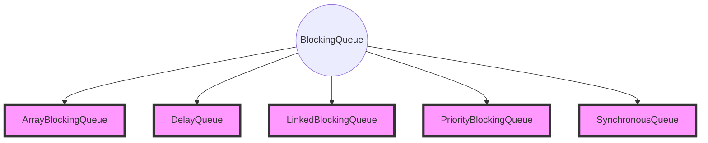

# Java并发编程与高并发解决方案

**并发编程知识体系**：线程安全、线程封闭、线程调度、同步容器、并发容器、AQS、J.U.C。

**高并发解决思路与手段**：扩容、缓存、队列、拆分、服务降级与熔断、数据库切库、分库分表。


## 1. 并发与并发的线程安全处理


**并发**：同时拥有两个或多个线程，如果程序在单核处理器上运行，多个线程将交替地换人换出内存，这些线程是同时“存在”的，每个线程处于执行过程中的某个状态，如果运行在多核处理器上，此时程序中的每个线程都将分配到一个处理核上，因此可以同时运行。

**高并发（High Concurrency）**：是互联网分布式系统架构设计中必须考虑的因素之一，它通常是指通过设计保证系统能够同时并行处理很多请求。

并发指多个线程操作相同资源，此时讨论的点更多是**保证线程安全及合理使用资源**。而高并发指系统集中收到大量请求，会导致系统在这段时间内执行大量操作，如数据库、资源请求等，若高并发处理不好不仅会降低用户体验，请求时间变长，OOM异常甚至导致系统宕机停止工作；若要系统能够适应高并发的状态，需要从多个方面进行系统优化包括硬件、网络、系统架构、开发语言的选取、数据结构的运用、算法优化、数据库优化等，这时关注的是如何**提高程序的性能**，更多是对高并发场景提供解决方案、思路和手段。

### 1.1 CPU多级缓存与MESI协议


为什么需要缓存？CPU频率太快，快到主存跟不上，这样在处理的时钟周期内，CPU常常需要等待主存，浪费资源。缓存的出现是为了缓解CPU和主存之间速度不匹配问题。缓存容量有效，缓存的意义主要有两点：

1. 时间局部性，如果某个数据被访问，那么在不久的将来它很有可能被再次访问；
2. 空间局部性，如果某个数据被访问，那么与它相邻的数据很快也可能被访问；

**Cache一致性协议之MESI**

单核Cache中每个Cache line有2个标志：dirty和valid标志，它们很好的描述了Cache和Memory(内存)之间的数据关系(数据是否有效，数据是否被修改)，而在多核处理器中，多个核会共享一些数据，MESI协议就包含了描述共享的状态。   在MESI协议中，每个Cache line有4个状态，可用2个bit表示，它们分别是：

| 状态      | 说明                                                         |
| --------- | ------------------------------------------------------------ |
| Modify    | 这行数据有效，数据被修改了，和内存中的数据不一致，数据只存在于本Cache中 |
| Exclusive | 这行数据有效，数据和内存中的数据一致，数据只存在于本Cache中  |
| Share     | 这行数据有效，数据和内存中的数据一致，数据存在于很多Cache中。 |
| Invalid   | 这行数据无效                                                 |

**MESI用于保证多个CPU缓存之间缓存共享数据的一致性**，定义了缓存行的的四种状态，而CPU对缓存的四种操作可能会产生不一致的状态，因此缓存控制器监听到本地操作和远程操作时，需要对cache line做一定的修改，保证数据在多个缓存间的一致性。  

在MESI协议中，每个Cache的Cache控制器不仅知道自己的读写操作，而且也监听(snoop)其它Cache的读写操作。每个Cache line所处的状态根据本核和其它核的读写操作在4个状态间进行迁移。 


在上图中，Local Read表示本内核读本Cache中的值，Local Write表示本内核写本Cache中的值，Remote Read表示其它内核读其它Cache中的值，Remote Write表示其它内核写其它Cache中的值，箭头表示本Cache line状态的迁移，环形箭头表示状态不变。 

当内核需要访问的数据不在本Cache中，而其它Cache有这份数据的备份时，本Cache既可以从内存中导入数据，也可以从其它Cache中导入数据，不同的处理器会有不同的选择。MESI协议为了使自己更加通用，没有定义这些细节，只定义了状态之间的迁移，下面的描述假设本Cache从内存中导入数据。 

- I-无效状态

  | 事件           | 行为                                                         | 下一状态 |
  | -------------- | ------------------------------------------------------------ | -------- |
  | Local Read     | 如果其它Cache没有这份数据，本Cache从内存中取数据，Cache line状态变成E；  如果其它Cache有这份数据，且状态为M，则将数据更新到内存，本Cache再从内存中取数据，2个Cache 的Cache line状态都变成S；  如果其它Cache有这份数据，且状态为S或者E，本Cache从内存中取数据，这些Cache 的Cache line状态都变成S | E/S      |
  | Local Write| 从内存中取数据，在Cache中修改，状态变成M；  如果其它Cache有这份数据，且状态为M，则要先将数据更新到内存；  如果其它Cache有这份数据，则其它Cache的Cache line状态变成I | M        |
  | Remote Read| 既然是Invalid，别的核的操作与它无关                          | I        |
  | Remote Write | 既然是Invalid，别的核的操作与它无关                          | I        |

- E-独享状态

  | 事件         | 行为                          | 下一状态 |
  | ------------ | ----------------------------- | -------- |
  | Local Read   | 从Cache中取数据，状态不变     | E        |
  | Local Write  | 修改Cache中的数据，状态变成M  | M        |
  | Remote Read  | 数据和其它核共用，状态变成了S | S        |
  | Remote Write | 数据和其它核共用，状态变成了S | I        |

- S-共享状态

  | 事件         | 行为                                                         | 下一状态 |
  | ------------ | ------------------------------------------------------------ | -------- |
  | Local Read   | 从Cache中取数据，状态不变                                    | S        |
  | Local Write  | 修改Cache中的数据，状态变成M； 其它核共享的Cache line状态变成I | M        |
  | Remote Read  | 状态不变                                                     | S        |
  | Remote Write | 状态不变                                                     | I        |

- M-已修改状态

  | 事件         | 行为                                                         | 下一状态 |
  | ------------ | ------------------------------------------------------------ | -------- |
  | Local Read   | 从Cache中取数据，状态不变                                    | M        |
  | Local Write  | 修改Cache中的数据，状态不变                                  | M        |
  | Remote Read  | 这行数据被写到内存中，使其它核能使用到最新的数据，状态变成S  | S        |
  | Remote Write | 这行数据被写到内存中，使其它核能使用到最新的数据，由于其它核会修改这行数据， | I        |

### 1.2 **乱序执行优化**

通过改变原有执行顺序而减少时间的执行过程我们被称之为**乱序执行*,也称为*重排* 。随着处理器流水线技术和多核技术的发展,目前的高级处理器通过提高内部逻辑元件的利用率来提高运行速度，通常会采用乱序执行技术。


可以说乱序执行技术是处理器为提高运算速度而做出违背代码原有顺序的优化。在单核时代，处理器保证做出的优化不会导致执行结果远离预期目标，但在多核环境下却并非如此.。

首先多核时代，同时会有多个核执行指令，每个核的指令都可能被乱序；另外，处理器还引入了L1、L2等缓存机制，每个核都有自己的缓存，这就导致逻辑次序上后写入内存的数据未必真的最后写入。最终带来了这么一个问题：如果我们不做任何防护措施，处理器最终得出的结果和我们逻辑得出的结果大不相同。比如我们在一个核上执行数据的写入操作，并在最后写一个标记用来表示之前的数据已经准备好，然后从另一个核上通过判断这个标志来判定所需要的数据已经就绪，这种做法存在风险：标记位先被写入，但是之前的数据操作却并未完成(可能是未计算完成，也可能是数据没有从处理器缓存刷新到主存当中)，最终导致另一个核中使用了错误的数据。

所有可能发生乱序执行的情况如下：

- 现代处理器采用指令并行技术，在不存在数据依赖性的前提下，处理器可以改变语句对应的机器指令的执行顺序来提高处理器执行速度。
- 现代处理器采用内部缓存技术，导致数据的变化不能及时反映在主存所带来的乱序。
- 现代编译器为优化而重新安排语句的执行顺序。

### 1.3 JAVA内存模型(JMM)

Java内存模型的主要目标是定义程序中各个变量的访问规则，即在虚拟机中将变量存储到内存和从内存中取出变量这样底层细节。Java内存模型中规定了**所有的变量都存储在主内存中，每条线程还有自己的工作内存**（可以与前面将的处理器的高速缓存类比），线程的工作内存中保存了该线程使用到的变量到主内存副本拷贝，**线程对变量的所有操作（读取、赋值）都必须在工作内存中进行，而不能直接读写主内存中的变量 **。

> JMM规范规定一个线程如何、何时看到由其他线程修改过后的共享变量的值，及在必须时如何同步访问共享变量。


堆是运行时数据区，由垃圾回收管理，优势：动态分配内存大小，生存期不必实现告诉编译器，因为是运行时动态分配内存，垃圾收集器会自动回收不在使用的内存。缺点：由于需要在运行时动态分配内存，存取速度慢一些。栈的存取速度比堆快，仅次于计算机中的寄存器，栈中的数据可以共享，缺点是栈中数据大小与生存期必须时确定的，缺乏灵活性，栈中一般存放基本类型变量。JAVA要求调用栈和本地变量存放在线程栈上，对象存放在堆上。对象的方法和方法中的局部变量存放在线程栈上；一个对象的成员变量可能会随着对象自身存放在堆上，不管成员对象是原始类型还是引用类型；静态成员变量跟随定义一起存放在堆上；而存放在对上的对象可以被所持有对该对象引用的线程访问。当一个线程可以访问一个对象，那么就能访问其成员变量，若两个线程同时调用同一个对象的同一个方法访问对象的成员变量时，这两个线程都拥有**对成员变量的私有拷贝**。


**JVM同步的八种操作**

- lock(锁定)，作用于主内存的变量，把一个变量标识为一条线程独占状态；
- unlock(解锁)，作用于主内存的变量，把一个处于锁定状态的变量释放出来，释放后的变量才可以被其他线程锁定；
- read(读取)，作用于主内存的变量，把一个变量值从主内存传输到线程的工作内存中，以便随后的load动作使用；
- load(载入)，作用于工作内存的变量，它把rea操作从主内存中得到的变量值放入工作内存的变量副本中；
- use(使用)，作用于工作内存的变量，把工作内存中的一个变量值传递给执行引擎；
- assign(赋值)，作用于工作内存的变量，它把一个从执行引擎接收到的值赋值给工作内存的变量；
- store(存储)，作用于工作内存的变量，把工作内存中的一个变量的值传送到主内存中，以便随后的write操作；
- write(写入)，作用于工作内存的变量，它把store操作从工作内存中一个变量的值传送到主内存的变量中；

**同步规则**

1. 如果要把一个变量从主内存中复制到工作内存，就需要按顺序执行read和load操作，如果把变量从工作内存中同步回主内存中，就要顺序执行store和write操作。但Java内存模型只要求上述操作必须按顺序进行，而没有保证必须是连续执行(中间可以执行其他指令)；
2. 不允许read和load、store和write操作之一单独出现；
3. 不允许一个线程丢弃它的最近assign的操作，即变量在工作内存中改变了之后必须同步到主内存中；
4. 不允许一个线程无原因地(没有发生过任何assign)把数据从工作内存同步到主内存；
5. 一个新的变量只能在主内存中诞生，不允许在工作内存中直接使用一个未被初始化(load或assign)的变量，即对一个变量实施use和store操作之前，必须先执行过来 assign和load操作；
6. 一个变量在同一时刻只允许一条线程对其进行lock操作，但lock操作可以被同一条线程重复执行多次，多次执行lock后，只有执相同次数的 unlock操作，变量才会被解锁。lock和unlock必须成对出现；
7. 如果对一个变量执行lock操作，将会清空工作内存中此变量的值，在执行引擎使用这个变量前需要重新执行load或 assign操作初始化变量的值；
8. 如果一个变量事先没有被lock操作锁定，则不允许对它执行unlock操作，也不允许去unlock一个被其他线程锁定的变量；
9. 对一个变量执行unlock操作之前，必须先把此变量同步到主内存中(执行store和write操作)


### 1.4 并发的优势与风险


### 1.5 并发模拟工具

- Postman：http请求模拟工具

- Apache Bench（AB）：Apache附带的工具，测试网站性能

- JMeter：Apache组织开发的压力测试工具，通过创建线程组实现并发测试

  具体线程属性说明如下：

  - 线程数：虚拟用户数，标识模拟多少个用户访问服务。
  - Ramp-Up Period：虚拟用户增长时长，例如：测试一个考勤系统，实际登录时并不是大家同时登录，而是从某个时刻开始用户陆续开始登录，直到某一时刻得到峰值。一般评估出登录频率最高的时间长度，例如：8:55~9:00登录评率最多，这里应设置为:5*60=300秒。
  - 循环次数：一个虚拟用户循环进行多少次测试。

  

- 代码：Semaphore、CountDownLatch等类实现测试

## 2. 线程安全性

定义：当多个线程访问某个类时，不管运行时环境采用何种调度方式或者这些进程将如何交替执行，并且在主调代码中不需要任何额外的同步或协同，这个类都能表现出正确的行为,那么就称这个类是线程安全的。线程安全需要满足以下特性：

- **原子性**，提供了互斥访问,同一时刻只能有一个线程来对它进行操作；
- **可见性**，一个线程对主内存的修改可以及时的被其他线程观察到；
- **有序性**，一个线程观察其他线程中的指令执行顺序,由于指令重排序的存在,该观察结果一般杂乱无序；

### 2.1 **原子性-Atomic包**

以并发多线程AtomicIntefer计数器为例，AtomicXXX包中类实现核心是通过CAS完成，在Atomic包中，使用一个类**Unsafe**.getAndAddInt完成自增操作，其主要实现如下所示

```java
//如执行：2+1，则var2为当前值，var4为增量，var1为Atomic对象
public final int getAndAddInt(Object var1, long var2, int var4) {
    int var5;
    do {
        //通过底层方法获取当前值(主内存的值)，var2为工作内存中的值
        var5 = this.getIntVolatile(var1, var2); 
        //compareAndSwapInt目标是：若var2与var5一致，则更新var1的值为var5+var4
    } while(!this.compareAndSwapInt(var1, var2, var5, var5 + var4));
    return var5;
}
//native标识java底层方法，不是通过java实现的
public native int getIntVolatile(Object var1, long var2);
public final native boolean compareAndSwapInt(Object var1, long var2, int var4, int var5);
```

[atomic包中的**AtomicLong**类和**LongAdder**类实现功能一样，增加LongAdder的原因是什么？](https://github.com/aCoder2013/blog/issues/22)CAS (compare-and-swap)本质上是由现代CPU在硬件级实现的原子指令，允许进行无阻塞，多线程的数据操作同时兼顾了安全性以及效率。大部分情况下，CAS都能够提供不错的性能，但是在高竞争的情况下开销可能会成倍增长。由上述代码可以看出AtomicXXX类实现CAS时是通过while循环完成，当修改失败频率过高时，while循环消耗资源就会增加，并且Long类型写入是分两次写入内存中，因此无谓的消耗太多。

**java.util.concurrency.atomic.LongAdder**是Java8新增的一个类，提供了原子累计值的方法。根据文档的描述其性能要优于AtomicLong。首先它有一个基础的值base，在发生竞争的情况下，会有一个Cell数组用于将不同线程的操作离散到不同的节点上去(会根据需要扩容，最大为CPU核数)，`sum()`会将所有Cell数组中的value和base累加作为返回值。核心的思想就是将AtomicLong一个value的更新压力分散到多个value中去，从而降级更新热点，在低并发的时候通过对base的直接更新可以很好的保障和AtomicLong的性能基本保持一致，而在高并发的时候通过分散提高了性能。 **缺点**是LongAdder在统计的时候如果有并发更新，可能导致统计的数据有误差。 

> 在低竞争的情况下AtomicLong表现优于LongAdder，但是在高并发竞争的情况下LongAdder更好。

**AtomicReference & AtomicReferenceFieldUpdater**

AtomicReference用法与AtomicXXX对应类使用一样，例子如下所示：

```java
private static AtomicReference<Integer> count = new AtomicReference<>(0);
public static void main(String[] args) {
    count.compareAndSet(0, 2); // 设置为2
    count.compareAndSet(0, 1); // 设置失败
    count.compareAndSet(1, 3); // 设置失败
    count.compareAndSet(2, 4); // 设置为2
    count.compareAndSet(3, 5); // 设置失败
    log.info("count: {}", count);
}
```

```java
private static AtomicIntegerFieldUpdater<TestAtomicFieldUpdater> updater =
    AtomicIntegerFieldUpdater.newUpdater(TestAtomicFieldUpdater.class, "count");
//FieldUpdater使用时，对应的变量需要使用volatile修饰且非static变量
@Getter
private volatile int count = 100;
private static TestAtomicFieldUpdater fieldUpdater = new TestAtomicFieldUpdater();
public static void main(String[] args) {
    if (updater.compareAndSet(fieldUpdater, 100, 120)) {
        log.info("update count success: {}", fieldUpdater.getCount());
    } else {
        log.info("update count failed: {}", fieldUpdater.getCount());
    }
    if (updater.compareAndSet(fieldUpdater, 100, 120)) {
        log.info("update count success: {}", fieldUpdater.getCount());
    } else {
        log.info("update count failed: {}", fieldUpdater.getCount());
    }
}
```

**AtomicStampReference：解决CAS的ABA问题**

CAS有3个操作数，内存值V，旧的预期值A，要修改的新值B。当且仅当预期值A和内存值V相同时，将内存值V修改为B，否则什么都不做。 **CAS算法实现一个重要前提需要取出内存中某时刻的数据，而在下时刻比较并替换，那么在这个时间差类会导致数据的变化**。 

- 场景1，一个线程1从内存位置V中取出A，这时候另一个线程2也从内存中取出A，并且3进行了一些操作变成了B，然后2又将V位置的数据变成A，这时候线程1进行CAS操作发现内存中仍然是A，然后1操作成功。尽管CAS成功，但可能存在潜藏的问题。
- 场景2，一个用单向链表实现的堆栈，栈顶为A，这时线程1已经知道A.next为B，然后希望用CAS将栈顶替换为B，在1执行指令CAS(A，B)之前，线程2介入，将A、B出栈，再入栈D、C、A，而此时对象B此时处于游离状态，当轮到线程1执行CAS(A，B)操作时，检测发现栈顶仍为A，所以CAS成功，栈顶变为B，但实际上B.next为null，C和D组成的链表不再存在于堆栈中，平白无故就把C、D丢掉 了。

**解决方案**：乐观锁，用版本戳version来对记录或对象标记，避免并发操作带来的问题。在Java中的类AtomicStampedReference<E>也实现了这个作用，它通过包装[E,Integer]的元组来对对象标记版本戳stamp，在CAS操作时带上版本号，每修改一次版本号+1，不但比较对象是否相等，还要比较版本号是否一致，从而避免ABA问题。

```java
public boolean compareAndSet(V   expectedReference,
                             V   newReference,
                             int expectedStamp,
                             int newStamp) {
    Pair<V> current = pair;
    return
        expectedReference == current.reference &&
        expectedStamp == current.stamp &&
        ((newReference == current.reference &&
          newStamp == current.stamp) ||
         casPair(current, Pair.of(newReference, newStamp)));
}
```

### 2.2 原子性-synchronized

JDK的锁类型分为两种，保证作用对象内作用范围中，同一时刻一段代码只能执行一次：

- synchronized依赖JVM实现的同步锁；
- 代码层面的Lock，依赖特殊的CPU指令，实现类如ReentrantLock；

**synchronized的使用方法**

1. 修饰代码块：大括号括起来的代码，作用于调用的对象；
2. 修改方法：整个方法，作用于调用的对象；
3. 修饰静态方法：整个静态方法，作用于所有对象；
4. 修饰类：括号括起来的部分，作用于所有对象；

> synchronized修饰的方法在继承后，是不起作用的，子类若要使用同步方法需要添加synchronized关键字显示声明。

可以在任意对象及方法加锁，而加锁的这段代码称为互斥区或临界区。一个线程想要执行sychronized修饰的代码块会首先尝试获取这把锁，若是拿到锁就会执行synchronized中的代码；若没有拿到则线程会不断的尝试获取这把锁，因此会存在多个线层同时竞争这把锁。

**多线程多个锁**：每个线程都可以拿到自己的锁，然后去执行临界区中的代码。**一个对象有一把锁**，下面代码中m1、m2对象各自获取有一把对象锁，因此在执行时会各自回去锁然后执行临界区中的代码因此打印结果为：
$$
tag \ a, set \ num \ over! \ \   tag \ b, set\  num \ over! \ \  tag  \ a, num=100! \ \  tag \ b, num = 200!
$$

```java
public class MultiThread {
	private int num = 0;
	/** static */
	public synchronized void printNum(String tag){
		try {
			if(tag.equals("a")){
				num = 100;
				System.out.println("tag a, set num over!");
				Thread.sleep(1000);
			} else {
				num = 200;
				System.out.println("tag b, set num over!");
			}
			System.out.println("tag " + tag + ", num = " + num);
		} catch (InterruptedException e) {
			e.printStackTrace();
		}
	}
	//注意观察run方法输出顺序
	public static void main(String[] args) {
		//俩个不同的对象
		final MultiThread m1 = new MultiThread();
		final MultiThread m2 = new MultiThread();
		Thread t1 = new Thread(new Runnable() {
			@Override
			public void run() {
				m1.printNum("a");
			}
		});
		Thread t2 = new Thread(new Runnable() {
			@Override 
			public void run() {
				m2.printNum("b");
			}
		});		
		t1.start();
		t2.start();
	}
```

关键字synchronized取得的锁都是对象锁，而不是把一段代码（方法）当做锁，所以代码中哪个线程先执行synchronized关键字的方法，哪个线程就持有该方法所属对象的锁（Lock），在静态方法上加synchronized关键字，表示锁定.class类，类一级别的锁（独占.class类）。

#### 2.2.1 **对象锁的同步与异步问题**

下面代码中method1和method2各自打印调用该方法的线程名称，不同的是method1上加了synchronized修饰。当两个线程分别同时访问method1和method2时打印的结果会不同：

1.  当同时访问method1时，先打印t1，然后打印t2。**t1线程先持有object对象的Lock锁，t2线程如果在这个时候调用对象中的同步（synchronized）方法则需等待，也就是同步**
2.  当两个线程同时分别访问method1，method2时，同时打印t1,t2。**t1线程先持有object对象的Lock锁，t2线程可以以异步的方式调用对象中的非synchronized修饰的方法**

```java
public class MyObject {
	public synchronized void method1(){
		try {
			System.out.println(Thread.currentThread().getName());
			Thread.sleep(4000);
		} catch (InterruptedException e) {
			e.printStackTrace();
		}
	}
	/** synchronized */
	public void method2(){
			System.out.println(Thread.currentThread().getName());
	}
	public static void main(String[] args) {
		final MyObject mo = new MyObject();

		Thread t1 = new Thread(new Runnable() {
			@Override
			public void run() {
				mo.method1();
			}
		},"t2");
		Thread t2 = new Thread(new Runnable() {
			@Override
			public void run() {
				mo.method2();
			}
		},"t2");
		t1.start();
		t2.start();
	}
}
```

#### 2.2.2 脏读问题

对于对象的同步方法和异步方法，在设计程序时一定要考虑问题的整体，不然就会出现数据不一致的错误，很经典的错误就是脏读(Dirty Read)。

下面代码中set方法使用了synchronized修饰，而get方法没有用synchronized修饰，执行下面代码得到的结果是：getValue方法得到：username = name , password = 123；setValue最终结果：username =z3 , password = 456。实际上我们需要get的结果是后者，业务整体需要使用完整的synchronized，即对get和set方法同时加锁synchronized同步关键字，保证业务(service)的原子性，否则就会出现业务错误。

```java
public class DirtyRead {
	private String username = "name";
	private String password = "123";
	public synchronized void setValue(String username, String password){
		this.username = username;
		try {
			Thread.sleep(2000);
		} catch (InterruptedException e) {
			e.printStackTrace();
		}
		this.password = password;
		System.out.println("setValue最终结果：username = " 
                           + username + " , password = " + password);
	}
	public void getValue(){
		System.out.println("getValue方法得到：username = " 
                           + this.username + " , password = " + this.password);
	}
	public static void main(String[] args) throws Exception{
		final DirtyRead dr = new DirtyRead();
		Thread t1 = new Thread(new Runnable() {
			@Override
			public void run() {
				dr.setValue("z3", "456");		
			}
		});
		t1.start();
		Thread.sleep(1000);
		dr.getValue();
	}
}
```

**实例：** 关系型数据中的特性ACID并各自举出一个例子，假设数据库中的一个表有一千万条，一个用户A在9:00时要通过select查询一条数据，而这条数据在第9千万条且值为100，不考虑索引优化情况，假设这个请求要执行10分钟才能得到结果；而另一个用户B在9:05时对这一条数据进行update操作将其设置为200并提交了修改，那么当A执行完成select查询结果后，A得到的数据是什么？`结果一定是100`，数据库的ACID特性保证数据库的一致性读，在用户A发送请求的那一刻看到的数据一定是那个时刻的所有数据。

#### 2.2.3 Synchronized锁重入

关键字synchronized拥有锁重入功能，类似JDK底层API ReentrantLock，即当一个线程得到一个对象的锁后，再次请求此对象时是可以再次得到该对象的锁。

```java
public class ReentrantLock {
	public synchronized void method1(){
		System.out.println("method1..");
		method2();
	}
	public synchronized void method2(){
		System.out.println("method2..");
		method3();
	}
	public synchronized void method3(){
		System.out.println("method3..");
	}
	public static void main(String[] args) {
		final ReentrantLock sd = new ReentrantLock();
		Thread t1 = new Thread(new Runnable() {
			@Override
			public void run() {
				sd.method1();
			}
		});
		t1.start();
	}
}
```

在父子继承关系存在时，使用synchronized也能够实现锁的重入

```java
public class SyncDubbo2 {
	static class Main {
		public int i = 10;
		public synchronized void operationSup(){
			try {
				i--;
				System.out.println("Main print i = " + i);
				Thread.sleep(100);
			} catch (InterruptedException e) {
				e.printStackTrace();
			}
		}
	}
	static class Sub extends Main {
		public synchronized void operationSub(){
			try {
				while(i > 0) {
					i--;
					System.out.println("Sub print i = " + i);
					Thread.sleep(100);		
					this.operationSup();
				}
			} catch (InterruptedException e) {
				e.printStackTrace();
			}
		}
	}
	public static void main(String[] args) {
		Thread t1 = new Thread(new Runnable() {
			@Override
			public void run() {
				Sub sub = new Sub();
				sub.operationSub();
			}
		});
		t1.start();
	}
}
```

#### 2.2.4 **出现异常，锁自动释放**

对于web应用程序，异常释放锁的情况，如果不及时处理，很可能对你的应用程序业务逻辑产生严重的错误，比如你现在执行一个队列任务，很多对象都去在等待第一个对象正确执行完毕再去释放，但是第一个对象由于异常的出现，导致业务逻辑没有正常执行完毕，就释放了锁，那么可想而知后续的对象执行的都是错误的逻辑。

在operation获得锁后执行业务逻辑时出现异常后，假设operation业务是一个整体，不应该因为异常就释放锁业务不继续执行下去了，而是应该应该捕获异常打印日志后继续运行。若要退出线程执行过程可以抛出InterruptedException或RuntimeException异常。

```java
public class SyncException {
	private int i = 0;
	public synchronized void operation(){
		while(true){
			try {
				i++;
				Thread.sleep(100);
				System.out.println(Thread.currentThread().getName() + " , i = " + i);
				if(i == 20){
					//终止线程运行
					throw new RuntimeException();
				}
			} catch (InterruptedException e) {
                //打印日志后继续运行 
                e.printStackTrace();
                continue;
			}
		}
	}
	public static void main(String[] args) {
		final SyncException se = new SyncException();
		Thread t1 = new Thread(new Runnable() {
			@Override
			public void run() {
				se.operation();
			}
		},"t1");
		t1.start();
	}
}
```

#### 2.2.5 使用synchronized需要注意的问题

1. 使用synchronized声明的方法在某些情况下是有弊端的，比如A线程调用同步的方法执行一个很长时间的任务，那么B线程就必须等待比较长的时间才能执行，这样的情况下可以使用synchronized代码块优化代码执行时间，减少锁的粒度。synchronized可以是使用任意的Object进行加锁，用法灵活。

   ```java
   public class ObjectLock {
   	public void method1(){
   		synchronized (this) {	//对象锁
   			try {
   				System.out.println("do method1..");
   				Thread.sleep(2000);
   			} catch (InterruptedException e) {
   				e.printStackTrace();
   			}
   		}
   	}
   	public void method2(){		//类锁
   		synchronized (ObjectLock.class) {
   			try {
   				System.out.println("do method2..");
   				Thread.sleep(2000);
   			} catch (InterruptedException e) {
   				e.printStackTrace();
   			}
   		}
   	}
   	private Object lock = new Object();
   	public void method3(){		//任何对象锁
   		synchronized (lock) {
   			try {
   				System.out.println("do method3..");
   				Thread.sleep(2000);
   			} catch (InterruptedException e) {
   				e.printStackTrace();
   			}
   		}
   	}
   	public static void main(String[] args) {
   		final ObjectLock objLock = new ObjectLock();
   		Thread t1 = new Thread(new Runnable() {
   			@Override
   			public void run() {
   				objLock.method1();
   			}
   		});
   		Thread t2 = new Thread(new Runnable() {
   			@Override
   			public void run() {
   				objLock.method2();
   			}
   		});
   		Thread t3 = new Thread(new Runnable() {
   			@Override
   			public void run() {
   				objLock.method3();
   			}
   		});
   		t1.start();
   		t2.start();
   		t3.start();
   	}
   }
   ```

   

2. 不要使用String的常量加锁，会出现死循环问题，synchronized代码块对字符串的锁，注意String常量池的缓存功能。

   ```java
   public class StringLock {
   	public void method() {
   		synchronized ("字符串常量") { //常量只有一个引用，用new String("字符串常量")替换
   			try {
   				while(true){
   					System.out.println("当前线程 : "  
                                          + Thread.currentThread().getName() + "开始");
   					Thread.sleep(1000);		
   					System.out.println("当前线程 : "  
                                          + Thread.currentThread().getName() + "结束");
   				}
   			} catch (InterruptedException e) {
   				e.printStackTrace();
   			}
   		}
   	}
   	public static void main(String[] args) {
   		final StringLock stringLock = new StringLock();
   		Thread t1 = new Thread(new Runnable() {
   			@Override
   			public void run() {
   				stringLock.method();
   			}
   		},"t1");
   		Thread t2 = new Thread(new Runnable() {
   			@Override
   			public void run() {
   				stringLock.method();
   			}
   		},"t2");
   		t1.start();
   		t2.start();
   	}
   }
   ```

3. 锁对象的改变问题，当使用一个对象进行加锁时，要注意对象本身发生改变的时候，那么持有的锁就不同。如果对象本身不发生改变，那么依然是同步的， 同一对象属性的修改不会影响锁的情况。下面例子中，但锁对象改变后，其他进程就能够进入临界区。

   ```java
   public class ChangeLock {
   	private String lock = "lock";
   	private void method(){
   		synchronized (lock) {
   			try {
   				System.out.println("当前线程 : "  
                                      + Thread.currentThread().getName() + "开始");
   				lock = "change lock";
   				Thread.sleep(2000);
   				System.out.println("当前线程 : "  
                                      + Thread.currentThread().getName() + "结束");
   			} catch (InterruptedException e) {
   				e.printStackTrace();
   			}
   		}
   	}
   	public static void main(String[] args) {
   		final ChangeLock changeLock = new ChangeLock();
   		Thread t1 = new Thread(new Runnable() {
   			@Override
   			public void run() {
   				changeLock.method();
   			}
   		},"t1");
   		Thread t2 = new Thread(new Runnable() {
   			@Override
   			public void run() {
   				changeLock.method();
   			}
   		},"t2");
   		t1.start();
   		try {
   			Thread.sleep(100);
   		} catch (InterruptedException e) {
   			e.printStackTrace();
   		}
   		t2.start();
   	}
   }
   ```

4. 死锁问题，在设计程序时就应该避免双方相互持有对方的锁的情况。

   ```java
   public class DeadLock implements Runnable{
   	private String tag;
   	private static Object lock1 = new Object();
   	private static Object lock2 = new Object();
   	@Override
   	public void run() {
   		if(tag.equals("a")){
   			synchronized (lock1) {
   				try {
   					System.out.println("当前线程 : "  
                                          + Thread.currentThread().getName() 
                                          + " 进入lock1执行");
   					Thread.sleep(2000);
   				} catch (InterruptedException e) {
   					e.printStackTrace();
   				}
   				synchronized (lock2) {
   					System.out.println("当前线程 : "  
                                          + Thread.currentThread().getName() 
                                          + " 进入lock2执行");
   				}
   			}
   		}
   		if(tag.equals("b")){
   			synchronized (lock2) {
   				try {
   					System.out.println("当前线程 : "  
                                          + Thread.currentThread().getName() 
                                          + " 进入lock2执行");
   					Thread.sleep(2000);
   				} catch (InterruptedException e) {
   					e.printStackTrace();
   				}
   				synchronized (lock1) {
   					System.out.println("当前线程 : "  
                                          + Thread.currentThread().getName() 
                                          + " 进入lock1执行");
   				}
   			}
   		}
   	}
   	public static void main(String[] args) {
   		DeadLock d1 = new DeadLock();
   		d1.setTag("a");
   		DeadLock d2 = new DeadLock();
   		d2.setTag("b");
   		Thread t1 = new Thread(d1, "t1");
   		Thread t2 = new Thread(d2, "t2");
   		t1.start();
   		try {
   			Thread.sleep(500);
   		} catch (InterruptedException e) {
   			e.printStackTrace();
   		}
   		t2.start();
   	}
   }
   ```

### 2.3 可见性-volatile

导致共享变量在线程间不可见的原因：

- 线程交叉执行
- 重排序结合线程交叉执行
- 共享变量更新后的值没有在工作内存和主存间及时更新

JMM关于synchronized的两条规定保证变量的可见性：

1. 线程解锁前，必须把共享变量的最新值刷新到主存；
2. 线程加锁时，将清空工作内存中共享变量的值，从而使用共享变量时需要从主内存中重新读取最新的值(加锁和解锁为同一把锁)；

volatile的可见性通过加入**内存屏障**和**禁止重排序**优化来实现，规则如下：

1. 对volatile变量写操作时，会在写操作后加入一条store屏障指令，将本地内存中的共享变量值刷新到主内存中；

   ```mermaid
   graph LR
     A[普通读]
     B[普通写]
     C[StoreStore屏障]
     D[volatile写]
     E[StoreLoad屏障]
     A --> B
     B --> C
     C --> D
     D --> E
   ```

   - StoreStore：禁止上面的普通写与下面的volatile写重排序。
   - StoreLoad：防止上面的volatile写与下面可能有的volatile读写重排序。

2. 对volatile变量读操作时，会在读操作前加入一条load屏障指令，从主内存中读取共享变量；

   ```mermaid
   graph LR
     A[volatile读]
     B[LoadLoad屏障]
     C[LoadStore屏障]
     D[普通读]
     E[普通写]
     A --> B
     B --> C
     C --> D
     D --> E
   ```

   - LoadLoad：禁止下面所有普通读操作和上面的volatile读从排序。
   - LoadStore：禁止下面所有的写操作和上面的volatile读重排序。

#### 2.3.1 volatile的含义及使用

Volatile关键字的主要作用是**使变量在多线程间可见**。在Java中每个线程都会有一块工作内存区，其中存放着所有线程共享的主内存中的变量值的拷贝。当线程执行时，他在自己的工作内存区中操作这些变量。为了存取一个共享的变量，一个线程通常先获取锁定并清除它的内存工作区，把这些共享变量从所有线程的共享内存区中正确的装入大它自己的工作内存区中，当线程解锁时，保证该工作内存区中变量的值写回到共享内存中。

- 一个线程可以执行的操作有use、assign、load、store、lock、unlock；
- 主内存可以执行的操作有read、write、lock、unlock，其中每个操作都是原子的；

volatile的作用就是强制线程到主内存(共享内存)里去读取变量，而不去线程工作区里读取，从而实现了多个线程间的变量可见，也是满足线程安全的可见性。

**使用volatile必须具备两个条件：1. 对变量的写操作不依赖当前值；2. 该变量没有包含在具有其他变量的不变式中**。可以看出被写入 volatile 变量的这些有效值**独立于任何程序的状态**，包括变量的当前状态，通常volatile常用于状态标记量，例如线程初始化是否完成、double-check。

```java
public class RunThread extends Thread{
    //改变量在多个线程间可见，若为非volatile则不同RunThread对象所看到的isRunning是不同的
	private volatile boolean isRunning = true;
	private void setRunning(boolean isRunning){
		this.isRunning = isRunning;
	}
	public void run(){
		System.out.println("进入run方法..");
		int i = 0;
		while(isRunning == true){
			//..
		}
		System.out.println("线程停止");
	}
	public static void main(String[] args) throws InterruptedException {
		RunThread rt = new RunThread();
       //创建线程并分配专用内存空间(存放引用的主内存中的变量值得拷贝)，并把主内存中的isRunning的拷贝放
       //在专用内存中，以后使用时直接load，而使用volatile后，线程每一次访问都会从主内存中read出变量的值
		rt.start();
		Thread.sleep(1000);
        //设置的是主内存中的isRunning变量的值
		rt.setRunning(false);
		System.out.println("isRunning的值已经被设置了false");
	}
}
```

#### 2.3.2 原子性与可见性的区别

volatile关键字修饰的变量虽然拥有多个线程之间的可见性，但是却不具备同步性(原子性)，可以算是一个轻量级的synchronized，性能要比synchronized强很多，不会造成阻塞。在很多开源的架构里，比如Netty的底层代码就大量使用volatile，可见Netty性能很好。需要注意的是：一般volatile用于多线程可见的变量操作，并不能代替synchronized的同步功能。**volatile只具有可见性不具备原子性**，要实现原子性建议使用atomic包中的对象，需要注意的是atomic类只保证本身方法的原子性，并不保证多次操作的原子性。

下面例子中，若对volatile变量count进行自增操作，由于不是原子性存在并行操作，则会导致最后得到的count的结果为一定小于等于10000，而采用AtomicInteger则能保证原子性结果恒定为10000。

```java
import java.util.concurrent.atomic.AtomicInteger;
// volatile关键字不具备synchronized关键字的原子性（同步）
public class VolatileNoAtomic extends Thread{
	private static volatile int count;
	//private static AtomicInteger count = new AtomicInteger(0);
	private static void addCount(){
		for (int i = 0; i < 1000; i++) {
			count++ ;
			//count.incrementAndGet();
		}
		System.out.println(count);
	}
	public void run(){
		addCount();
	}
    
    //多个addAndGet在一个方法内是非原子性的，需要加synchronized进行修饰，保证4个addAndGet整体原子性
	public synchronized int multiAdd(){
			try {
				Thread.sleep(100);
			} catch (InterruptedException e) {
				e.printStackTrace();
			}
			count.addAndGet(1);
			count.addAndGet(2);
			count.addAndGet(3);
			count.addAndGet(4); //+10
			return count.get();
	}
    
	public static void main(String[] args) {
		VolatileNoAtomic[] arr = new VolatileNoAtomic[100];
		for (int i = 0; i < 10; i++) {
			arr[i] = new VolatileNoAtomic();
		}
		for (int i = 0; i < 10; i++) {
			arr[i].start();
		}
	}
}
```
### 2.4 有序性-happens-before

Java内存模型中，允许编译器和处理器对指令进行重排序，但重排序过程不会影响到单线程程序的执行，却会影响到多线程并发执行的正确性。保证有序性的手段有：volatile、synchronized、Lock、happens-before。

什么是happens-before？举个例子：

```java
i = 1; // 操作 A 
j = i; // 操作 B
```

如果 操作A happens-before 于 操作B，那么就可以确定，操作B执行完之后，j 的值一定为 1；因为happens-before关系可以向程序员保证： 在操作B执行之前，操作A的执行后的影响[或者说结果](修改 i 的值)操作B是可以观察到的[或者说可见的]。**如果一个操作执行的结果需要对另一个操作可见，那么这两个操作之间必须要存在happens-before关系**，在这个例子就是A操作的结果要对B操作可见，那么必然存在A happens-before B，**使用happens-before的概念来阐述操作之间的内存可见性**

**先行发生原则(happens-before)**

1. 程序次序规则：一个线程内，按照代码顺序，书写在前面的操作先行发生于书写在后面的操作。(对单线程有效，多线程不一定)
2. 锁定规则：一个 unlock操作先行发生于后面对同一个锁的lock操作。
3. volatile变量规则：对一个变量的写操作先行发生于后面对这个变量的读操作。
4. 传递性：如果A happens-before B，且B happens-before C，那么A happens-before C 。
5. 线程启动规则：Thread对象的start方法先行发生于此线程的每一个动作。
6. 线程中断原则：对线程的interrupt方法的调用先行发生于被中断线程的代码检测到中断事件的发生。
7. 线程终结规则：线程中所有的操作都先行发生于线程的终止检测，可以通过Thread.join方法结束，Thread.isAlive的返回值手段检测到线程已终止执行。
8. 对象终结规则：一个对象的初始化完成先行发生于他的finalize方法的开始。

> 如果操作顺序不能够从happens-before原则中推导出来，那么就不能保证操作的有序性，虚拟机可以随意的对操作进行重排序。

## 3. 安全发布对象

**发布对象**：使一个对象能够被当前范围之外的代码所使用。与之对应的概念是**对象逸出**：一种错误的发布，当一个对象还没有构造完成时，就使它被其他线程所见。在日常开发中，经常要发布对象，比如通过类的非私有方法返回对象引用、通过共有静态变量发布对象。如果不正确的发布对象会导致两种错误：

1. 发布线程以外的任何线程都可以看到发布对象的过期的值；
2. 线程看到的被发布对象的引用是最新的，然而被发布对象的状态确实过期的；

因此一个对象要是可变对象，就必须要正其能够安全发布。

下面通过非私有方法发布对象是不安全的，因为我们无法假设其他线程会不会修改这个对象，从而会造成类中状态错误。当采用这种方法获取对象私有对象的引用，就可以在其他线程中直接修改数组中的值，这样当该线程要使用数组中的值时会出现问题，这种发布对象的方法不安全。

```java
@NotThreadSafe
@Slf4j
public class PublishObject {
    @Getter
    private String[] states = {"a", "b","c"};
    public static void main(String[] args) {
        PublishObject publishObject = new PublishObject();
        log.info("{}", publishObject.getStates());

        publishObject.getStates()[0] = "d";
        log.info("{}", publishObject.getStates());
    }
}
```

下面是对象逸出的例子，在对象未创建完成时，就访问了对象中的私有变量，

```java
@NotThreadSafe
@Slf4j
public class ObjectEscape {
    private int thisCanEscape = 0;
    public ObjectEscape() {
        // 若这里启动一个线程，会造成this对象逸出，建议线程先不要start而是采用专门的方法来统一启动线程，例如；工厂方法、私有构造函数完成对象创建和监听器的注册
        new InnerClass(); 
    }
    private class InnerClass {
        public InnerClass() {
            log.info("{}", ObjectEscape.this.thisCanEscape);
        }
    }
    public static void main(String[] args) {
        new Escape();
    }
}
```

**安全发布对象的方法**

1. 在静态初始化函数中初始化一个对象引用；
2. 将对象的引用保存到volatile类型或AtomicReference对象中；
3. 将对象的引用保存到某个正确构造对象的final类型域中；
4. 将对象的引用保存到一个由锁保护的域中；

**懒汉模式**

 ```java
@NotThreadSafe
@NotRecommend
public class Singleton1 {
    private Singleton1(){} //私有构造函数
    private static Singleton1 intance = null; //单例对象
    //静态工厂方法，添加synchronized方法后保证同步，但不推荐
    //通过不同确保只有线程顺序访问会带来性能问题。
    public static Singleton1 getInstance() {
        //懒汉模式：线程不安全
        if (intance == null) {
            intance = new Singleton1();
        }
        return intance;
    }
}
 ```

**饿汉模式**

```java
@ThreadSafe
public class Singleton2 {
    private Singleton2(){} //私有构造函数
    //单例对象，饿汉模式：线程安全，当类的初始化没有太多操作要做是可以，
    //当初始化需要过多操作处理，会导致类加载时过慢，可能会引起性能问题；
    //同时静态方法都会加载，若未被使用会造成资源浪费。
    private static Singleton2 intance = new Singleton2();
    /**
     饿汉模式的另一种写法
     要写在前面，静态域初始化与声明顺序有关，放在后面导致instance值为空
    private static Singleton2 intance = null;
    static {
        intance = new Singleton2();
    }*/
    //静态工厂方法
    public static Singleton2 getInstance() {
        return intance;
    }
}
```

**双重检测模式**

```java
@NotThreadSafe
public class Singleton3 {
    //私有构造函数
    private Singleton3(){}
    //单例对象 禁止指令重排
    private volatile static Singleton3 intance = null;
    /**
     * 为什么说是非线程安全的呢？
     * new Singleton3()操作要执行三步：
     * 1. 分配对象的内存空间memory allocation
     * 2. 初始化对象ctorInstance
     * 3. 设置instance指向刚刚分配的内存
     * 操作完成后instance就指向被分配的内存，在单线程总这个是没有问题的。
     * 因为JVM和CPU优化导致指令重排，导致再多线程中可能会出现下面的情况：
     * 因为2和3没有前后关联，因此可能顺序为132，当线程A、B处于下面位置时，
     * 当线程A执行到操作2后，线程B判断instance不为空直接返回instance对象，
     * 此时由于instance尚未进行初始化，因此线程B拿到对象引用进行其他操作
     * 就可能出现错误。
     *
     * 限制不让其指令重排：使用关键字volatile，double-check线程安全
     */
    public static Singleton3 getInstance() {
        if (intance == null) {                                   //线程B
            synchronized (Singleton3.class) {
                //double-check：双重同步锁
                if (intance == null)intance = new Singleton3();  //线程A
            }
        }
        return intance;
    }
}
```

**枚举模式**

```java
@ThreadSafe
@Recommend
public class Singleton4 {
    private Singleton4(){}
    public static Singleton4 getInstance() {
        return Singleton.INSTANCE.getInstance();
    }
    //枚举类实现单例模式，相比于懒汉模式安全性更易于保证，
    // 较饿汉模式在实际使用时才初始化不会造成资源模式
    private enum Singleton {
        INSTANCE;
        private Singleton4 singleton;
        //JVM保证这个方法绝对只被实例化一次
        Singleton() {
            singleton = new Singleton4();
        }
        public Singleton4 getInstance() {
            return singleton;
        }
    }
}
```

## 4. 不可变对象

不可变对象需要满足的条件：

- 对象创建后其状态就不能修改
- 对象所有域都是final类型
- 对象是正确创建的(在对象创建期间，this引用没有逸出)

通常创建不可变对象(可以参考String)采用的方式有将类声明为final，所有成员声明为私有的不允许直接访问成员，对变量不提供setter方法，将所有可变对象声明为final这样只能对它们赋值一次，通过构造器初始化所有成员进行深度拷贝，在getter方法中不直接返回对象本身而是克隆对象并返回对象的拷贝。

**final关键字**可以**修饰类**(不能被继承，同时final类中的所有成员方法隐式指定为final方法)、**修饰方法**(锁定方法不被继承类修改，早期final方法会被转为内嵌方法提高效率但若final方法过于庞大效果就不会太明显--现在已没有这个作用了，一个类的private方法会隐式转为final方法)和**修饰变量**(基本类型初始化后不能修改，引用类型变量初始化后不能再指向另外一个对象)。

**定义不可变对象的类和方法**

1. collections.unmodifiableXXX：Collection、List、Set、Map
2. Guava中ImmutableXXX：Collection、List、Set、Map，带初始化数据的方法，初始化后就无法修改

```java
private static Map<Integer, Integer> maps = Maps.newHashMap();
private final static ImmutableList list = ImmutableList.of(1,2,3);
private final static ImmutableSet set = ImmutableSet.copyOf(list);
private final static ImmutableMap<Integer, Integer> map =
    ImmutableMap.of(1,2,3,4);
private final static ImmutableMap<Integer, Integer> map1 = 
    ImmutableMap.<Integer, Integer>builder().put(2,3).put(3,4).build();
static {
    maps.put(2,3);
    maps.put(1,4);
    maps.put(6,5);
    maps = Collections.unmodifiableMap(maps);
}
```

## 5. 线程封闭

通过在某些情况下，将不会修改的类对象设计成不可变对象来让对象在多个线程间保证对象时线程安全的，归根到底是我们躲避并发问题。避免并发除了使用不可变对象，还有另一种方法**线程封闭**：把对象封装到一个线程中，只有这一个线程能够看到这个对象，那么这个对象就算不是线程安全的也不会出现任何线程安全方面的问题，因为该对象只能在一个线程中访问。实现线程封闭的方法有：

- **Ad-hoc线程封闭**，程序控制实现，最糟糕，可忽略；
- **堆栈封闭**，即局部变量，多线程执行方法时，方法中的局部变量都会被拷贝一份到线程工作栈中，因此局部变量不会被多个线程所共享的，因此无并发问题；**全局变量容易引发并发问题**
- ThreadLocal线程封闭，比较好的封闭方法，ThreadLocal内部维护了一个Map，键为每个线程的名称，值为要封闭的对象，每一个线程中的对象都对应于一个Map中的值。

线程局部变量(ThreadLocal)是一种**多线程间并发访问变量的解决方案**，与synchronized加锁方式不同，线程局部变量完全不提供锁，而使用以空间换时间的手段，为每个线程提供变量的独立副本，以保证线程安全。从性能上说，ThreadLocal不具有绝对的优势，在并发不是很高时，加锁的性能会更好，但作为一套与锁完全无关的线程安全解决方案，在高并发量或者竞争激烈的场景，使用ThreadLocal可以在一定程度上减少锁竞争。

使用场景：请求进来之后通过Filter拦截请求将线程信息保存在ThreadLocal变量中，当需要使用时从ThreadLocal变量中取出使用，若不使用了通过Interceptor将使用后的信息移除掉避免内存泄漏。

```java
public class RequestHolder {
    private final static ThreadLocal<Long> requestHolder = new ThreadLocal<>();
    public static void add(Long id) {
        requestHolder.set(id);
    }
    public static Long getId() {
        return requestHolder.get();
    }
    //若不移除，数据不会释放，会造成内存泄漏，requestHolder静态变量生命周期与项目一样，只有项目重启后存储的信息才会被释放
    public static void remove() {
        requestHolder.remove();
    }
}

public void doFilter(
    ServletRequest servletRequest, 
    ServletResponse servletResponse, 
    FilterChain filterChain)  {
    HttpServletRequest request = (HttpServletRequest) servletRequest;
    log.info("do filter,{},{}", Thread.currentThread().getId(), request.getServletPath());
    RequestHolder.add(Thread.currentThread().getId());
    filterChain.doFilter(servletRequest, servletResponse);
}

public class HttpInterceptor extends HandlerInterceptorAdapter {
    @Override
    public boolean preHandle(HttpServletRequest request, HttpServletResponse response, Object handler) throws Exception {
        log.info("preHandle");
        return true;
    }
    @Override
    public void afterCompletion(HttpServletRequest request, HttpServletResponse response, Object handler, Exception ex) throws Exception {
        RequestHolder.remove();
        log.info("afterCompletion");
        return;
    }
}
```

## 6. 线程不安全类

线程不安全类是指在多线程环境中，若类的对象可以同时被多个线程访问而没有做同步或并发处理，那么对象很容易表现出线程不安全的现象，比如抛出异常、逻辑处理错误等。线程不安全的类如下：

- 字符串拼接，StringBuilder $\rightarrow$ StringBuffer(线程安全)

- 日期处理，SimpleDateFormat $\rightarrow$ JodaTime(线程安全)

  ```java
  //解决方法1：堆栈封闭实现线程安全 代替全局静态变量
  private static void update() {
      try {
          SimpleDateFormat simpleDateFormat = 
                              new SimpleDateFormat("yyyyMMdd");
          simpleDateFormat.parse("20180208");
      } catch (Exception e) {
          log.error("parse exception", e);
      }
  }
  //解决方法2：
  static DateTimeFormatter dateTimeFormatter 
                        = DateTimeFormat.forPattern("yyyyMMdd");
  private static void update(int i) {
      log.info("{}, {}", i, DateTime.parse("20180208", 
                                           dateTimeFormatter).toDate());
  }
  ```

  - ArrayList、HashSet、HashMap等collections中类
  - 先检查在执行：if(condition) {handle(a);}

## 7. 同步容器与并发容器

同步类容器都是线程安全的，但是在某些场景下可能需要加锁来保护复合操作。复合操作如：迭代、跳转、条件运算。这些复合操作在多线程并发修改容器时，可能会表现出意外的行为，最经典的是ConcurrentModification-Exception原因是当容器迭代的过程中，被并发的修改了内容，这是由于早期迭代器设计的时候没有考虑并发修改问题。**同步类容器：Vector、HashTable**，这些容器的同步功能其实都是JDK的**Collections.synchronizedXX**等工厂方法去创建实现的，其底层机制就是传统的synchronized关键字对每个公用方法都进行同步，使得每次只能有一个线程访问容器的状态，这显然不能满足今天互联网时代高并发的需求，在保证线程安全的同时，也必须有足够好的性能。

```java
Map<Integer, Integer> map = Collections.synchronizedMap(new HashMap<>());
Set<Integer> set = Collections.synchronizedSet(Sets.newHashSet());
List<Integer> list = Collections.synchronizedList(Lists.newArrayList());
```

JDK5.0以后提供了多种并发类容器来代替同步类容器从而改善性能，同步类容器的状态都是串行化的，它们虽然实现了线程安全，但是严重降低了并发性，在多线程环境中时会严重降低应用程序的吞吐量。并发容器类是专门为并发设计的，使用ConcurrentHashMap来代替HashTable而且在ConcurrentHashMap中，添加了一些常见的复合操作的支持；使用CopyOnWriteArrayList代替Vector，此外还提供并发的CopyOnWriteArraySet、并发的Queue、ConcurrentLinkedQueue和LinkedBlockingQueue，前者是高性能的队列，后者是是以阻塞队列。而具体的Queue有很多，例如ArrayBlockingQueue、PriorityBlockingQueue和SynchronousQueue。

**ConcurrentMap接口**有两个重要实现：

- HashMap、TreeMap $\rightarrow$ ConcurrentHashMap，内部使用段(Segment)来表示不同的部分，每个段是一个小的HashMap，它们拥有自己的锁，只要多个修改操作发生在不同的段上，它们就可以并发进行。把一个整体分成16个段，即最高支持16个线程的并发修改操作，这也是多线层场景时，减小锁的粒度从而降低锁竞争的一种方案，并且代码中大多共享变量使用volatile关键字生命，目的是第一时间获取修改的内容性能非常好。
- HashMap、TreeMap $\rightarrow$ ConcurrentSkipListMap，支持并发排序功能，弥补ConcurrentHashMap无法排序的功能；

**CopyOnWrite(COW)**：是一种用于程序设计中的优化策略。JDK里的COW容器有两种

- ArrayList $\rightarrow$ CopyOnWriteArrayList
- HashSet、TreeSet $\rightarrow$ CopyOnWriteArraySet

COW容器非常有用，可以在非常多的并发场景中使用到，什么是CopyOnWrite容器？CopyOnWrite容器即写时复制的容器，通俗的理解时当我们往一个容器添加元素的时候，不直接往当前容器添加，而是先将当前容器进行Copy，复制出一个新的容器，然后新的容器里添加元素，添加完元素后，再将原容器的引用指向新的容器。这样做的好处是我们可以对CopyOnWrite容器进行并发的读，而不需要加锁，因为当前容器不会添加加任何元素。所以CopyOnWrite容器也是一种读写分离的思想，读和写不同的容器。

## 8. 安全共享对象策略

1. **线程限制**，一个被线程限制的对象，由线程独占，并且只能被占有它的线程修改。
2. **共享只读**，一个共享只读的对象，在没有额外同步的情况下，可以被多个线程并发访问，但是任何线程都不能修改它。
3. **线程安全对象**，一个线程安全的对象或容器，在内部通过同步机制来保证线程安全，所以其他线程无需额外的同步就可以通过公共接口随意访问它。
4. **被守护对象**，被守护对象只能通过获取特定的锁来访问。

> 这四个方面是通过不可变对象、线程封闭、同步容器及并发容器中总结出来！

## 9. J.U.C.之AQS

AQS(java.util.concurrent.locks.AbstractQueuedSynchronizer)从JDK1.5开始引入了并发包J.U.C (java.util.concurrent)大大提高了Java程序的并发性能，而AQS被认为是J.U.C的核心， 它虽然只是一个类，但也是一个强大的框架， **目的**是为构建依赖于先进先出 (FIFO) 等待队列的阻塞锁和相关同步器（信号量、事件，等等）提供一个框架，这些类**同步器都依赖单个原子 int 值来表示状态**，例如基于AQS实现的同步组件ReentrantLock，类中的state状态表示获取锁的线程数量，若state=0表示还没有线程获取锁，1表示有一个线程获取锁，大于1表示重入锁的数量。**使用AQS的方法是继承**，AQS是基于模板方法实现，使用时只需要继承AQS类并通过实现它的方法管理其状态的方法操作状态。**基于AQS可以实现排它锁和共享锁模式**(独占、共享)，但是两者不能同时实现，例如`ReentrantReadWriteLock`内部通过两个内部类分别实现AQS得到`ReentrantReadLock`和`ReentrantWriteLock`。

>A synchronizer that may be exclusively owned by a thread. This class provides a basis for creating locks and related synchronizers that may entail a notion of ownership. The AbstractOwnableSynchronizer class itself does not manage or use this information. However, subclasses and tools may use appropriately maintained values to help control and monitor access and provide diagnostics.  

同步器一般包含两种方法，一种是acquire，另一种是release。acquire操作阻塞调用的线程，直到或除非同步状态允许其继续执行。而release操作则是通过某种方式改变同步状态，使得一或多个被acquire阻塞的线程继续执行。 

**acquire操作**

```java
// 循环里不断尝试，典型的失败后重试
while (synchronization state does not allow acquire) {
     // 同步状态不允许获取，进入循环体，也就是失败后的处理
     // 如果当前线程不在等待队列里，则加入等待队列
     enqueue current thread if not already queued;  
     // 可能的话，阻塞当前线程
     possibly block current thread;     
}
// 执行到这里，说明已经成功获取，如果之前有加入队列，则出队列。
dequeue current thread if it was queued; 
```

**release操作**

```java
//  更新同步状态
update synchronization state;
// 检查状态是否允许一个阻塞线程获取
if (state may permit a blocked thread to acquire) 
      // 允许，则唤醒后继的一个或多个阻塞线程。
      unblock one or more queued threads;     
```

为了实现上述操作，需要下面三个基本组件的相互协作：

- 同步状态的原子性管理：怎么判断同步器是否可用的？怎么维护原子状态不会出现非法状态？怎么让其他线程看到当前线程对状态的修改？
- 线程的阻塞与解除阻塞：同步器不可用时，怎么挂起线程？同步器可用时，怎么恢复挂起线程继续执行？
- 队列的管理：有多个线程被阻塞时，怎么管理这些被阻塞的线程？同步器可用时，应该恢复哪个阻塞线程继续执行？怎么处理取消获取的线程？

**1. 同步状态的原子性管理**

AQS 的状态是通过一个 `int` 类型的整数来表示的，这个字段是用`volatile`关键字修饰的，这样通过简单的原子读写就可以达到内存可视性，减少了同步的需求。子类可以获取和设置状态的值，通过定义状态的值来表示 AQS 对象是否被获取或被释放。 

**2. 线程的阻塞与解除阻塞**

JDK5新增了一个类 `java.util.concurrent.locks.LockSupport` 用来支持创建锁和其他同步类需要的基本线程阻塞、解除阻塞原语。这个类最主要的功能有两个：

- park：把线程阻塞。
- unpark：让线程恢复执行。

此类以及每个使用它的线程与一个许可关联。如果该许可可用，并且可在进程中使用，则调用 park 将立即返回；否则可能阻塞。如果许可尚不可用，则可以调用 unpark 使其可用（许可不能累积，并且最多只能有一个许可） 。

**3. 队列管理**

​	底层使用双向链表实现的FIFO队列，其中`sync queue`为同步队列，其中`head`节点主要用于后续的调度。`Condition Queue`为单向链表构成的条件队列，不是必须的，只有当程序中使用条件信号量时才会使用，并且可能会存在多个`Condition Queue`。

AQS实现思路：AQS内部维护了一个CLH队列管理锁，线程会首先尝试获取锁，如果失败就将当前线程以及等待状态信息包装成一个Node节点插入到同步队列`Sync Queue`中，接着head节点的直接后继会不断的循环尝试获取锁，若失败就会阻塞自己直到自己被唤醒，而当持有锁的线程释放锁的时候会唤醒队列中的后继线程。


每个结点的 “status” 字段跟踪一个线程是否应该阻塞，插入到队列只要求在 "tail" 上进行仅仅一个原子操作，出队列包含仅更新 "head"额外一点工作用于结点确认它们的后继是谁，部分地为了处理可能的由于超时和中断导致的取消。 "prev" 连接主要是出于处理取消的需求。如果一个结点被取消，它的后继是重新连接到一个非取消的前驱。 

### 9.1 AQS同步组件之CountDownLatch

CountDownLatch是一个同步工具类，用来协调多个线程之间的同步，或者说起到线程之间的通信，而不是用作互斥的作用。 CountDownLatch能够使一个线程在等待另外一些线程完成各自工作之后，再继续执行。使用一个计数器进行实现。计数器初始值为线程的数量。当每一个线程完成自己任务后，计数器的值就会减一。当计数器的值为0时，表示所有的线程都已经完成了任务，然后在CountDownLatch上等待的线程就可以恢复执行任务。 


**CountDownLatch是一次性的**，计数器的值只能在构造方法中初始化一次，之后没有任何机制再次对其设置值，当CountDownLatch使用完毕后，它不能再次被使用。 若业务上需要可以重置计数器次数的版本，则可以考虑使用`CyclicBarrier`。

**CountDownLatch的共享锁模型**

假设AQS中状态值state=2，对于 CountDownLatch 来说，state=2表示所有调用await方法的线程都应该阻塞，等到同一个latch被调用两次countDown后才能唤醒沉睡的线程。接着线程3和线程4执行了 await方法，此时的状态如下：

 

上图中的`通知状态`是节点的属性，表示该节点出队后，必须唤醒其后续的节点线程，一个线程在阻塞之前，就会把它前面的节点设置为通知状态，这样便可以实现链式唤醒机制了 。 当线程1和线程2分别执行完latch.countDown方法后，会把state值置为0，此时，通过CAS成功置为0的那个线程将会同时承担起唤醒队列中第一个节点线程的任务，从上图可以看出，第一个节点即为线程3，当线程3恢复执行之后，其发现状态值为通知状态，所以会唤醒后续节点，即线程4节点，然后线程3继续做自己的事情，到这里，线程3和线程4都已经被唤醒，CountDownLatch功成身退。 

```java
public static void main(String[] args) throws InterruptedException {
    ExecutorService exec = Executors.newCachedThreadPool();
    CountDownLatch latch = new CountDownLatch(count);
    for (int i=0; i<count; i++) {
        final int threadNum = 1;
        exec.execute(() -> {
            try {
                test(threadNum);
            } catch (InterruptedException e) {
                e.printStackTrace();
            } finally {
                latch.countDown();
            }
        });
    }
    //latch.await();
    //超时后就不关心
    latch.await(10, TimeUnit.SECONDS);
    log.info("finish");
    //关闭线程池
    exec.shutdown();
}
```

### 9.2 AQS同步组件之Semaphore 

信号量(Semaphore)在多线程环境下用于协调各个线程, 以保证它们能够正确、合理的使用公共资源。信号量维护了一个许可集，我们在初始化Semaphore时需要为这个许可集传入一个数量值，该数量值代表同一时间能访问共享资源的线程数量。线程通过`acquire()`方法获取到一个许可，然后对共享资源进行操作，注意如果许可集已分配完了，那么线程将进入等待状态，直到其他线程释放许可才有机会再获取许可，线程释放一个许可通过`release()`方法完成。 


Semaphore内部存在继承自AQS的内部类Sync以及继承自Sync的公平锁(FairSync)和非公平锁(NofairSync)，子类Semaphore共享锁的获取与释放需要自己实现，这两个方法分别是获取锁的`tryAcquireShared(int arg)`方法和释放锁的`tryReleaseShared(int arg)`方法 。Semaphore的内部类公平锁(FairSync)和非公平锁(NoFairSync)各自实现不同的获取锁方法`tryAcquireShared(int arg)`，毕竟公平锁和非公平锁的获取不同，而释放锁`tryReleaseShared(int arg)`的操作交由Sync实现，因为释放操作都是相同的，因此放在父类Sync中实现当然是最好的。  

**非公平锁中的共享锁**

```java
//默认创建公平锁，permits指定同一时间访问共享资源的线程数
public Semaphore(int permits) {
        sync = new NonfairSync(permits);
    }

public Semaphore(int permits, boolean fair) {
     sync = fair ? new FairSync(permits) : new NonfairSync(permits);
 }
```

通过默认构造函数创建时，诞生的就是非公平锁

```java
static final class NonfairSync extends Sync {
    NonfairSync(int permits) {
          super(permits);
    }
   //调用父类Sync的nonfairTryAcquireShared
   protected int tryAcquireShared(int acquires) {
       return nonfairTryAcquireShared(acquires);
   }
}
```

传入的许可数permits传递给父类，最终会传给AQS中的state变量，也就是同步状态的变量，如：

```java
//AQS中控制同步状态的state变量
public abstract class AbstractQueuedSynchronizer
    extends AbstractOwnableSynchronizer {
    private volatile int state;

    protected final int getState() {
        return state;
    }
    protected final void setState(int newState) {
        state = newState;
    }
    //对state变量进行CAS 操作
    protected final boolean compareAndSetState(int expect, int update) {
        return unsafe.compareAndSwapInt(this, stateOffset, expect, update);
    }
}
```

Semaphore的初始化值也就是state的初始化值。当我们调用Semaphore的acquire()方法后，执行过程是这样的，当一个线程请求到来时，如果state值代表的许可数足够使用，那么请求线程将会获得同步状态即对共享资源的访问权，并更新state的值(一般是对state值减1)，但如果state值代表的许可数已为0，则请求线程将无法获取同步状态，线程将被加入到同步队列并阻塞，直到其他线程释放同步状态(一般是对state值加1)才可能获取对共享资源的访问权。调用Semaphore的`acquire()`方法后将会调用到AQS的`acquireSharedInterruptibly()`如下 

```java
//Semaphore的acquire()
public void acquire() throws InterruptedException {
      sync.acquireSharedInterruptibly(1);
  }
/**
*  注意Sync类继承自AQS
*  AQS的acquireSharedInterruptibly()方法
*/ 
public final void acquireSharedInterruptibly(int arg)
        throws InterruptedException {
    //判断是否中断请求
    if (Thread.interrupted())
        throw new InterruptedException();
    //如果tryAcquireShared(arg)不小于0，则线程获取同步状态成功
    if (tryAcquireShared(arg) < 0)
        //未获取成功加入同步队列等待
        doAcquireSharedInterruptibly(arg);
}
```

从方法名就可以看出该方法是可以中断的，也就是说Semaphore的`acquire()`方法也是可中断的。在`acquireSharedInterruptibly()`方法内部先进行了线程中断的判断，如果没有中断，那么先尝试调用`tryAcquireShared(arg)`方法获取同步状态，如果获取成功，则方法执行结束，若获取失败调用`doAcquireSharedInterruptibly(arg);`方法加入同步队列等待。`tryAcquireShared(arg)`是个模板方法，AQS内部没有提供具体实现，由子类实现，也就是有Semaphore内部自己实现，该方法在Semaphore内部非公平锁的实现如下 

```java
//Semaphore中非公平锁NonfairSync的tryAcquireShared()
protected int tryAcquireShared(int acquires) {
    //调用了父类Sync中的实现方法
    return nonfairTryAcquireShared(acquires);
}
//Syn类中
abstract static class Sync extends AbstractQueuedSynchronizer {
    final int nonfairTryAcquireShared(int acquires) {
         //使用死循环
         for (;;) {
             int available = getState();
             int remaining = available - acquires;
             //判断信号量是否已小于0或者CAS执行是否成功
             if (remaining < 0 ||
                 compareAndSetState(available, remaining))
                 return remaining;
         }
     }
}
```

`nonfairTryAcquireShared(int acquires)`方法内部，先获取state的值，并执行减法操作，得到remaining值，如果remaining不小于0，那么线程获取同步状态成功，可访问共享资源，并更新state的值，如果remaining大于0，那么线程获取同步状态失败，将被加入同步队列(通过`doAcquireSharedInterruptibly(arg)`)，注意Semaphore的`acquire()`可能存在并发操作，因此`nonfairTryAcquireShared()`方法体内部采用无锁(CAS)并发的操作保证对state值修改的安全性。如何尝试获取同步状态失败，那么将会执行`doAcquireSharedInterruptibly(int arg)`方法 

```java
private void doAcquireSharedInterruptibly(int arg)
        throws InterruptedException {
     //创建共享模式的结点Node.SHARED，并加入同步队列
   final Node node = addWaiter(Node.SHARED);
     boolean failed = true;
     try {
         //进入自旋操作
         for (;;) {
             final Node p = node.predecessor();
             //判断前驱结点是否为head
             if (p == head) {
                 //尝试获取同步状态
                 int r = tryAcquireShared(arg);
                 //如果r>0 说明获取同步状态成功
                 if (r >= 0) {
                     //将当前线程结点设置为头结点并传播               
                     setHeadAndPropagate(node, r);
                     p.next = null; // help GC
                     failed = false;
                     return;
                 }
             }
           //调整同步队列中node结点的状态并判断是否应该被挂起
           //并判断是否需要被中断，如果中断直接抛出异常，当前结点请求也就结束
             if (shouldParkAfterFailedAcquire(p, node) &&
                 parkAndCheckInterrupt())
                 throw new InterruptedException();
         }
     } finally {
         if (failed)
             //结束该结点线程的请求
             cancelAcquire(node);
     }
}
```

在方法中，由于当前线程没有获取同步状态，因此创建一个共享模式（`Node.SHARED`）的结点并通过`addWaiter(Node.SHARED)`加入同步队列，加入完成后，当前线程进入自旋状态，首先判断前驱结点是否为head，如果是，那么尝试获取同步状态并返回r值，如果r大于0，则说明获取同步状态成功，将当前线程设置为head并传播，传播指的是，同步状态剩余的许可数值不为0，通知后续结点继续获取同步状态，到此方法将会return结束，获取到同步状态的线程将会执行原定的任务。但如果前驱结点不为head或前驱结点为head并尝试获取同步状态失败，那么调用`shouldParkAfterFailedAcquire(p, node)`方法判断前驱结点的waitStatus值是否为SIGNAL并调整同步队列中的node结点状态，如果返回true，那么执行`parkAndCheckInterrupt()`方法，将当前线程挂起并返回是否中断线程的flag。 

```java
private static boolean shouldParkAfterFailedAcquire(Node pred, Node node) {
        //获取当前结点的等待状态
        int ws = pred.waitStatus;
        //如果为等待唤醒（SIGNAL）状态则返回true
        if (ws == Node.SIGNAL)
            return true;
        //如果ws>0 则说明是结束状态，
        //遍历前驱结点直到找到没有结束状态的结点
        if (ws > 0) {
            do {
                node.prev = pred = pred.prev;
            } while (pred.waitStatus > 0);
            pred.next = node;
        } else {
            //如果ws小于0又不是SIGNAL状态，
            //则将其设置为SIGNAL状态，代表该结点的线程正在等待唤醒。
            compareAndSetWaitStatus(pred, ws, Node.SIGNAL);
        }
        return false;
}
private final boolean parkAndCheckInterrupt() {
        //将当前线程挂起
        LockSupport.park(this);
        //获取线程中断状态,interrupted()是判断当前中断状态，
        //并非中断线程，因此可能true也可能false,并返回
        return Thread.interrupted();
}
```

到此，加入同步队列的整个过程完成。这里小结一下，在AQS中存在一个变量state，当我们创建Semaphore对象传入许可数值时，最终会赋值给state，state的数值代表同一个时刻可同时操作共享数据的线程数量，每当一个线程请求(如调用Semaphored的acquire()方法)获取同步状态成功，state的值将会减少1，直到state为0时，表示已没有可用的许可数，也就是对共享数据进行操作的线程数已达到最大值，其他后来线程将被阻塞，此时AQS内部会将线程封装成共享模式的Node结点，加入同步队列中等待并开启自旋操作。只有当持有对共享数据访问权限的线程执行完成任务并释放同步状态后，同步队列中的对应的结点线程才有可能获取同步状态并被唤醒执行同步操作，注意在同步队列中获取到同步状态的结点将被设置成head并清空相关线程数据(毕竟线程已在执行也就没有必要保存信息了)，AQS通过这种方式便实现共享锁，简单模型如下 

前面我们分析的是可中断的请求，与只对应的不可中的的请求(这些方法都存在于AQS，由子类Semaphore间接调用)如下

```java
//不可中的acquireShared()
public final void acquireShared(int arg) {
        if (tryAcquireShared(arg) < 0)
            doAcquireShared(arg);
}
private void doAcquireShared(int arg) {
        final Node node = addWaiter(Node.SHARED);
        boolean failed = true;
        try {
            boolean interrupted = false;
            for (;;) {
                final Node p = node.predecessor();
                if (p == head) {
                    int r = tryAcquireShared(arg);
                    if (r >= 0) {
                        setHeadAndPropagate(node, r);
                        p.next = null; // help GC
                        if (interrupted)
                            selfInterrupt();
                        failed = false;
                        return;
                    }
                }
                if (shouldParkAfterFailedAcquire(p, node) &&
                    parkAndCheckInterrupt())
                    //没有抛出异常中的。。。。
                    interrupted = true;
            }
        } finally {
            if (failed)
                cancelAcquire(node);
        }
}
private void setHeadAndPropagate(Node node, int propagate) {
        Node h = head; // Record old head for check below
        setHead(node);//设置为头结点
        /* 
         * 尝试去唤醒队列中的下一个节点，如果满足如下条件： 
         * 调用者明确表示"传递"(propagate > 0), 
         * 或者h.waitStatus为PROPAGATE(被上一个操作设置) 
         * 并且 
         *   下一个节点处于共享模式或者为null。 
         * 
         * 这两项检查中的保守主义可能会导致不必要的唤醒，但只有在有
         * 有在多个线程争取获得/释放同步状态时才会发生，所以大多
         * 数情况下会立马获得需要的信号
         */  
        if (propagate > 0 || h == null || h.waitStatus < 0 ||
            (h = head) == null || h.waitStatus < 0) {
            Node s = node.next;
            if (s == null || s.isShared())
            //唤醒后继节点，因为是共享模式，所以允许多个线程同时获取同步状态
                doReleaseShared();
        }
}
```

与前面带中断请求`doAcquireSharedInterruptibly(int arg)`方法不同的是少线程中断的判断以及异常抛出，其他操作都一样。了解完请求同步状态的过程，我们看看释放请求状态的过程，当每个线程执行完成任务将会释放同步状态，此时state值一般都会增加1。先从Semaphore的release()方法入手 

```java
//Semaphore的release()
public void release() {
       sync.releaseShared(1);
}
//调用到AQS中的releaseShared(int arg) 
public final boolean releaseShared(int arg) {
       //调用子类Semaphore实现的tryReleaseShared方法尝试释放同步状态
      if (tryReleaseShared(arg)) {
          doReleaseShared();
          return true;
      }
      return false;
}
```

Semaphore间接调用了AQS中的releaseShared(int arg)方法，通过`tryReleaseShared(arg)`方法尝试释放同步状态，如果释放成功，那么将调用`doReleaseShared()`唤醒同步队列中后继结点的线程，`tryReleaseShared(int releases)`方法如下   

```java
//在Semaphore的内部类Sync中实现的
protected final boolean tryReleaseShared(int releases) {
       for (;;) {
              //获取当前state
             int current = getState();
             //释放状态state增加releases
             int next = current + releases;
             if (next < current) // overflow
                 throw new Error("Maximum permit count exceeded");
              //通过CAS更新state的值
             if (compareAndSetState(current, next))
                 return true;
         }
}
```

释放同步状态，更新state的值，值得注意的是这里必须操作无锁操作，即for死循环和CAS操作来保证线程安全问题，因为可能存在多个线程同时释放同步状态的场景。释放成功后通过`doReleaseShared()`方法唤醒后继结点。 

```java
private void doReleaseShared() {
    /* 
     * 保证释放动作(向同步等待队列尾部)传递，即使没有其他正在进行的  
     * 请求或释放动作。如果头节点的后继节点需要唤醒，那么执行唤醒  
     * 动作；如果不需要，将头结点的等待状态设置为PROPAGATE保证   
     * 唤醒传递。另外，为了防止过程中有新节点进入(队列)，这里必  
     * 需做循环，所以，和其他unparkSuccessor方法使用方式不一样  
     * 的是，如果(头结点)等待状态设置失败，重新检测。 
     */  
    for (;;) {
        Node h = head;
        if (h != null && h != tail) {
            // 获取头节点对应的线程的状态
            int ws = h.waitStatus;
            // 如果头节点对应的线程是SIGNAL状态，则意味着头
            //结点的后继结点所对应的线程需要被unpark唤醒。
            if (ws == Node.SIGNAL) {
                // 修改头结点对应的线程状态设置为0。失败的话，则继续循环。
                if (!compareAndSetWaitStatus(h, Node.SIGNAL, 0))
                    continue;
                // 唤醒头结点h的后继结点所对应的线程
                unparkSuccessor(h);
            }
            else if (ws == 0 &&
                     !compareAndSetWaitStatus(h, 0, Node.PROPAGATE))
                continue;                // loop on failed CAS
        }
        // 如果头结点发生变化，则继续循环。否则，退出循环。
        if (h == head)                   // loop if head changed
            break;
    }
}
//唤醒传入结点的后继结点对应的线程
private void unparkSuccessor(Node node) {
    int ws = node.waitStatus;
      if (ws < 0)
          compareAndSetWaitStatus(node, ws, 0);
       //拿到后继结点
      Node s = node.next;
      if (s == null || s.waitStatus > 0) {
          s = null;
          for (Node t = tail; t != null && t != node; t = t.prev)
              if (t.waitStatus <= 0)
                  s = t;
      }
      if (s != null)
          //唤醒该线程
          LockSupport.unpark(s.thread);
}
```

显然`doReleaseShared()`方法中通过调用`unparkSuccessor(h)`方法唤醒head的后继结点对应的线程。注意这里把head的状态设置为`Node.PROPAGATE`是为了保证唤醒传递，博主认为是可能同时存在多个线程并发争取资源，如果线程A已执行到doReleaseShared()方法中，正被唤醒后正准备替换head（实际上还没替换），而线程B又跑来请求资源，此时调用`setHeadAndPropagate(Node node, int propagate)`时，传入的propagate=0 

```java
if (propagate > 0 || h == null || h.waitStatus < 0 ||
            (h = head) == null || h.waitStatus < 0) {
            Node s = node.next;
            if (s == null || s.isShared())
            //唤醒后继节点，因为是共享模式，所以允许多个线程同时获取同步状态
                doReleaseShared();
}
```

为了保证持续唤醒后继结点的线程即`doReleaseShared()`方法被调用，可以把head的waitStatus设置为`Node.PROPAGATE`，这样就保证线程B也可以执行`doReleaseShared()`保证后续结点被唤醒或传播，注意`doReleaseShared()`可以同时被释放操作和获取操作调用，但目的都是为唤醒后继节点，因为是共享模式，所以允许多个线程同时获取同步状态。 

**公平锁中的共享锁**

公平锁的中的共享模式实现除了在获取同步状态时与非公平锁不同外，其他基本一样，看看公平锁的实现 

```java
static final class FairSync extends Sync {
        FairSync(int permits) {
            super(permits);
        }

        protected int tryAcquireShared(int acquires) {
            for (;;) {
                //这里是重点，先判断队列中是否有结点再执行
                //同步状态获取。
                if (hasQueuedPredecessors())
                    return -1;
                int available = getState();
                int remaining = available - acquires;
                if (remaining < 0 ||
                    compareAndSetState(available, remaining))
                    return remaining;
            }
        }
}
```

与非公平锁`tryAcquireShared(int acquires)`方法实现的唯一不同是，在尝试获取同步状态前，先调用了`hasQueuedPredecessors()`方法判断同步队列中是否存在结点，如果存在则返回-1，即将线程加入同步队列等待。从而保证先到来的线程请求一定会先执行，也就是所谓的公平锁。至于其他操作，与前面分析的非公平锁一样。 

**总结**

AQS中通过state值来控制对共享资源访问的线程数，每当线程请求同步状态成功，state值将会减1，如果超过限制数量的线程将被封装共享模式的Node结点加入同步队列等待，直到其他执行线程释放同步状态，才有机会获得执行权，而每个线程执行完成任务释放同步状态后，state值将会增加1，这就是共享锁的基本实现模型。至于公平锁与非公平锁的不同之处在于公平锁会在线程请求同步状态前，判断同步队列是否存在Node，如果存在就将请求线程封装成Node结点加入同步队列，从而保证每个线程获取同步状态都是先到先得的顺序执行的。非公平锁则是通过竞争的方式获取，不管同步队列是否存在Node结点，只有通过竞争获取就可以获取线程执行权。 

### 9.3 AQS同步组件之CyclicBarrier

`CyclicBarrier`是也一种同步帮助工具，允许多个线程相互等待，即多个线程到达同步点时被阻塞，直到最后一个线程到达同步点时栅栏才会被打开(计数器值递增，直到达到初始值)，只要有一个线程有异常发生中断，那么其它线程都会被唤醒继续工作，然后接着就是抛异常处理 。。由于**CyclicBarrier在释放等待线程后可以重用，又称其为循环屏障**。`CyclicBarrier`内部没有所谓的公平锁\非公平锁的静态内部类，只是利用了`ReentrantLock`(独占锁)、`ConditionObject`(条件对象)实现了线程之间相互等待的功能，`CyclicBarrier`的实现是间接利用了`ReentrantLock`的父类AQS的state变量值 。

`CyclicBarrier`的应用场景与`CountDownLatch`比较类似，可以实现多线程计算数据最后合并计算结果的应用，例如：用excel保存了银行流水，excel的每一sheet保存了每一个账户近一年的每笔银行流水，可以用`CyclicBarrier`计算出日均银行流水。首先对于每一个sheet用一个线程计算用户的流水信息，执行完成后，`public CyclicBarrier(int parties, Runnable barrierAction)`，使用`CyclicBarries`的Action计算出整个银行的日均流水。

`CyclicBarrier`与`CountDownLatch`的区别：

1. `CountDownLatch`的计数器只能使用一次，而`CyclicBarrier`可以重复使用；
2. `CountDownLatch`通常用于一个或多个线程等待其他某些线程完成某项操作之后，才能继续往下执行，描述的是一个或多个线程等待其他线程；而`CyclicBarrier`用于实现多个线程之间相互等待，直到所有线程都满足条件之后才能继续执行后续操作，描述的是各个线程内部相互等待的关系，`CyclicBarrier`能够处理更复杂的业务场景，例如：计算错误了可以重置计数器重新执行一次。

```java
//在达到屏障后，优先执行Action后再继续其他操作
private final static CyclicBarrier barrier = new CyclicBarrier(count,
   () ->{ 
       log.info("call back is running");
 });
public static void test(int threadNum) throws InterruptedException {
    Thread.sleep(1000);
    log.info("{} is ready",threadNum);
    try {
        barrier.await(2000, TimeUnit.MILLISECONDS);
    } catch (BrokenBarrierException e) {
        e.printStackTrace();
    } catch (TimeoutException e) {
        e.printStackTrace();
    }
    log.info("{} continue", threadNum);
}
```

### 9.4 AQS同步组件之ReentrantLock与Lock

`ReentrantLock`与`Synchronized`的区别：

- 可重入性，两者都是可重入，同一个线程每一次进入计数器都会自增1，直到计数器下降到0才释放锁；
- 锁的实现，`ReentrantLock`是通过JDK实现的，而Synchronized是通过JVM实现，两者的区别是前者相当于用户实现，而后者相当于操作系统级别的实现。
- 性能区别，优化后的`synchronized`方法(采用`ReentrantLock`中的CAS技术都是在用户态把加锁问题解决，避免进入内核态的线程阻塞)与`ReentrantLock`两者区别不大，在两种方法均可用的情况下官方建议使用`synchronized`方法，因为使用更简单。
- 功能区别，`synchronized`使用便捷且由JVM保证锁的加锁和释放，而`ReentrantLock`需要手动声明加锁和释放锁，为避免忘记释放锁造成死锁，建议在finnally中释放锁；此外，从锁的细粒度和灵活度方面来说`ReentrantLock`占优。

`ReentrantLock`独有的功能：

- 可指定是公平锁(先等待的线程先获得锁)还是非公平锁。

- 提供一个`Condition`类，可以实现分组唤醒需要唤醒的线程，而`synchronized`随机唤醒一个线程或唤醒所有线程。

- 提供能够中断等待线程的机制，通过`lock.lockInterruptibly()`实现。


`ReentrantLock`采用自旋锁循环调用CAS操作实现加锁，其性能比较好是因为避免使线程进入内核态的阻塞状态，这也是分析和设计锁的所见所在。`ReentrantLock`的**使用场景**是：当需要`ReentrantLock`这三个独有功能时。

```java
private static Lock lock = new ReentrantLock();
private Condition condition = lock.newCondition();
public static thread1() {
    // 线程加入AQS等待队列中,等待获取锁执行
    lock.lock();
    try {
        log.info("get lock")； //执行顺序：1
        //将此线程从AQS队列中移除，同时释放锁并将该线程加入condition等待队列中
        conditon.await();
        log.info("get singal")；//执行顺序：4
    } finnaly {
        lock.unlock();
    }
}
public static thread2() {
    //线程加入AQS等待队列中,等待获取锁执行
    lock.lock();
    try {
        log.info("get lock")； //执行顺序：2
        //condition等待队中节点加入到AQS的等待队列中(此时线程未被唤醒)
        condition.singalAll();
        log.info("send singal")；//执行顺序：3
    } finnaly {
        lock.unlock();
    }
}

```

`ReentrantReadWriteLock `在沒有任何读写锁时，才可以取得写入锁，这可用于实现了悲观读取。然而，如果读取很多，写入很少的情况下，使用 `ReentrantReadWriteLock `可能会使写入线程遭遇饥饿问题，也就是写入线程无法竞争到锁定而一直处于等待状态。 

`StampedLock`由三种模式(写、读、乐观读)的锁，用于控制读取/写入访问，`StampedLock`的状态由版本和模式组成，锁获取操作返回一个用于展示和访问锁状态的票据（stamp）变量，它用相应的锁状态表示并控制访问，数字0表示没有写锁被授权访问。在读锁上分为悲观锁和乐观锁，锁释放以及其他相关方法需要使用邮编（stamps）变量作为参数，如果他们和当前锁状态不符则失败，这三种模式为 

1. 写入，方法`writeLock`可能为了获取独占访问而阻塞当前线程，返回一个stamp变量，能够在`unlockWrite`方法中使用从而释放锁。也提供了`tryWriteLock`。当锁被写模式所占有，没有读或者乐观的读操作能够成功。 
2. 读取，方法`readLock`可能为了获取非独占访问而阻塞当前线程，返回一个stamp变量，能够在`unlockRead`方法中用于释放锁，也提供了`tryReadLock`。 
3. 乐观读取，方法`tryOptimisticRead`返回一个非0邮编变量，仅在当前锁没有以写入模式被持有。如果在获得stamp变量之后没有被写模式持有，方法validate将返回true。这种模式可以被看做一种弱版本的读锁，可以被一个写入者在任何时间打断。乐观读取模式仅用于短时间读取操作时经常能够`降低竞争和提高吞吐量`。  

> 在读多写很少情况下，可以乐观认为写入和读取同时发生的几率很少，因此不悲观使用读取锁定。采用乐观读可以提高吞吐量！

```java
public class StampedLockEx1 {
    private double x, y;
    private final StampedLock sl = new StampedLock();
    void move(double deltaX, double deltaY) { // an exclusively locked method
        long stamp = sl.writeLock();
        try {
            x += deltaX;
            y += deltaY;
        } finally {
            sl.unlockWrite(stamp);
        }
    }
    //乐观锁案例
    double distanceFromOrigin() { // A read-only method
        //获取乐观锁
        long stamp = sl.tryOptimisticRead();
        //将两个字段读入本地工作内存
        double currentX = x, currentY = y;
        //如果读取的时候发生了写，则stampedLock的stamp属性值会变化，此时需要重读，
        //再重读的时候需要加读锁（并且重读时使用的应当是悲观的读锁，即阻塞写的读锁）
        //此外重读的时候可用tryOptimisticRead，此时需要结合循环了，即类似CAS方式
        if (!sl.validate(stamp)) {
            //若没有，我们再一次获得一个读悲观锁
            stamp = sl.readLock();
            try {
                //将两个字段读入本地工作内存
                currentX = x;
                currentY = y;
            } finally {
                //释放读锁
                sl.unlockRead(stamp);
            }
        }
        return Math.sqrt(currentX  + currentY );
    }
    //悲观读锁案例
    void moveIfAtOrigin(double newX, double newY) { // upgrade
        // Could instead start with optimistic, not read mode
        long stamp = sl.readLock();
        try {
            //循环检查当前状态是符合
            while (x == 0.0 && y == 0.0) {
                //将读锁转为写锁
                long ws = sl.tryConvertToWriteLock(stamp);
                //确认转为写锁是否成功
                if (ws != 0L) {
                    //若成功，替换票据
                    stamp = ws;
                    //更新状态
                    x = newX;
                    y = newY;
                    break;
                } else {
                    //若不能成功转换为写锁，则释放锁
                    sl.unlockRead(stamp);
                    //显示直接获取写锁，然后通过循环再试
                    stamp = sl.writeLock();
                }
            }
        } finally {
            //释放读锁或写锁
            sl.unlock(stamp);
        }
    }
}
```

**使用说明**

| 锁类型        | 应用场景                           |
| ------------- | ---------------------------------- |
| synchronized  | 少量竞争者，由JVM保证不会死锁      |
| ReentrantLock | 竞争者不少，但可以预估线程增长趋势 |
| StampedLock   | 读锁写少                           |

#### 9.4.1 ReentrantLock深度理解

**Lock接口**

解决多线程同步问题的关键字synchronized，synchronized属于隐式锁，即锁的持有与释放都是隐式的，我们无需干预，而本篇我们要讲解的是显式锁，即锁的持有和释放都必须由我们手动编写。 在Java 1.5中，官方在concurrent并发包中加入了Lock接口，该接口中提供了lock()方法和unLock()方法对显式加锁和显式释放锁操作进行支持。简单实用如下：

```java
Lock lock = new ReentrantLock();
lock.lock();
try{
    //临界区......
}finally{
    lock.unlock();
}
```

ReentrantLock是Lock的实现类，当前线程使用lock()方法与unlock()对临界区进行包围，其他线程由于无法持有锁将无法进入临界区直到当前线程释放锁，注意unlock()操作必须在finally代码块中，这样可以确保即使临界区执行抛出异常，线程最终也能正常释放锁，Lock接口还提供了锁以下相关方法

```java
public interface Lock {
    void lock();//加锁
    void unlock();//解锁
    //可中断获取锁，与lock()不同之处在于可响应中断操作，即在获取锁的过程中可中断，注意synchronized在获取锁时是不可中断的
    void lockInterruptibly() throws InterruptedException;
    //尝试非阻塞获取锁，调用该方法后立即返回结果，如果能够获取则返回true，否则返回false
    boolean tryLock();
    //根据传入的时间段获取锁，在指定时间内没有获取锁则返回false，如果在指定时间内当前线程未被中并断获取到锁则返回true
    boolean tryLock(long time, TimeUnit unit) throws InterruptedException;
    //获取等待通知组件，该组件与当前锁绑定，当前线程只有获得了锁才能调用该组件的wait()方法，而调用后，当前线程将释放锁。
    Condition newCondition();
}
```

**ReetrantLock重入锁**

JDK 1.5新增的类，实现了Lock接口，作用与synchronized关键字相当，但比synchronized更加灵活。ReetrantLock本身也是一种支持重进入的锁，即该锁可以支持一个线程对资源重复加锁，同时也支持公平锁与非公平锁。所谓的公平与非公平指的是在请求先后顺序上，先对锁进行请求的就一定先获取到锁，那么这就是公平锁，反之，如果对于锁的获取并没有时间上的先后顺序，如后请求的线程可能先获取到锁，这就是非公平锁，一般而言非，非公平锁机制的效率往往会胜过公平锁的机制，但在某些场景下，可能更注重时间先后顺序，那么公平锁自然是很好的选择。**ReetrantLock支持对同一线程重加锁，但是加锁多少次，就必须解锁多少次，这样才可以成功释放锁**。 

**ReetrantLock内部实现原理**

AbstractQueuedSynchronizer又称为队列同步器，它是用来构建锁或其他同步组件的基础框架，内部通过一个int类型的成员变量state来控制同步状态,当state=0时，则说明没有任何线程占有共享资源的锁，当state=1时，则说明有线程目前正在使用共享变量，其他线程必须加入同步队列进行等待，AQS内部通过内部类Node构成FIFO的同步队列来完成线程获取锁的排队工作，同时利用内部类ConditionObject构建等待队列，当Condition调用wait()方法后，线程将会加入等待队列中，而当Condition调用signal()方法后，线程将从等待队列转移动同步队列中进行锁竞争。注意这里涉及到两种队列，一种的**同步队列**，当线程请求锁而等待的后将加入同步队列等待，而另一种则是**等待队列**(可有多个)，通过Condition调用await()方法释放锁后，将加入等待队列。 


head和tail分别是AQS中的变量，其中head指向同步队列的头部，注意head为空结点，不存储信息。而tail则是同步队列的队尾，同步队列采用的是双向链表的结构这样可方便队列进行结点增删操作。state变量则是代表同步状态，执行当线程调用lock方法进行加锁后，如果此时state的值为0，则说明当前线程可以获取到锁(在本篇文章中，锁和同步状态代表同一个意思)，同时将state设置为1，表示获取成功。如果state已为1，也就是当前锁已被其他线程持有，那么当前执行线程将被封装为Node结点加入同步队列等待。其中Node结点是对每一个访问同步代码的线程的封装，从图中的Node的数据结构也可看出，其包含了需要同步的线程本身以及线程的状态，如是否被阻塞，是否等待唤醒，是否已经被取消等。每个Node结点内部关联其前继结点prev和后继结点next，这样可以方便线程释放锁后快速唤醒下一个在等待的线程，Node是AQS的内部类，其数据结构如下 

```java
static final class Node {
    static final Node SHARED = new Node();//共享模式
    static final Node EXCLUSIVE = null;  //独占模式
    static final int CANCELLED =  1;  //标识线程已处于结束状态
    static final int SIGNAL    = -1;  //等待被唤醒状态
    static final int CONDITION = -2; //条件状态
    static final int PROPAGATE = -3; //在共享模式中使用表示获得的同步状态会被传播
    //等待状态,存在CANCELLED、SIGNAL、CONDITION、PROPAGATE 4种
    volatile int waitStatus;
    volatile Node prev; //同步队列中前驱结点
    volatile Node next; //同步队列中后继结点
    volatile Thread thread; //请求锁的线程
    Node nextWaiter; //等待队列中的后继结点，这个与Condition有关，稍后会分析
    final boolean isShared() {  //判断是否为共享模式
        return nextWaiter == SHARED;
    }
}
```

其中SHARED和EXCLUSIVE常量分别代表共享模式和独占模式，所谓共享模式是一个锁允许多条线程同时操作，如信号量Semaphore采用的就是基于AQS的共享模式实现的，而独占模式则是同一个时间段只能有一个线程对共享资源进行操作，多余的请求线程需要排队等待，如ReentranLock。变量waitStatus则表示当前被封装成Node结点的等待状态，共有4种取值CANCELLED、SIGNAL、CONDITION、PROPAGATE。 

- CANCELLED：值为1，在同步队列中等待的线程等待超时或被中断，需要从同步队列中取消该Node的结点，其结点的waitStatus为CANCELLED，即结束状态，进入该状态后的结点将不会再变化。
- SIGNAL：值为-1，被标识为该等待唤醒状态的后继结点，当其前继结点的线程释放了同步锁或被取消，将会通知该后继结点的线程执行。说白了，就是处于唤醒状态，只要前继结点释放锁，就会通知标识为SIGNAL状态的后继结点的线程执行。
- CONDITION：值为-2，与Condition相关，该标识的结点处于等待队列中，结点的线程等待在Condition上，当其他线程调用了Condition的signal()方法后，CONDITION状态的结点将从等待队列转移到同步队列中，等待获取同步锁。
- PROPAGATE：值为-3，与共享模式相关，在共享模式中，该状态标识结点的线程处于可运行状态。
- 0状态：值为0，代表初始化状态。

pre和next，分别指向当前Node结点的前驱结点和后继结点，thread变量存储的请求锁的线程。nextWaiter，与Condition相关，代表等待队列中的后继结点，关于这点这里暂不深入，后续会有更详细的分析。

**ReentrantLock与AQS的类关系**


- AbstractOwnableSynchronizer：抽象类，定义了存储独占当前锁的线程和获取的方法
- AbstractQueuedSynchronizer：抽象类，AQS框架核心类，其内部以虚拟队列的方式管理线程的锁获取与锁释放，其中获取锁(tryAcquire方法)和释放锁(tryRelease方法)并没有提供默认实现，需要子类重写这两个方法实现具体逻辑，目的是使开发人员可以自由定义获取锁以及释放锁的方式。
- Node：AbstractQueuedSynchronizer 的内部类，用于构建虚拟队列(链表双向链表)，管理需要获取锁的线程。
- Sync：抽象类，是ReentrantLock的内部类，继承自AbstractQueuedSynchronizer，实现了释放锁的操作(tryRelease()方法)，并提供了lock抽象方法，由其子类实现。
- NonfairSync：是ReentrantLock的内部类，继承自Sync，非公平锁的实现类。
- FairSync：是ReentrantLock的内部类，继承自Sync，公平锁的实现类。
- ReentrantLock：实现了Lock接口的，其内部类有Sync、NonfairSync、FairSync，在创建时可以根据fair参数决定创建NonfairSync(默认非公平锁)还是FairSync。

`ReentrantLock`内部存在3个实现类，分别是`Sync`、`NonfairSync`、`FairSync`，其中Sync继承自AQS实现了解锁`tryRelease()`方法，而`NonfairSync`(非公平锁)、 `FairSync`(公平锁)则继承自`Sync`，实现了获取锁的`tryAcquire()`方法，ReentrantLock的所有方法调用都通过间接调用AQS和`Sync`类及其子类来完成的。 

#### 9.4.2 基于ReetrantLock分析AQS独占模式实现过程

##### 1. ReetrantLock中非公平锁

AQS同步器的实现依赖于内部的同步队列(FIFO的双向链表对列)完成对同步状态(state)的管理，当前线程获取锁(同步状态)失败时，AQS会将该线程以及相关等待信息包装成一个节点(Node)并将其加入同步队列，同时会阻塞当前线程，当同步状态释放时，会将头结点head中的线程唤醒，让其尝试获取同步状态。 

```java
public ReentrantLock() { //默认构造，创建非公平锁NonfairSync
    sync = new NonfairSync();
}
public ReentrantLock(boolean fair) { //根据传入参数创建锁类型
    sync = fair ? new FairSync() : new NonfairSync();
}
public void lock() { //加锁操作
     sync.lock();
}
```

NonfairSync是抽象类Sync的实现的公平锁，其lock实现如下：

```java
//非公平锁实现
static final class NonfairSync extends Sync {
    final void lock() { //加锁
        if (compareAndSetState(0, 1)) //执行CAS操作，获取同步状态
      	   //成功则将独占锁线程设置为当前线程  
          setExclusiveOwnerThread(Thread.currentThread());
        else
            acquire(1); //否则再次请求同步状态
    }
}
```

首先对同步状态执行CAS操作，尝试把state的状态从0设置为1，如果返回true则代表获取同步状态成功，也就是当前线程获取锁成功，可操作临界资源，如果返回false，则表示已有线程持有该同步状态(其值为1)，获取锁失败，注意这里存在并发的情景，也就是可能同时存在多个线程设置state变量，因此是CAS操作保证了state变量操作的原子性。返回false后，执行 `acquire(1)`方法，该方法是AQS中的方法，它对中断不敏感，即使线程获取同步状态失败，进入同步队列，后续对该线程执行中断操作也不会从同步队列中移出，方法如下 

```java
public final void acquire(int arg) {
    //再次尝试获取同步状态
    if (!tryAcquire(arg) &&acquireQueued(addWaiter(Node.EXCLUSIVE), arg))
        selfInterrupt();
}
```

这里传入参数arg表示要获取同步状态后设置的值(即要设置state的值)，因为要获取锁，而status为0时是释放锁，1则是获取锁，所以这里一般传递参数为1，进入方法后首先会执行tryAcquire(arg)方法，在前面分析过该方法在AQS中并没有具体实现，而是交由子类实现，因此该方法是由ReetrantLock类内部实现的 :

```java
//NonfairSync类
static final class NonfairSync extends Sync {

    protected final boolean tryAcquire(int acquires) {
         return nonfairTryAcquire(acquires);
     }
 }
//Sync类
abstract static class Sync extends AbstractQueuedSynchronizer {
  //nonfairTryAcquire方法
  final boolean nonfairTryAcquire(int acquires) {
      final Thread current = Thread.currentThread();
      int c = getState();
      //判断同步状态是否为0，并尝试再次获取同步状态
      if (c == 0) {
          //执行CAS操作
          if (compareAndSetState(0, acquires)) {
              setExclusiveOwnerThread(current);
              return true;
          }
      }
      //如果当前线程已获取锁，属于重入锁，再次获取锁后将status值加1
      else if (current == getExclusiveOwnerThread()) {
          int nextc = c + acquires;
          if (nextc < 0) // overflow
              throw new Error("Maximum lock count exceeded");
          //设置当前同步状态，当前只有一个线程持有锁，因为不会发生线程安全问题，可以直接执行 setState(nextc);
          setState(nextc);
          return true;
      }
      return false;
  }
  //省略其他代码
}
```

从代码执行流程可以看出，这里做了两件事，一是尝试再次获取同步状态，如果获取成功则将当前线程设置为OwnerThread，否则失败，二是判断当前线程current是否为OwnerThread，如果是则属于重入锁，state自增1，并获取锁成功，返回true，反之失败，返回false，也就是`tryAcquire(arg)`执行失败，返回false。需要注意的是`nonfairTryAcquire(int acquires)`内部使用的是CAS原子性操作设置state值，可以保证state的更改是线程安全的，因此只要任意一个线程调用`nonfairTryAcquire(int acquires)`方法并设置成功即可获取锁，不管该线程是新到来的还是已在同步队列的线程，毕竟这是非公平锁，并不保证同步队列中的线程一定比新到来线程请求(可能是head结点刚释放同步状态然后新到来的线程恰好获取到同步状态)先获取到锁，这点跟后面还会讲到的公平锁不同。

```java
public final void acquire(int arg) {
    //再次尝试获取同步状态
    if (!tryAcquire(arg) &&acquireQueued(addWaiter(Node.EXCLUSIVE), arg))
        selfInterrupt();
}
```

如果tryAcquire(arg)返回true，`acquireQueued`自然不会执行，这是最理想的，因为毕竟当前线程已获取到锁，如果tryAcquire(arg)返回false，则会执行`addWaiter(Node.EXCLUSIVE)`进行入队操作,由于ReentrantLock属于独占锁，因此结点类型为`Node.EXCLUSIVE`，下面看看addWaiter方法具体实现

```java
private Node addWaiter(Node mode) {
    //将请求同步状态失败的线程封装成结点
    Node node = new Node(Thread.currentThread(), mode);

    Node pred = tail;
    //如果是第一个结点加入肯定为空，跳过。
    //如果非第一个结点则直接执行CAS入队操作，尝试在尾部快速添加
    if (pred != null) {
        node.prev = pred;
        //使用CAS执行尾部结点替换，尝试在尾部快速添加
        if (compareAndSetTail(pred, node)) {
            pred.next = node;
            return node;
        }
    }
    //如果第一次加入或者CAS操作没有成功执行enq入队操作
    enq(node);
    return node;
}
```

创建了一个`Node.EXCLUSIVE`类型Node结点用于封装线程及其相关信息，其中tail是AQS的成员变量，指向队尾(这点前面的我们分析过AQS维持的是一个双向的链表结构同步队列)，如果是第一个结点，则为tail肯定为空，那么将执行`enq(node)`操作，如果非第一个结点即tail指向不为null，直接尝试执行CAS操作加入队尾，如果CAS操作失败还是会执行`enq(node)`，继续`enq(node)`： 

```java
private Node enq(final Node node) {
    for (;;) {
         Node t = tail;
         //如果队列为null，即没有头结点
         if (t == null) { // Must initialize
             //创建并使用CAS设置头结点
             if (compareAndSetHead(new Node()))
                 tail = head;
         } else {//队尾添加新结点
             node.prev = t;
             if (compareAndSetTail(t, node)) {
                 t.next = node;
                 return t;
             }
         }
     }
}
```

这个方法使用一个死循环进行CAS操作，可以解决多线程并发问题。这里做了两件事，一是如果还没有初始同步队列则创建新结点并使用compareAndSetHead设置头结点，tail也指向head，二是队列已存在，则将新结点node添加到队尾。注意这两个步骤都存在同一时间多个线程操作的可能，如果有一个线程修改head和tail成功，那么其他线程将继续循环，直到修改成功，这里使用CAS原子操作进行头结点设置和尾结点tail替换可以保证线程安全，从这里也可以看出head结点本身不存在任何数据，它只是作为一个牵头结点，而tail永远指向尾部结点(前提是队列不为null)。 


添加到同步队列后，结点就会进入一个自旋过程，即每个结点都在观察时机待条件满足获取同步状态，然后从同步队列退出并结束自旋，回到之前的`acquire()`方法，自旋过程是在`acquireQueued(addWaiter(Node.EXCLUSIVE), arg))`方法中执行的，代码如下 

```java
final boolean acquireQueued(final Node node, int arg) {
    boolean failed = true;
    try {
        boolean interrupted = false;
        //自旋，死循环
        for (;;) {
            //获取前驱结点
            final Node p = node.predecessor();
            当且仅当p为头结点才尝试获取同步状态
            if (p == head && tryAcquire(arg)) {
                //将node设置为头结点
                setHead(node);
                //清空原来头结点的引用便于GC
                p.next = null; // help GC
                failed = false;
                return interrupted;
            }
            //如果前驱结点不是head，判断是否挂起线程
            if (shouldParkAfterFailedAcquire(p, node) &&
                parkAndCheckInterrupt())
                interrupted = true;
        }
    } finally {
        if (failed)
            //最终都没能获取同步状态，结束该线程的请求
            cancelAcquire(node);
    }
}
```

当前线程在自旋(死循环)中获取同步状态，当且仅当前驱结点为头结点才尝试获取同步状态，这符合FIFO的规则，即先进先出，其次head是当前获取同步状态的线程结点，只有当head释放同步状态唤醒后继结点，后继结点才有可能获取到同步状态，因此后继结点在其前继结点为head时，才进行尝试获取同步状态，其他时刻将被挂起。进入if语句后调用`setHead(node)`方法，将当前线程结点设置为head

```java
//设置为头结点
private void setHead(Node node) {
        head = node;
        //清空结点数据
        node.thread = null;
        node.prev = null;
}
```

设置为node结点被设置为head后，其thread信息和前驱结点将被清空，因为该线程已获取到同步状态(锁)，正在执行了，也就没有必要存储相关信息了，head只有保存指向后继结点的指针即可，便于head结点释放同步状态后唤醒后继结点，执行结果如下图 


从图可知更新head结点的指向，将后继结点的线程唤醒并获取同步状态，调用`setHead(node)`将其替换为head结点，清除相关无用数据。当然如果前驱结点不是head，那么执行如下 

```java
//如果前驱结点不是head，判断是否挂起线程
if (shouldParkAfterFailedAcquire(p, node) &&parkAndCheckInterrupt())

      interrupted = true;
}
private static boolean shouldParkAfterFailedAcquire(Node pred, Node node) {
        //获取当前结点的等待状态
        int ws = pred.waitStatus;
        //如果为等待唤醒（SIGNAL）状态则返回true
        if (ws == Node.SIGNAL)
            return true;
        //如果ws>0 则说明是结束状态，
        //遍历前驱结点直到找到没有结束状态的结点
        if (ws > 0) {
            do {
                node.prev = pred = pred.prev;
            } while (pred.waitStatus > 0);
            pred.next = node;
        } else {
            //如果ws小于0又不是SIGNAL状态，
            //则将其设置为SIGNAL状态，代表该结点的线程正在等待唤醒。
            compareAndSetWaitStatus(pred, ws, Node.SIGNAL);
        }
        return false;
    }
private final boolean parkAndCheckInterrupt() {
        //将当前线程挂起
        LockSupport.park(this);
        //获取线程中断状态,interrupted()是判断当前中断状态，
        //并非中断线程，因此可能true也可能false,并返回
        return Thread.interrupted();
}
```

`shouldParkAfterFailedAcquire()`方法的作用是判断当前结点的前驱结点是否为`SIGNAL`状态(即等待唤醒状态)，如果是则返回true。如果结点的ws为`CANCELLED`状态(`值为1>0`),即结束状态，则说明该前驱结点已没有用应该从同步队列移除，执行while循环，直到寻找到非`CANCELLED`状态的结点。倘若前驱结点的ws值不为`CANCELLED`，也不为`SIGNAL`(当从Condition的条件等待队列转移到同步队列时，结点状态为CONDITION因此需要转换为SIGNAL)，那么将其转换为`SIGNAL`状态，等待被唤醒。  

若`shouldParkAfterFailedAcquire()`方法返回true，即前驱结点为`SIGNAL`状态同时又不是head结点，那么使用`parkAndCheckInterrupt()`方法挂起当前线程，称为WAITING状态，需要等待一个unpark()操作来唤醒它，到此ReetrantLock内部间接通过AQS的FIFO的同步队列就完成了lock()操作，这里我们总结成逻辑流程图 


关于获取锁的操作，这里看看另外一种可中断的获取方式，即调用ReentrantLock类的`lockInterruptibly()`或者`tryLock()`方法，最终它们都间接调用到`doAcquireInterruptibly()` 

```java
 private void doAcquireInterruptibly(int arg)
        throws InterruptedException {
        final Node node = addWaiter(Node.EXCLUSIVE);
        boolean failed = true;
        try {
            for (;;) {
                final Node p = node.predecessor();
                if (p == head && tryAcquire(arg)) {
                    setHead(node);
                    p.next = null; // help GC
                    failed = false;
                    return;
                }
                if (shouldParkAfterFailedAcquire(p, node) &&
                    parkAndCheckInterrupt())
                    //直接抛异常，中断线程的同步状态请求
                    throw new InterruptedException();
            }
        } finally {
            if (failed)
                cancelAcquire(node);
        }
}
```

最大的不同是`if (shouldParkAfterFailedAcquire(p, node) && parkAndCheckInterrupt()) throw new InterruptedException();//直接抛异常，中断线程的同步状态请求 `，检测到线程的中断操作后，直接抛出异常，从而中断线程的同步状态请求，移除同步队列，ok~,加锁流程到此。下面接着看unlock()操作 

```java
//ReentrantLock类的unlock
public void unlock() {
    sync.release(1);
}
//AQS类的release()方法
public final boolean release(int arg) {
    //尝试释放锁
    if (tryRelease(arg)) {

        Node h = head;
        if (h != null && h.waitStatus != 0)
            //唤醒后继结点的线程
            unparkSuccessor(h);
        return true;
    }
    return false;
}
//ReentrantLock类中的内部类Sync实现的tryRelease(int releases) 
protected final boolean tryRelease(int releases) {

      int c = getState() - releases;
      if (Thread.currentThread() != getExclusiveOwnerThread())
          throw new IllegalMonitorStateException();
      boolean free = false;
      //判断状态是否为0，如果是则说明已释放同步状态
      if (c == 0) {
          free = true;
          //设置Owner为null
          setExclusiveOwnerThread(null);
      }
      //设置更新同步状态
      setState(c);
      return free;
  }
```

释放同步状态的操作相对简单些，`tryRelease(int releases)`方法是ReentrantLock类中内部类自己实现的，因为AQS对于释放锁并没有提供具体实现，必须由子类自己实现。释放同步状态后会使用`unparkSuccessor(h)`唤醒后继结点的线程，这里看看`unparkSuccessor(h)` 

```java
private void unparkSuccessor(Node node) {
    //这里，node一般为当前线程所在的结点。
    int ws = node.waitStatus;
    if (ws < 0)//置零当前线程所在的结点状态，允许失败。
        compareAndSetWaitStatus(node, ws, 0);

    Node s = node.next;//找到下一个需要唤醒的结点s
    if (s == null || s.waitStatus > 0) {//如果为空或已取消
        s = null;
        for (Node t = tail; t != null && t != node; t = t.prev)
            if (t.waitStatus <= 0)//从这里可以看出，<=0的结点，都是还有效的结点。
                s = t;
    }
    if (s != null)
        LockSupport.unpark(s.thread);//唤醒
}
```

​	从代码执行操作来看，这里主要作用是用unpark()唤醒同步队列中最前边未放弃线程(也就是状态为CANCELLED的线程结点s)。此时，回忆前面分析进入自旋的函数`acquireQueued()`，s结点的线程被唤醒后，会进入`acquireQueued()`函数的`if (p == head && tryAcquire(arg))`的判断，如果`p!=head`也不会有影响，因为它会执行`shouldParkAfterFailedAcquire()`，由于s通过`unparkSuccessor()`操作后已是同步队列中最前边未放弃的线程结点，那么通过	shouldParkAfterFailedAcquire()内部对结点状态的调整，s也必然会成为head的next结点，因此再次自旋时`p==head`就成立了，然后s把自己设置成head结点，表示自己已经获取到资源了，最终`acquire()`也返回了，这就是独占锁释放的过程。

 	总之，在AQS同步器中维护着一个同步队列，当线程获取同步状态失败后，将会被封装成Node结点，加入到同步队列中并进行自旋操作，当当前线程结点的前驱结点为head时，将尝试获取同步状态，获取成功将自己设置为head结点。在释放同步状态时，则通过调用子类(ReetrantLock中的Sync内部类)的`tryRelease(int releases)`方法释放同步状态，释放成功则唤醒后继结点的线程。 

##### 2. ReetrantLock中公平锁

与非公平锁不同的是，在获取锁的时，公平锁的获取顺序是完全遵循时间上的FIFO规则，也就是说先请求的线程一定会先获取锁，后来的线程肯定需要排队，这点与前面我们分析非公平锁的`nonfairTryAcquire(int acquires)`方法实现有锁不同，下面是公平锁中tryAcquire()方法的实现 

```java
//公平锁FairSync类中的实现
protected final boolean tryAcquire(int acquires) {
            final Thread current = Thread.currentThread();
            int c = getState();
            if (c == 0) {
            //注意！！这里先判断同步队列是否存在结点
                if (!hasQueuedPredecessors() &&
                    compareAndSetState(0, acquires)) {
                    setExclusiveOwnerThread(current);
                    return true;
                }
            }
            else if (current == getExclusiveOwnerThread()) {
                int nextc = c + acquires;
                if (nextc < 0)
                    throw new Error("Maximum lock count exceeded");
                setState(nextc);
                return true;
            }
            return false;
}
```

该方法与`nonfairTryAcquire(int acquires)`方法唯一的不同是在使用CAS设置尝试设置state值前，调用了`hasQueuedPredecessors()`判断同步队列是否存在结点，如果存在必须先执行完同步队列中结点的线程，当前线程进入等待状态。这就是非公平锁与公平锁最大的区别，即公平锁在线程请求到来时先会判断同步队列是否存在结点，如果存在先执行同步队列中的结点线程，当前线程将封装成node加入同步队列等待。而非公平锁呢，当线程请求到来时，不管同步队列是否存在线程结点，直接尝试获取同步状态，获取成功直接访问共享资源，但请注意在绝大多数情况下，非公平锁才是我们理想的选择，毕竟从效率上来说非公平锁总是胜于公平锁。  

### 9.5 AQS同步组件之Conditon

在并发编程中，每个Java对象都存在一组监视器方法，如`wait()`、`notify()`以及`notifyAll()`方法，通过这些方法，我们可以实现线程间通信与协作（也称为等待唤醒机制），如生产者-消费者模式，而且这些方法必须配合着synchronized关键字使用，与synchronized的等待唤醒机制相比Condition具有更多的灵活性以及精确性，这是因为`notify()`在唤醒线程时是随机(同一个锁)，而Condition则可通过多个Condition实例对象建立更加精细的线程控制，也就带来了更多灵活性了，我们可以简单理解为以下两点

- 通过Condition能够精细的控制多线程的休眠与唤醒。
- 对于一个锁，我们可以为多个线程间建立不同的Condition。

Condition是一个接口类，其主要方法如下： 

```java
public interface Condition {
 /**
  * 使当前线程进入等待状态直到被通知(signal)或中断
  * 当其他线程调用singal()或singalAll()方法时，该线程将被唤醒
  * 当其他线程调用interrupt()方法中断当前线程
  * await()相当于synchronized等待唤醒机制中的wait()方法
  */
 void await() throws InterruptedException;
 //当前线程进入等待状态，直到被唤醒，该方法不响应中断要求
 void awaitUninterruptibly();
 //调用该方法，当前线程进入等待状态，直到被唤醒或被中断或超时
 //其中nanosTimeout指的等待超时时间，单位纳秒
 long awaitNanos(long nanosTimeout) throws InterruptedException;
  //同awaitNanos，但可以指明时间单位
  boolean await(long time, TimeUnit unit) throws InterruptedException;
 //调用该方法当前线程进入等待状态，直到被唤醒、中断或到达某个时
 //间期限(deadline),如果没到指定时间就被唤醒，返回true，其他情况返回false
  boolean awaitUntil(Date deadline) throws InterruptedException;
 //唤醒一个等待在Condition上的线程，该线程从等待方法返回前必须
 //获取与Condition相关联的锁，功能与notify()相同
  void signal();
 //唤醒所有等待在Condition上的线程，该线程从等待方法返回前必须
 //获取与Condition相关联的锁，功能与notifyAll()相同
  void signalAll();
}
```

**Condition的使用案例-生产者消费者模式**

通过一个卖烤鸭的案例来演示多生产多消费者的案例，该场景中存在两条生产线程t1和t2，用于生产烤鸭，也存在两条消费线程t3，t4用于消费烤鸭，4条线程同时执行，需要保证只有在生产线程产生烤鸭后，消费线程才能消费，否则只能等待，直到生产线程产生烤鸭后唤醒消费线程，注意烤鸭不能重复消费。ResourceByCondition类中定义product()和consume()两个方法，分别用于生产烤鸭和消费烤鸭，并且定义ReentrantLock锁，用于控制product()和consume()的并发，由于必须在烤鸭生成完成后消费线程才能消费烤鸭，否则只能等待，因此这里定义两组Condition对象，分别是producer_con和consumer_con，前者拥有控制生产线程，后者拥有控制消费线程，这里我们使用一个标志flag来控制是否有烤鸭，当flag为true时，代表烤鸭生成完毕，生产线程必须进入等待状态同时唤醒消费线程进行消费，消费线程消费完毕后将flag设置为false，代表烤鸭消费完成，进入等待状态，同时唤醒生产线程生产烤鸭，具体代码如下 

```java
public class ResourceByCondition {
    private String name;
    private int count = 1;
    private boolean flag = false;
    //创建一个锁对象。
    Lock lock = new ReentrantLock();
    //通过已有的锁获取两组监视器，一组监视生产者，一组监视消费者。
    Condition producer_con = lock.newCondition();
    Condition consumer_con = lock.newCondition();

    public  void product(String name)
    {
        lock.lock();
        try
        {
            while(flag){
                try{producer_con.await();}catch(InterruptedException e){}
            }
            this.name = name + count;
            count++;
            System.out.println(Thread.currentThread().getName()+"...生产者5.0..."+this.name);
            flag = true;
            consumer_con.signal();//直接唤醒消费线程
        }
        finally
        {
            lock.unlock();
        }
    }
    public  void consume()
    {
        lock.lock();
        try
        {
            while(!flag){
                try{consumer_con.await();}catch(InterruptedException e){}
            }
            System.out.println(Thread.currentThread().getName()+"...消费者.5.0......."+this.name);//消费烤鸭1
            flag = false;
            producer_con.signal();//直接唤醒生产线程
        }
        finally
        {
            lock.unlock();
        }
    }
}
```

执行过如下

```java
public class Mutil_Producer_ConsumerByCondition {
    public static void main(String[] args) {
        ResourceByCondition r = new ResourceByCondition();
        Mutil_Producer pro = new Mutil_Producer(r);
        Mutil_Consumer con = new Mutil_Consumer(r);
        //生产者线程
        Thread t0 = new Thread(pro);
        Thread t1 = new Thread(pro);
        //消费者线程
        Thread t2 = new Thread(con);
        Thread t3 = new Thread(con);
        //启动线程
        t0.start();
        t1.start();
        t2.start();
        t3.start();
    }
}
class Mutil_Producer implements Runnable {
    private ResourceByCondition r;

    Mutil_Producer(ResourceByCondition r) {
        this.r = r;
    }
    public void run() {
        while (true) {
            r.product("北京烤鸭");
        }
    }
}
class Mutil_Consumer implements Runnable {
    private ResourceByCondition r;

    Mutil_Consumer(ResourceByCondition r) {
        this.r = r;
    }
    public void run() {
        while (true) {
            r.consume();
        }
    }
}
```

通过两者Condition对象单独控制消费线程与生产消费，这样可以避免消费线程在唤醒线程时唤醒的还是消费线程，如果是通过synchronized的等待唤醒机制实现的话，就可能无法避免这种情况，毕竟同一个锁，对于synchronized关键字来说只能有一组等待唤醒队列，而不能像Condition一样，同一个锁拥有多个等待队列。 

**Condition实现原理**

Condition的具体实现类是AQS的内部类ConditionObject，前面我们分析过AQS中存在两种队列，一种是同步队列，一种是等待队列，而等待队列就相对于Condition而言的。注意在使用Condition前必须获得锁，同时在Condition的等待队列上的结点与前面同步队列的结点是同一个类即Node，其结点的waitStatus的值为CONDITION。在实现类ConditionObject中有两个结点分别是firstWaiter和lastWaiter，firstWaiter代表等待队列第一个等待结点，lastWaiter代表等待队列最后一个等待结点，如下 

```java
 public class ConditionObject implements Condition, java.io.Serializable {
    //等待队列第一个等待结点
    private transient Node firstWaiter;
    //等待队列最后一个等待结点
    private transient Node lastWaiter;
    //省略其他代码.......
}
```

每个Condition都对应着一个等待队列，也就是说如果一个锁上创建了多个Condition对象，那么也就存在多个等待队列。等待队列是一个FIFO的队列，在队列中每一个节点都包含了一个线程的引用，而该线程就是Condition对象上等待的线程。当一个线程调用了await()相关的方法，那么该线程将会释放锁，并构建一个Node节点封装当前线程的相关信息加入到等待队列中进行等待，直到被唤醒、中断、超时才从队列中移出。Condition中的等待队列模型如下 


如图所示，Node节点的数据结构，在等待队列中使用的变量与同步队列是不同的，Condtion中等待队列的结点只有直接指向的后继结点并没有指明前驱结点，而且使用的变量是nextWaiter而不是next。firstWaiter指向等待队列的头结点，lastWaiter指向等待队列的尾结点，等待队列中结点的状态只有两种即CANCELLED和CONDITION，前者表示线程已结束需要从等待队列中移除，后者表示条件结点等待被唤醒。再次强调每个Codition对象对于一个等待队列，也就是说AQS中只能存在一个同步队列，但可拥有多个等待队列。 

下面从代码层面看看被调用await()方法(其他await()实现原理类似)的线程是如何加入等待队列的，而又是如何从等待队列中被唤醒的

```java
public final void await() throws InterruptedException {
      //判断线程是否被中断
      if (Thread.interrupted())
          throw new InterruptedException();
      //创建新结点加入等待队列并返回
      Node node = addConditionWaiter();
      //释放当前线程锁即释放同步状态
      int savedState = fullyRelease(node);
      int interruptMode = 0;
      //判断结点是否同步队列(SyncQueue)中,即是否被唤醒
      while (!isOnSyncQueue(node)) {
          //挂起线程
          LockSupport.park(this);
          //判断是否被中断唤醒，如果是退出循环。
          if ((interruptMode = checkInterruptWhileWaiting(node)) != 0)
              break;
      }
      //被唤醒后执行自旋操作争取获得锁，同时判断线程是否被中断
      if (acquireQueued(node, savedState) && interruptMode != THROW_IE)
          interruptMode = REINTERRUPT;
       // clean up if cancelled
      if (node.nextWaiter != null) 
          //清理等待队列中不为CONDITION状态的结点
          unlinkCancelledWaiters();
      if (interruptMode != 0)
          reportInterruptAfterWait(interruptMode);
}
```

执行`addConditionWaiter()`添加到等待队列

```java
 private Node addConditionWaiter() {
     Node t = lastWaiter;
     // 判断是否为结束状态的结点并移除
     if (t != null && t.waitStatus != Node.CONDITION) {
         unlinkCancelledWaiters();
         t = lastWaiter;
     }
     //创建新结点状态为CONDITION
     Node node = new Node(Thread.currentThread(), Node.CONDITION);
     //加入等待队列
     if (t == null)
         firstWaiter = node;
     else
         t.nextWaiter = node;
     lastWaiter = node;
     return node;
}
```

`await()`方法主要做了3件事，一是调用`addConditionWaiter()`方法将当前线程封装成node结点加入等待队列，二是调用`fullyRelease(node)`方法释放同步状态并唤醒后继结点的线程。三是调用`isOnSyncQueue(node)`方法判断结点是否在同步队列中，注意是个while循环，如果同步队列中没有该结点就直接挂起该线程，需要明白的是如果线程被唤醒后就调用`acquireQueued(node, savedState)`执行自旋操作争取锁，即当前线程结点从等待队列转移到同步队列并开始努力获取锁。 

接着看看唤醒操作singal()方法 

```java
public final void signal() {
     //判断是否持有独占锁，如果不是抛出异常
   if (!isHeldExclusively())
          throw new IllegalMonitorStateException();
      Node first = firstWaiter;
      //唤醒等待队列第一个结点的线程
      if (first != null)
          doSignal(first);
 }
```

这里`signal()`方法做了两件事，一是判断当前线程是否持有独占锁，没有就抛出异常，从这点也可以看出只有独占模式先采用等待队列，而共享模式下是没有等待队列的，也就没法使用Condition。二是唤醒等待队列的第一个结点，即执行`doSignal(first)` 

```java
private void doSignal(Node first) {
  do {
         //移除条件等待队列中的第一个结点，
         //如果后继结点为null，那么说没有其他结点将尾结点也设置为null
         if ( (firstWaiter = first.nextWaiter) == null)
             lastWaiter = null;
         first.nextWaiter = null;
         //如果被通知节点没有进入到同步队列并且条件等待队列还有不为空的节点，则继续循环通知后续结点
     } while (!transferForSignal(first) &&
              (first = firstWaiter) != null);
}
//transferForSignal方法
final boolean transferForSignal(Node node) {
    //尝试设置唤醒结点的waitStatus为0，即初始化状态
    //如果设置失败，说明当期结点node的waitStatus已不为
    //CONDITION状态，那么只能是结束状态了，因此返回false
    //返回doSignal()方法中继续唤醒其他结点的线程，注意这里并
    //不涉及并发问题，所以CAS操作失败只可能是预期值不为CONDITION，
    //而不是多线程设置导致预期值变化，毕竟操作该方法的线程是持有锁的。
    if (!compareAndSetWaitStatus(node, Node.CONDITION, 0))
         return false;

        //加入同步队列并返回前驱结点p
        Node p = enq(node);
        int ws = p.waitStatus;
        //判断前驱结点是否为结束结点(CANCELLED=1)或者在设置
        //前驱节点状态为Node.SIGNAL状态失败时，唤醒被通知节点代表的线程
        if (ws > 0 || !compareAndSetWaitStatus(p, ws, Node.SIGNAL))
            //唤醒node结点的线程
            LockSupport.unpark(node.thread);
        return true;
}
```

`doSignal(first)`方法中做了两件事，从条件等待队列移除被唤醒的节点，然后重新维护条件等待队列的firstWaiter和lastWaiter的指向。二是将从等待队列移除的结点加入同步队列(在`transferForSignal()`方法中完成的)，如果进入到同步队列失败并且条件等待队列还有不为空的节点，则继续循环唤醒后续其他结点的线程。到此整个`signal()`的唤醒过程就很清晰了，即`signal()`被调用后，先判断当前线程是否持有独占锁，如果有，那么唤醒当前Condition对象中等待队列的第一个结点的线程，并从等待队列中移除该结点，移动到同步队列中，如果加入同步队列失败，那么继续循环唤醒等待队列中的其他结点的线程，如果成功加入同步队列，那么如果其前驱结点是否已结束或者设置前驱节点状态为Node.SIGNAL状态失败，则通过`LockSupport.unpark()`唤醒被通知节点代表的线程，到此`signal()`任务完成，注意被唤醒后的线程，将从前面的`await()`方法中的while循环中退s出，因为此时该线程的结点已在同步队列中，那么`while (!isOnSyncQueue(node))`将不在符合循环条件，进而调用AQS的`acquireQueued()`方法加入获取同步状态的竞争中，这就是等待唤醒机制的整个流程实现原理，流程如下图所示（注意无论是同步队列还是等待队列使用的Node数据结构都是同一个，不过是使用的内部变量不同罢了） 


### 9.6 JUC之FutureTask

**Runnable**

它只有一个run()函数，用于将耗时操作写在其中，该函数没有返回值。然后使用某个线程去执行该runnable即可实现多线程，Thread类在调用start()函数后就是执行的是Runnable的run()函数。Runnable的声明如下 :

```java
public interface Runnable {
    public abstract void run();
}
```

 **Callable**

Callable中有一个call()函数，但是call()函数有返回值，而Runnable的run()函数不能将结果返回给客户程序。Callable的声明如下 : 

```java
public interface Callable<V> {
    V call() throws Exception;
}
```

这是一个泛型接口，call()函数返回的类型就是客户程序传递进来的V类型。Executor就是Runnable和Callable的调度容器，Future就是对于具体的Runnable或者Callable任务的执行结果进行取消、查询是否完成、获取结果、设置结果操作。get方法会阻塞，直到任务返回结果( [Future简介](http://openhome.cc/Gossip/DesignPattern/FuturePattern.htm) )。具体的实现类为java.util.concurrent.FutureTask<V> ，Future声明如下 : 

```java
public interface Future<T>
{
    V get() throws ...;
    V get(long timeout, TimeUnit unit) throws ...;
    void cancle(boolean mayInterrupt);
    boolean isCancelled();
    boolean isDone();
}
```

**FutueTask**

FutureTask则是一个RunnableFuture<V>，而RunnableFuture实现了Runnbale又实现了Futrue<V>这两个接口 

```java
public class FutureTask<V> implements RunnableFuture<V>;
public interface RunnableFuture<V> extends Runnable, Future<V> {
    void run();
}
```

另外它还可以包装Runnable和Callable<V>， 由构造函数注入依赖

```java
public FutureTask(Callable<V> callable) {
    if (callable == null)
      throw new NullPointerException();
    this.callable = callable;
    this.state = NEW;	   // ensure visibility of callable
}
 
public FutureTask(Runnable runnable, V result) {
    this.callable = Executors.callable(runnable, result);
    this.state = NEW;	   // ensure visibility of callable
}
```

Runnable注入会被Executors.callable()函数转换为Callable类型，即FutureTask最终都是执行Callable类型的任务。该适配函数的实现如下 

```java
public static <T> Callable<T> callable(Runnable task, T result) {
    if (task == null)
        throw new NullPointerException();
    return new RunnableAdapter<T>(task, result);
}
static final class RunnableAdapter<T> implements Callable<T> {
    final Runnable task;
    final T result;
    RunnableAdapter(Runnable task, T result) {
        this.task = task;
        this.result = result;
    }
    public T call() {
        task.run();
        return result;
    }
}
```

由于FutureTask实现了Runnable，因此它既可以通过Thread包装来直接执行，也可以提交给ExecuteService来执行。并且还可以直接通过get()函数获取执行结果，该函数会阻塞，直到结果返回。 

**使用举例**

```java
/**
     * 其中Runnable实现的是void run()方法，无返回值；
     * Callable实现的是V call()方法，并且可以返回执行结果。
     * 其中Runnable可以提交给Thread来包装下，直接启动一个线程来执行，而Callable则一般都是提交给ExecutorService来执行
     */
static void futureDemo(){
    try {
        /**
    	* 提交Runnable则没有返回值，futurn没有数据
    	* 使用submit提交任务会返回Future对象，而使用execute没有返回值。
    	* submit提交Runnable任务本质上也是转化为Callable去执行
    	*/
        Future<?>  result = mExecutor.submit(new Runnable() {
            @Override
            public void run() {
                fibc(20);	  
            }
        });
        System.out.println("future result from runnable:" + result.get());
        /**
		* 提交Callable,有返回值，future中能够获取返回值
		*/
        Future<Integer> result2 = mExecutor.submit(new Callable<Integer>(){
            @Override
            public Integer call() throws Exception {
                return fibc(20);
            }
        });
        System.out.println("future result from  callable:" + result2.get());
        /**
		* FutureTask是一个RunnableFuture<V>，而RunnableFuture实现了Runnbale又实
		* 现了Futrue<V>这两个接口同时包装了Runnable和Callable<V>， 由构造函数注入
		* 依赖。Runnable注入会被Executors.callable()函数转换为Callable类型，即
		* FutureTask最终都是执行Callable类型的任务
		*/
        FutureTask<Integer> futureTask = new FutureTask<Integer>(
            new Callable<Integer>() {
                @Override
                public Integer call() throws Exception {
                    return fibc(20);
                }
            });
        //提交futureTask
        mExecutor.submit(futureTask);
        System.out.println("future result from futureTask:" + futureTask.get());

    } catch (InterruptedException e) {
        e.printStackTrace();
    } catch (ExecutionException e) {
        e.printStackTrace();
    }
}
```

### 9.7 JUC之Fork/Join

Fork/Join框架是Java7提供了的一个用于并行执行任务的框架， 是一个把大任务分割成若干个小任务，最终汇总每个小任务结果后得到大任务结果的框架。 Fork就是把一个大任务切分为若干子任务并行的执行，Join就是合并这些子任务的执行结果，最后得到这个大任务的结果。

**工作窃取算法**

工作窃取(work-stealing)算法是指某个线程从其他队列里窃取任务来执行。**为什么需要使用工作窃取算法**？假如我们需要做一个比较大的任务，我们可以把这个任务分割为若干互不依赖的子任务，为了减少线程间的竞争，于是把这些子任务分别放到不同的队列里，并为每个队列创建一个单独的线程来执行队列里的任务，线程和队列一一对应，比如A线程负责处理A队列里的任务。但是有的线程会先把自己队列里的任务干完，而其他线程对应的队列里还有任务等待处理。干完活的线程与其等着，不如去帮其他线程干活，于是它就去其他线程的队列里窃取一个任务来执行。而在这时它们会访问同一个队列，所以为了减少窃取任务线程和被窃取任务线程之间的竞争，通常会使用双端队列，被窃取任务线程永远从双端队列的头部拿任务执行，而窃取任务的线程永远从双端队列的尾部拿任务执行。 


**工作窃取算法的优点**是充分利用线程进行并行计算，并减少了线程间的竞争，其缺点是在某些情况下还是存在竞争，比如双端队列里只有一个任务时。并且消耗了更多的系统资源，比如创建多个线程和多个双端队列。 

**Fork/Join框架介绍**

**第一步分割任务**。首先我们需要有一个fork类来把大任务分割成子任务，有可能子任务还是很大，所以还需要不停的分割，直到分割出的子任务足够小。**第二步执行任务并合并结果**。分割的子任务分别放在双端队列里，然后几个启动线程分别从双端队列里获取任务执行。子任务执行完的结果都统一放在一个队列里，启动一个线程从队列里拿数据，然后合并这些数据。

Fork/Join使用两个类来完成以上两件事情：

1. **ForkJoinTask**类

   要使用ForkJoin框架，必须首先创建一个ForkJoin任务，它提供在任务中执行fork()和join()操作的机制，通常情况下我们不需要直接继承ForkJoinTask类，而只需要继承它的子类，Fork/Join框架提供了以下两个子类

   - RecursiveAction用于没有返回结果的任务；
   - RecursiveTask用于有返回结果的任务；

2. **ForkJoinPool**类

   ForkJoinTask需要通过ForkJoinPool来执行，任务分割出的子任务会添加到当前工作线程所维护的双端队列中，进入队列的头部。当一个工作线程的队列里暂时没有任务时，它会随机从其他工作线程的队列的尾部获取一个任务。 

```java
public class CountTask extends RecursiveTask {
    private static final int THRESHOLD= 2;//阈值
    private int start;
    private int end;

    public CountTask(int start,int end) {
        this.start= start;
        this.end= end;
    }
    @Override
    protected Integer compute() {
        int sum = 0;
        //如果任务足够小就计算任务
        boolean canCompute = ((end-start) <= THRESHOLD);
        if(canCompute) {
            for(inti =start; i <=end; i++) {
                sum += i;
            }
        }else{
            //如果任务大于阀值，就分裂成两个子任务计算
            intmiddle = (start+end) / 2;
            CountTask leftTask =new CountTask(start, middle);
            CountTask rightTask =new CountTask(middle + 1,end);

            //执行子任务
            leftTask.fork();
            rightTask.fork();
            //等待子任务执行完，并得到其结果
            int leftResult = leftTask.join();
            int rightResult = rightTask.join();
            //合并子任务
            sum = leftResult  + rightResult;
        }
        return sum;
     }
    public static void main(String[] args) {
        ForkJoinPool forkJoinPool =new ForkJoinPool();
        //生成一个计算任务，负责计算1+2+3+4
            CountTask task =new CountTask(1, 4);
        //执行一个任务
            Future result = forkJoinPool.submit(task);
        try{
                    System.out.println(result.get());
        }catch(InterruptedException e) {
        }catch(ExecutionException e) {
        }
     }
}
```

ForkJoinTask与一般的任务的主要区别在于它需要实现compute方法，在这个方法里，首先需要判断任务是否足够小，如果足够小就直接执行任务。如果不足够小，就必须分割成两个子任务，每个子任务在调用fork方法时，又会进入compute方法，看看当前子任务是否需要继续分割成孙任务，如果不需要继续分割，则执行当前子任务并返回结果。使用join方法会等待子任务执行完并得到其结果。 

**Fork/Join框架的异常处理**

ForkJoinTask在执行的时候可能会抛出异常，但是我们没办法在主线程里直接捕获异常，所以ForkJoinTask提供了isCompletedAbnormally()方法来检查任务是否已经抛出异常或已经被取消了，并且可以通过ForkJoinTask的getException方法获取异常。 

```java
if(task.isCompletedAbnormally()) {
  //getException方法返回Throwable对象，如果任务被取消了则返CancellationException。
  //如果任务没有完成或者没有抛出异常则返回null。 
    System.out.println(task.getException());
}
```

**Fork/Join框架实现原理**

ForkJoinPool由ForkJoinTask数组和ForkJoinWorkerThread数组组成，ForkJoinTask数组负责存放程序提交给ForkJoinPool的任务，而ForkJoinWorkerThread数组负责执行这些任务。 

当我们调用ForkJoinTask的fork方法时，程序会调用ForkJoinWorkerThread的pushTask方法异步的执行这个任务，然后立即返回结果。代码如下： 

```java
public final ForkJoinTask fork() {
    ((ForkJoinWorkerThread) Thread.currentThread()).pushTask(this);
    return this;
}
```

pushTask方法把当前任务存放在ForkJoinTask 数组queue里。然后再调用ForkJoinPool的signalWork()方法唤醒或创建一个工作线程来执行任务。 

```java
final void pushTask(ForkJoinTask t) {
    ForkJoinTask[] q; int s, m;
    if ((q = queue) != null) {    // ignore if queue removed
        long u = (((s = queueTop) & (m = q.length - 1)) << ASHIFT) + ABASE;
        UNSAFE.putOrderedObject(q, u, t);
        queueTop = s + 1;         // or use putOrderedInt
        if ((s -= queueBase) <= 2)
            pool.signalWork();
        else if (s == m)
            growQueue();
    }
}
```

Join方法的主要作用是阻塞当前线程并等待获取结果。让我们一起看看ForkJoinTask的join方法的实现，代码如下： 

```java
public final V join() {
    if (doJoin() != NORMAL)
        return reportResult();
    else
        return getRawResult();
}
private V reportResult() {
    int s; Throwable ex;
    if ((s = status) == CANCELLED)
        throw new CancellationException();
    if (s == EXCEPTIONAL && (ex = getThrowableException()) != null)
        UNSAFE.throwException(ex);
    return getRawResult();
}
```

首先，它调用了doJoin()方法，通过doJoin()方法得到当前任务的状态来判断返回什么结果，任务状态有四种：已完成（NORMAL），被取消（CANCELLED），信号（SIGNAL）和出现异常（EXCEPTIONAL）:

- 如果任务状态是已完成，则直接返回任务结果；
- 如果任务状态是被取消，则直接抛出CancellationException ；
- 如果任务状态是抛出异常，则直接抛出对应的异常；

```java
private int doJoin() {
    Thread t; ForkJoinWorkerThread w; int s; boolean completed;
    if ((t = Thread.currentThread()) instanceof ForkJoinWorkerThread) {
        if ((s = status) < 0)
        return s;
        if ((w = (ForkJoinWorkerThread)t).unpushTask(this)) {
            try {
                completed = exec();
            } catch (Throwable rex) {
                return setExceptionalCompletion(rex);
            }
            if (completed)
                return setCompletion(NORMAL);
        }
        return w.joinTask(this);
    }
    else
        return externalAwaitDone();
}
```

在doJoin()方法里，首先通过查看任务的状态，看任务是否已经执行完了，如果执行完了，则直接返回任务状态，如果没有执行完，则从任务数组里取出任务并执行。如果任务顺利执行完成了，则设置任务状态为NORMAL，如果出现异常，则纪录异常，并将任务状态设置为EXCEPTIONAL 

### 9.8 JUC之BlockingQueue

在新增的Concurrent包中，BlockingQueue很好的解决了多线程中，如何高效安全“传输”数据的问题。通过这些高效并且线程安全的队列类，为我们快速搭建高质量的多线程程序带来极大的便利。 

 多线程环境中，通过队列可以很容易实现数据共享，比如经典的“生产者”和“消费者”模型中，通过队列可以很便利地实现两者之间的数据共享。假设我们有若干生产者线程，另外又有若干个消费者线程。如果生产者线程需要把准备好的数据共享给消费者线程，利用队列的方式来传递数据，就可以很方便地解决他们之间的数据共享问题。但如果生产者和消费者在某个时间段内，万一发生数据处理速度不匹配的情况呢？理想情况下，如果生产者产出数据的速度大于消费者消费的速度，并且当生产出来的数据累积到一定程度的时候，那么生产者必须暂停等待一下（阻塞生产者线程），以便等待消费者线程把累积的数据处理完毕，反之亦然。然而，在concurrent包发布以前，在多线程环境下，我们每个程序员都必须去自己控制这些细节，尤其还要兼顾效率和线程安全，而这会给我们的程序带来不小的复杂度。因此，concurrent包中BlockingQueue横空出世了。 

| -       | throws exception | special value | blocks | times out                 |
| ------- | ---------------- | ------------- | ------ | ------------------------- |
| insert  | add(o)           | offer(o)      | put(o) | offer(o,timeout,timeunit) |
| remove  | remove(o)        | poll()        | take() | poll(timeout,timeunit)    |
| examine | element()        | peek()        |        |                           |

**BlockingQueue的核心方法**

- **add(E e)**，将给定的元素设置到队列中，如果设置成功返回true, 否则返回false。e的值不能为空，否则抛出空指针异常。 
- **offer(E e)** ，将给定的元素设置到队列中，如果设置成功返回true, 否则返回false. e的值不能为空，否则抛出空指针异常。 
- **offer(E e, long timeout, TimeUnit unit)** ，将给定元素在给定的时间内设置到队列中，如果设置成功返回true, 否则返回false。
- **put(E e)**，将元素设置到队列中，如果队列中没有多余的空间，该方法会一直阻塞，直到队列中有多余的空间。 
- **remove(E e)**，将给定的元素从队列中移除，如果设置成功返回true, 否则返回false。e的值不能为空，否则抛出空指针异常。
- **take()**，取走BlockingQueue里排在首位的对象,若BlockingQueue为空,阻断进入等待状态直到BlockingQueue有新的数据被加入;  
- **poll(timeout, timeunit)**，从BlockingQueue取出一个队首的对象，如果在指定时间内，队列一旦有数据可取，则立即返回队列中的数据。否则知道时间超时还没有数据可取，返回失败。 



**1. ArrayBlockingQueue**       

基于数组的阻塞队列实现，在ArrayBlockingQueue内部，维护了一个定长数组，以便缓存队列中的数据对象，这是一个常用的阻塞队列，除了一个定长数组外，ArrayBlockingQueue内部还保存着两个整形变量，分别标识着队列的头部和尾部在数组中的位置。 　　

ArrayBlockingQueue在生产者放入数据和消费者获取数据，都是共用同一个锁对象，由此也意味着两者无法真正并行运行，这点尤其不同于LinkedBlockingQueue；按照实现原理来分析，ArrayBlockingQueue完全可以采用分离锁，从而实现生产者和消费者操作的完全并行运行。Doug Lea之所以没这样去做，也许是因为ArrayBlockingQueue的数据写入和获取操作已经足够轻巧，以至于引入独立的锁机制，除了给代码带来额外的复杂性外，其在性能上完全占不到任何便宜。 ArrayBlockingQueue和LinkedBlockingQueue间还有一个明显的不同之处在于，前者在插入或删除元素时不会产生或销毁任何额外的对象实例，而后者则会生成一个额外的Node对象。这在长时间内需要高效并发地处理大批量数据的系统中，其对于GC的影响还是存在一定的区别。而在创建ArrayBlockingQueue时，我们还可以控制对象的内部锁是否采用公平锁，默认采用非公平锁。  

**2. LinkedBlockingQueue**       

基于链表的阻塞队列，同ArrayListBlockingQueue类似，其内部也维持着一个数据缓冲队列（该队列由一个链表构成），当生产者往队列中放入一个数据时，队列会从生产者手中获取数据，并缓存在队列内部，而生产者立即返回；只有当队列缓冲区达到最大值缓存容量时（LinkedBlockingQueue可以通过构造函数指定该值），才会阻塞生产者队列，直到消费者从队列中消费掉一份数据，生产者线程会被唤醒，反之对于消费者这端的处理也基于同样的原理。而LinkedBlockingQueue之所以能够高效的处理并发数据，还因为其对于生产者端和消费者端分别采用了独立的锁来控制数据同步，这也意味着在高并发的情况下生产者和消费者可以并行地操作队列中的数据，以此来提高整个队列的并发性能。 作为开发者，我们需要注意的是，如果构造一个LinkedBlockingQueue对象，而没有指定其容量大小，LinkedBlockingQueue会默认一个类似无限大小的容量（Integer.MAX_VALUE），这样的话，如果生产者的速度一旦大于消费者的速度，也许还没有等到队列满阻塞产生，系统内存就有可能已被消耗殆尽了。 

**3. DelayQueue**
DelayQueue中的元素只有当其指定的延迟时间到了，才能够从队列中获取到该元素。DelayQueue是一个没有大小限制的队列，因此往队列中插入数据的操作（生产者）永远不会被阻塞，而只有获取数据的操作（消费者）才会被阻塞。
使用场景：DelayQueue使用场景较少，但都相当巧妙，常见的例子比如使用一个DelayQueue来管理一个超时未响应的连接队列。
**4. PriorityBlockingQueue**
      基于优先级的阻塞队列（优先级的判断通过构造函数传入的Compator对象来决定），但需要注意的是PriorityBlockingQueue并不会阻塞数据生产者，而只会在没有可消费的数据时，阻塞数据的消费者。因此使用的时候要特别注意，生产者生产数据的速度绝对不能快于消费者消费数据的速度，否则时间一长，会最终耗尽所有的可用堆内存空间。在实现PriorityBlockingQueue时，内部控制线程同步的锁采用的是公平锁。
**5. SynchronousQueue**
      一种无缓冲的等待队列，类似于无中介的直接交易，有点像原始社会中的生产者和消费者，生产者拿着产品去集市销售给产品的最终消费者，而消费者必须亲自去集市找到所要商品的直接生产者，如果一方没有找到合适的目标，那么对不起，大家都在集市等待。相对于有缓冲的BlockingQueue来说，少了一个中间经销商的环节（缓冲区），如果有经销商，生产者直接把产品批发给经销商，而无需在意经销商最终会将这些产品卖给那些消费者，由于经销商可以库存一部分商品，因此相对于直接交易模式，总体来说采用中间经销商的模式会吞吐量高一些（可以批量买卖）；但另一方面，又因为经销商的引入，使得产品从生产者到消费者中间增加了额外的交易环节，单个产品的及时响应性能可能会降低。
　　声明一个SynchronousQueue有两种不同的方式，它们之间有着不太一样的行为。公平模式和非公平模式的区别:
　　如果采用公平模式：SynchronousQueue会采用公平锁，并配合一个FIFO队列来阻塞多余的生产者和消费者，从而体系整体的公平策略；
　　但如果是非公平模式（SynchronousQueue默认）：SynchronousQueue采用非公平锁，同时配合一个LIFO队列来管理多余的生产者和消费者，而后一种模式，如果生产者和消费者的处理速度有差距，则很容易出现饥渴的情况，即可能有某些生产者或者是消费者的数据永远都得不到处理。


## 6. 高并发处理的思路及手段 


