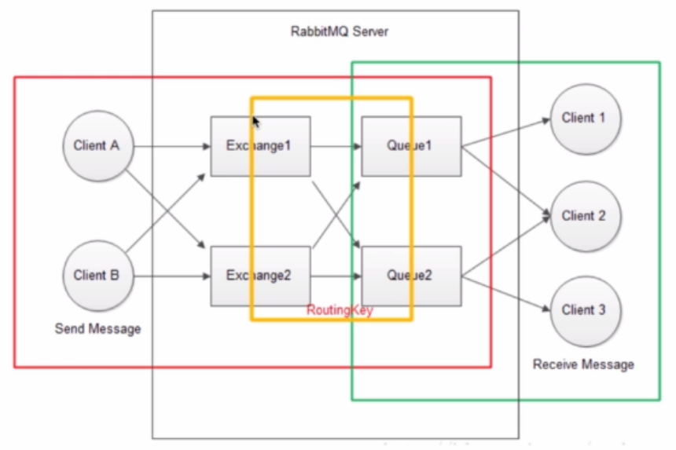

## 高并发处理的思路及手段 


### 1. 高并发场景之扩容

占用内存大小取决于工作内存里变量的多少，单个线程占用内存通常不会很大，但随着并发线程不断增加占用的内存也随之增加，最简答的扩容方法是增加系统内存(垂直扩容)，这样应用能够分配更多的内存来支撑并发的压力。复杂一点可能会考虑增加一台服务器分担一些压力(水平扩容)。

**垂直扩容**

在垂直扩展模型中，想要增加系统负荷就意味着要在系统现有的部件上下工夫，即通过提高系统部件的能力来实现。通过提高某个部件的性能（或速度）来提高负载能力的。（如数据库增加缓存处理，增加服务器CPU性能等） 。

**例子：**我们假设有3辆卡车，每辆车一次可以运25根木材，计算花费1小时的情况下可以运送到指定地点等待处理的木材数量。通过这些数字我们可以算出我们系统最大的负荷量：
$$
3辆卡车 * 25根木材 * 1小时=75根木材／小时
$$
如果我们选择垂直扩展模型，那么我们将怎么做来使我们每小时可以处理150根木材？我们需要至少做以下两件事中的一件：

1. 使每辆卡车的运输量增加一倍（50棵树每小时）：3辆卡车 * 50棵树 * 1小时 = 150棵树／每小时。
2. 使每辆卡车的运输时间减半（每辆卡车30分钟）：3辆卡车 * 25棵树 * 30分钟 = 150棵树／每小时。

我们没有增加系统的成员数，但是我们通过增加系统成员的生产效率来获得期望的负荷量。

**水平扩容**

在水平扩展模型中，我们不是通过增加单个系统成员的负荷而是简单的通过增加更多的系统成员来实现。 通过增加更多的系统成员（性能或速度一样）来提高负载能力的（如服务器集群）。

**例子：**在以上运送木材的例子中，通过增加卡车的数量来运送木材，因此当我们需要将负荷从75棵树每小时增加到150棵树每小时，那么只需要增加3辆卡车。

为什么数据库是最边缘的？因为数据库通常是共享资源，是几乎所有请求最终的连接点。

- **读操作扩展**

  如 果你的系统读操作非常多，那么通过关系型数据库如mysql或者PostgreSql来垂直扩展数据存储是一个不错的选择。结合你的关系型数据库通过使用 memcached或者CDN来构建一个健壮的缓存系统，那么你的系统将非常容易扩展。在这种模式中，如果数据库超负荷运行，那么将更多的数据放入缓存中来缓解系统的读压力。当没有更多的数据往缓存中放时，可以更换更快的数据存储硬件或者买更多核的处理器来获取更多的运行通道。摩尔定律使通过这种方法来垂直扩展变得和购买更好的硬件一样简单。

- **写操作扩展**

  如 果你的系统写操作非常多，那么你可能更希望考虑使用可水平扩展的数据存储方式，比如Riak，Cassandra或者HBase。和大多数关系型数据管理 系统不同，这种数据存储随着增长增加更多的节点。由于你的系统大部分时间是在写入，所以缓存曾并不能像在读操作比较频繁的系统中起到那么大作用。很多写频 繁的系统一开始使用垂直扩展的方式，但是很快发现并不能根本解决问题。为什么？因为硬盘数和处理器数在某一点达到平衡，在这个边界上再增加一个处理器或者 一个硬盘都会是每秒钟的I/O操作数成指数性增长。相反，如果对写频繁的系统采取水平扩展策略，那么你将达到一个拐点，在这个拐点之后如果在增加一个节点都远比使用更多的硬盘来的实惠。

**扩容引入的开销**

每种扩展策略下预想不到的开销。采用垂直扩展的系统将开销凡在单独的组件上。当我们去提升系统负荷时，这些单独的组件需要在管理上花费更多。拿我们运送木材的例子来说，如果需要使每辆卡车的货运量翻倍，那么我们需要更宽、更长、或者更高的车厢。也许有的路因为桥的高度对车辆高度有要求， 或者基于巷子宽度车宽不能太大，又或者由于机动车安全驾驶要求车厢不能太长。这里的限制就是对单个卡车做垂直扩展做的什么程度。同样的概念延伸到服务器垂直扩展：更多的处理器要求更多的空间，进而要求更多的服务器存储架。

采用水平扩展的系统将额外的开销放在系统中连接起来的共享组件上。当我们去提升系统负荷时，共享的开销和新增加的成员之间的协调性有关。在我们运送木材的例子中，当我们在路上增加更多卡车时，那么路就是共享资源也就 成了约束条件。这条路上适合同时跑多少量卡车？我们是否有足够的安全缓冲区使得所有的车可以同时装运木材？如果再来看我们水平扩展的数据库系统，那么经常 被忽略的开销就是服务器同时连接时的网络开销(译者注：网络为各个系统的共享资源)。当你为系统增加更多的节点时，共享资源的负荷也就越来越重，通常呈非线性改变。

### 2. 高并发场景之缓存

**使用缓存的场景** ：一般来说，现在网站或者app的整体流程可以用下图来表示。用户从浏览器或者app 发起请求 > 到网络转发 > 到服务 > 再到数据库，接着再返回把请求内容呈现给用户。但是随着访问量的增大 ，访问内容的增加，应用需要支撑更多的并发，同时应用服务器和数据库服务器所要做的计算越来越多，但是应用服务器的资源有限，文件内容的读写也是有限的 。 如何利用有限的资源提高更大的吞吐量 ，那就是**引入缓存** ，打破标准的流程，在每个环节中 ，请求可以从缓存中直接获取目标数据并返回 ，从而减少应用的计算量，提升应用的响应速度 ，让有限的资源服务更多的用户。如下图，缓存可以出现在 1 ~ 4 的各个环节中。


#### 2.1 缓存的特征、场景及组件

**缓存的特征**

- 命中率 = 命中数 / (命中数+ 没有命中数) 
  命中率越高 ，说明使用缓存的收益越好 ，应用性能越好，响应的时间越短 ，吞吐量越高 ,抗并发的能力越强
- 最大元素(空间) 
  代表缓存中可以存放的最大元素的数量 ，一旦缓存中元素的数量超过最大空间 ,是指缓存数据所在空间超过最大支持的空间，将会触发清空策略 . 根据不同的场景合理的设置最大元素值，可以在一定程度上提高缓存的命中率，从而更有效的使用缓存 .
- 清空策略
  - `FIFO` `first in first out`先进先出 
    最先进入缓存空间的数据 ，在缓存不够的情况下，或者缓存数量超过最大元素的情况下 ,会被优先清除掉 ，以腾出空间缓存新的数据，这个清除算法主要是比较缓存元素的创建时间.在数据实时性要求场景下可以使用该策略 ,优先保证最新数据可用 .
  - `LFU` `least frequently used`最少使用策略 
    该策略是根据元素的使用次数来判断 ，无论缓存元素是否过期 ，清除使用次数最少的元素来释放空间.这个策略的算法主要比较元素的命中次数.在保证高频数据有效性的场景下 ，可以使用此类策略.
  - `LRU` `Least Recently Used` 最近最少使用策略 
    它是指无论是否过期 ，根据元素最后一次被使用的时间戳 ，清除最远使用时间戳的元素 ，这个策略的算法主要比较元素的最近一次被 `get`使用时间，在热点数据的场景下较适用 ，优先保证热点数据的有效性 .
  - 过期时间 
    根据过期时间来判断 ，清理过期时间最长的元素，还可以根据过期时间来判读，来清理最近要过期的元素 .
  - 随机 
    随机清理元素

**缓存命中率的影响因素**

- 业务场景和业务需求 
  缓存适合 **读多写少** 的业务场景，否则使用其意义不大,命中率会很低。业务需求也决定了对实时性的要求，直接影响到缓存的过期时间和更新策略,实时性要求越低就越适合缓存。在相同 key 和相同请求数的情况下 ,缓存的时间越长，命中率就会越高。

- 缓存的设计(粒度和策略) 
  通常情况下 ，缓存的粒度越小，命中率就会越高。

- 缓存的容量和基础设施 
  缓存的容量有限，就容易引起缓存的失效和淘汰。目前多少的缓存框架都使用了 `LRU` 这个算法。同时缓存的技术选型也是很重要的，比如采用应用内置的本地缓存,就容易出现单机瓶颈 ，而采用分布式缓存 ,它就更容易扩展，所以要做好系统容量的规划 ,并考虑是否可以扩展 ，另外不同的缓存中间件，其效率和稳定性都是有差异的.除此之外，还有其他的一些会影响缓存命中率，比如某个缓存节点挂掉的时候，要避免缓存失效，并最大程度的降低影响。业内比较典型的做法就是 **一致性hash算法** ，或者通过节点冗余的方式来避免这个问题。

  有些朋友可能还有这样的理解误区：既然也无需求对于业务实时性要求很高，而缓存时间又会影响缓存命中率，那么系统就不要使用缓存了！其实忽略一个重要因素**并发**，通常在相同缓存时间和key的情况下，并发越高**缓存的收益**就越高，即使缓存的时间很短。

**如何提高缓存命中率**

从应用架构的角度 ，要尽可能的使得应用通过缓存来直接获得数据并避免缓存失效.当然这需要对业务需求、缓存粒度、缓存策略、技术选型等各个方面通盘考虑权衡的 ，尽可能聚焦在高频访问且时效性不高的热点业务上 ，通过缓存预加载，增加存储容量，调整缓存粒度，更新缓存等手段来提高命中率。对于时效性很高或缓存空间有限的情况下，内容跨度越大、访问很随机且访问量不高的应用来说，缓存命中率可能长期都很低，预热后的缓存还没来得及访问就可能过期了。

**缓存的应用场景和分类场景**

目前的应用服务框架中 ，是根据缓存与应用的耦合度分为**本地缓存**和分**布式缓存**。

* **本地缓存**  本地缓存是指缓存中的应用组件，它最大的优点是应用和缓存是在同一个进程的内部，请求缓存非常的快速，没有过多的网络开销等。在单应用中，不需要集群支持 各节点不需要互相通知的情景下，适合使用本地缓存。 它的**缺点**也是显而易见的，由于缓存和应用耦合度较高，多个应用无法共享缓存，各个应用都需要单独维护自己的缓存，对内存也是一种浪费，资源能节省就节省。在实际实现中 ，都是同成员变量，局部变量，静态变量来实现，也还有一些框架 比如 `Guava Cache`。
* **分布式缓存**  它是指应用分离的缓存组件或服务，最大的优点是自身是一个独立的应用，与本地应用是隔离的，多个应用可以直接共享缓存，比如常用的`Memcache、Redis`

https://www.cnblogs.com/bethunebtj/p/9159914.html

https://www.cnblogs.com/dinglang/p/6133501.html

https://blog.csdn.net/qq_32447301/article/details/79673341


#### 2.2 本地缓存之Guava Cache

Guava Cache是在内存中缓存数据，相比较于数据库或redis存储，访问内存中的数据会更加高效。Guava官网介绍，下面的这几种情况可以考虑使用Guava Cache：

1. 愿意消耗一些内存空间来提升速度。
2. 预料到某些键会被多次查询。
3. 缓存中存放的数据总量不会超出内存容量。

所以，可以将程序频繁用到的少量数据存储到Guava Cache中，以改善程序性能。

guava cache是一个本地缓存。有以下优点：

- 很好的封装了get、put操作，能够集成数据源。
  一般我们在业务中操作缓存，都会操作缓存和数据源两部分。如：put数据时，先插入DB，再删除原来的缓存；ge数据时，先查缓存，命中则返回，没有命中时，需要查询DB，再把查询结果放入缓存中。 guava cache封装了这么多步骤，只需要调用一次get/put方法即可。
- 线程安全的缓存，与ConcurrentMap相似，但前者增加了更多的元素失效策略，后者只能显示的移除元素。
- Guava Cache提供了三种基本的缓存回收方式：基于容量回收、定时回收和基于引用回收。定时回收有两种：按照写入时间，最早写入的最先回收；按照访问时间，最早访问的最早回收。
- 监控缓存加载/命中情况。

Guava Cache的架构设计灵感ConcurrentHashMap，在简单场景中可以通过HashMap实现简单数据缓存，但如果要实现缓存随时间改变、存储的数据空间可控则缓存工具还是很有必要的。下图为Guava Cache的结构图，它继承了ConcurrentHashMap的思路，使用多个Segment的细粒度锁在保证线程安全的同时支持高并发场景的需求，Cache存储的是键值对的集合，不同时是还需要处理缓存过期、动态加载等算法逻辑，需要额外信息实现这些操作，对此根据面向对象的思想，还需要做方法与数据的关联性封装，主要实现的缓存功能有：自动将节点加载至缓存结构中，当缓存的数据超过最大值时，使用LRU算法替换；它具备根据节点上一次被访问或写入时间计算缓存过期机制，缓存的key被封装在WeakReference引用中，缓存的value被封装在WeakReference或SoftReference引用中；还可以统计缓存使用过程中的命中率、异常率和命中率等统计数据。


**构建缓存对象**

接口Cache代表一块缓存，声明如下：

```java
public interface Cache<K, V> {
    //获取缓存中key对应的value，如果缓存没命中，返回null
    V getIfPresent(Object key);
    // 获取key对应的value，若缓存中没有，则调用LocalCache的load方法，从数据源中加载，并缓存
    V get(K key, Callable<? extends V> valueLoader) throws ExecutionException;
    // 批量操作，相当于循环调用get(key)方法
    ImmutableMap<K, V> getAllPresent(Iterable<?> keys);
    //  if cached, return; otherwise create, cache , and return
    void put(K key, V value);
    void putAll(Map<? extends K, ? extends V> m);
    //删除缓存
    void invalidate(Object key);
    // 清除所有的缓存
    void invalidateAll(Iterable<?> keys);
    void invalidateAll();
    // 获取缓存中元素的大概个数。为什么是大概呢？元素失效之时，并不会实时的更新size，所以这里的size可能会包含失效元素。
    long size();
    // 缓存的状态数据包括(未)命中个数，加载成功/失败个数，总共加载时间，删除个数等。
    CacheStats stats();
    // 将缓存存储到一个线程安全的map中。
    ConcurrentMap<K, V> asMap();
    void cleanUp();
}
```

可通过CacheBuilder类构建一个缓存对象，CacheBuilder类采用builder设计模式，它的每个方法都返回CacheBuilder本身，直到build方法被调用。构建一个缓存对象代码如下

```java
public class StudyGuavaCache {
    public static void main(String[] args) {
        Cache<String,String> cache = CacheBuilder.newBuilder()
            //设置cache的初始大小为10，要合理设置该值
		   .initialCapacity(10)
            //设置并发数为5，即同一时间最多只能有5个线程往cache执行写入操作
		   .concurrencyLevel(5)
            //设置cache中的数据在写入之后的存活时间为10秒
		   .expireAfterWrite(10, TimeUnit.SECONDS)
            .build();
        cache.put("word","Hello Guava Cache");
        System.out.println(cache.getIfPresent("word"));
    }
}
```

上面的代码通过**CacheBuilder.newBuilder().build()**这句代码创建了一个Cache缓存对象，并在缓存对象中存储了*key*为word，*value*为Hello Guava Cache的一条记录。可以看到Cache非常类似于JDK中的Map，但是相比于Map，Guava Cache提供了很多更强大的功能。

**设置最大存储**

Guava Cache可以在构建缓存对象时指定缓存所能够存储的最大记录数量。当Cache中的记录数量达到最大值后再调用put方法向其中添加对象，Guava会先从当前缓存的对象记录中选择一条删除掉，腾出空间后再将新的对象存储到Cache中。

1. 基于容量的清除(size-based eviction)，通过CacheBuilder.maximumSize(long)方法可以设置Cache的最大容量数，当缓存数量达到或接近该最大值时，Cache将清除掉那些最近最少使用的缓存。
2. 基于权重的清除，使用CacheBuilder.weigher(Weigher)指定一个权重函数，并且用CacheBuilder.maximumWeight(long)指定最大总重。比如每一项缓存所占据的内存空间大小都不一样，可以看作它们有不同的“权重”（weights）。

```java
public class StudyGuavaCache {
    public static void main(String[] args) {
        Cache<String,String> cache = CacheBuilder.newBuilder()
                .maximumSize(2)
                .build();
        cache.put("key1","value1");
        cache.put("key2","value2");
        cache.put("key3","value3");
        System.out.println("第一个值：" + cache.getIfPresent("key1"));
        System.out.println("第二个值：" + cache.getIfPresent("key2"));
        System.out.println("第三个值：" + cache.getIfPresent("key3"));
    }
}
```

上面代码在构造缓存对象时，通过CacheBuilder类的maximumSize方法指定Cache最多可以存储两个对象，然后调用Cache的put方法向其中添加了三个对象。程序执行结果如下图所示，可以看到第三条对象记录的插入，导致了第一条对象记录被删除。


**设置过期时间**

在构建Cache对象时，可以通过CacheBuilder类的expireAfterAccess和expireAfterWrite两个方法为缓存中的对象指定过期时间，过期的对象将会被缓存自动删除。

1. expireAfterWrite方法指定对象被写入到缓存后多久过期。
2. expireAfterAccess指定对象多久没有被访问后过期。

```java
public class StudyGuavaCache {
    public static void main(String[] args) throws InterruptedException {
        Cache<String,String> cache = CacheBuilder.newBuilder()
                .maximumSize(2)
                .expireAfterWrite(3,TimeUnit.SECONDS)
                .build();
        cache.put("key1","value1");
        int time = 1;
        while(true) {
            System.out.println("第" + time++ + "次取到key1的值为：" + cache.getIfPresent("key1"));
            Thread.sleep(1000);
        }
    }
}
```

上面的代码在构造Cache对象时，通过CacheBuilder的expireAfterWrite方法指定put到Cache中的对象在3秒后会过期。在Cache对象中存储一条对象记录后，每隔1秒读取一次这条记录。程序运行结果如下图所示，可以看到，前三秒可以从Cache中获取到对象，超过三秒后，对象从Cache中被自动删除。


下面是expireAfterAccess的例子

```java
public class StudyGuavaCache {
    public static void main(String[] args) throws InterruptedException {
        Cache<String,String> cache = CacheBuilder.newBuilder()
                .maximumSize(2)
                .expireAfterAccess(3,TimeUnit.SECONDS)
                .build();
        cache.put("key1","value1");
        int time = 1;
        while(true) {
            Thread.sleep(time*1000);
            System.out.println("睡眠" + time++ + "秒后取到key1的值为：" + cache.getIfPresent("key1"));
        }
    }
}
```

通过CacheBuilder的expireAfterAccess方法指定Cache中存储的对象如果超过3秒没有被访问就会过期。while中的代码每sleep一段时间就会访问一次Cache中存储的对象key1，每次访问key1之后下次sleep的时间会加长一秒。程序运行结果如下图所示，从结果中可以看出，当超过3秒没有读取key1对象之后，该对象会自动被Cache删除。


也可以同时用expireAfterAccess和expireAfterWrite方法指定过期时间，这时只要对象满足两者中的一个条件就会被自动过期删除。

注意：缓存项只有在被检索时才会真正刷新（如果CacheLoader.refresh实现为异步，那么检索不会被刷新拖慢）。因此，如果你在缓存上同时声明expireAfterWrite和refreshAfterWrite，缓存并不会因为刷新盲目地定时重置，如果缓存项没有被检索，那刷新就不会真的发生，缓存项在过期时间后也变得可以回收。

**弱引用**

通过使用弱引用的键、或弱引用的值、或软引用的值，Guava Cache可以把缓存设置为允许垃圾回收：

- CacheBuilder.weakKeys()：使用弱引用存储键。当键没有其它（强或软）引用时，缓存项可以被垃圾回收。因为垃圾回收仅依赖恒等式，使用弱引用键的缓存用而不是equals比较键。 
-  CacheBuilder.weakValues()：使用弱引用存储值。当值没有其它（强或软）引用时，缓存项可以被垃圾回收。因为垃圾回收仅依赖恒等式，使用弱引用值的缓存用而不是equals比较值。 
-  CacheBuilder.softValues()：使用软引用存储值。软引用只有在响应内存需要时，才按照全局最近最少使用的顺序回收。考虑到使用软引用的性能影响，我们通常建议使用更有性能预测性的缓存大小限定（见上文，基于容量回收）。使用软引用值的缓存同样用==而不是equals比较值。

可以通过weakKeys和weakValues方法指定Cache只保存对缓存记录key和value的弱引用。这样当没有其他强引用指向key和value时，key和value对象就会被垃圾回收器回收。

```java
public class StudyGuavaCache {
    public static void main(String[] args) throws InterruptedException {
        Cache<String,Object> cache = CacheBuilder.newBuilder()
                .maximumSize(2)
                .weakKeys()
                .weakValues()
                .build();
        Object value = new Object();
        cache.put("key1",value);

        value = new Object();//原对象不再有强引用
        System.gc();
        System.out.println(cache.getIfPresent("key1"));
    }
}
```

上面代码的打印结果是null。构建Cache时通过weakValues方法指定Cache只保存记录值的一个弱引用。当给value引用赋值一新的对象之后，就不再有任何一个强引用指向原对象。System.gc()触发垃圾回收后，原对象就被清除了。

**清理什么时候发生**

使用CacheBuilder构建的缓存不会”自动”执行清理和回收工作，也不会在某个缓存项过期后马上清理，也没有诸如此类的清理机制。相反，它会在写操作时顺带做少量的维护工作，或者偶尔在读操作时做——如果写操作实在太少的话。  

这样做的原因在于：如果要自动地持续清理缓存，就必须有一个线程，这个线程会和用户操作竞争共享锁。此外，某些环境下线程创建可能受限制，这样CacheBuilder就不可用了。 

 相反，我们把选择权交到你手里。如果你的缓存是高吞吐的，那就无需担心缓存的维护和清理等工作。如果你的 缓存只会偶尔有写操作，而你又不想清理工作阻碍了读操作，那么可以创建自己的维护线程，以固定的时间间隔调用Cache.cleanUp()。ScheduledExecutorService可以帮助你很好地实现这样的定时调度。

**显示清除**

可以调用Cache的invalidateAll或invalidate方法显示删除Cache中的记录。invalidate方法一次只能删除Cache中一个记录，接收的参数是要删除记录的key。invalidateAll方法可以批量删除Cache中的记录，当没有传任何参数时，invalidateAll方法将清除Cache中的全部记录。invalidateAll也可以接收一个Iterable类型的参数，参数中包含要删除记录的所有key值。下面代码对此做了示例。

```java
public class StudyGuavaCache {
    public static void main(String[] args) throws InterruptedException {
        Cache<String,String> cache = CacheBuilder.newBuilder().build();
        Object value = new Object();
        cache.put("key1","value1");
        cache.put("key2","value2");
        cache.put("key3","value3");

        List<String> list = new ArrayList<String>();
        list.add("key1");
        list.add("key2");

        cache.invalidateAll(list);//批量清除list中全部key对应的记录
        System.out.println(cache.getIfPresent("key1"));
        System.out.println(cache.getIfPresent("key2"));
        System.out.println(cache.getIfPresent("key3"));
    }
}
```

代码中构造了一个集合list用于保存要删除记录的key值，然后调用invalidateAll方法批量删除key1和key2对应的记录，只剩下key3对应的记录没有被删除。

**移除监听器**

可以为Cache对象添加一个移除监听器，这样当有记录被删除时可以感知到这个事件。

```java
public class StudyGuavaCache {
    public static void main(String[] args) throws InterruptedException {
        RemovalListener<String, String> listener = new RemovalListener<String, String>() {
            public void onRemoval(RemovalNotification<String, String> notification) {
                System.out.println("[" + notification.getKey() + ":" + notification.getValue() + "] is removed!");
            }
        };
        Cache<String,String> cache = CacheBuilder.newBuilder()
                .maximumSize(3)
                .removalListener(listener)
                .build();
        Object value = new Object();
        cache.put("key1","value1");
        cache.put("key2","value2");
        cache.put("key3","value3");
        cache.put("key4","value3");
        cache.put("key5","value3");
        cache.put("key6","value3");
        cache.put("key7","value3");
        cache.put("key8","value3");
    }
}
```

removalListener方法为Cache指定了一个移除监听器，这样当有记录从Cache中被删除时，监听器listener就会感知到这个事件。程序运行结果如下图所示。


警告：默认情况下，监听器方法是在移除缓存时同步调用的。因为缓存的维护和请求响应通常是同时进行的，代价高昂的监听器方法在同步模式下会拖慢正常的缓存请求。在这种情况下，你可以使用RemovalListeners.asynchronous(RemovalListener, Executor)把监听器装饰为异步操作。

**自动加载**

Cache的get方法有两个参数，第一个参数是要从Cache中获取记录的key，第二个记录是一个Callable对象。当缓存中已经存在key对应的记录时，get方法直接返回key对应的记录。如果缓存中不包含key对应的记录，Guava会启动一个线程执行Callable对象中的call方法，call方法的返回值会作为key对应的值被存储到缓存中，并且被get方法返回。下面是一个多线程的例子：

```java
public class StudyGuavaCache {
    private static Cache<String,String> cache = CacheBuilder.newBuilder()
            .maximumSize(3)
            .build();
    public static void main(String[] args) throws InterruptedException {

        new Thread(new Runnable() {
            public void run() {
                System.out.println("thread1");
                try {
                    String value = cache.get("key", new Callable<String>() {
                        public String call() throws Exception {
                            System.out.println("load1"); //加载数据线程执行标志
                            Thread.sleep(1000); //模拟加载时间
                            return "auto load by Callable";
                        }
                    });
                    System.out.println("thread1 " + value);
                } catch (ExecutionException e) {
                    e.printStackTrace();
                }
            }
        }).start();
        new Thread(new Runnable() {
            public void run() {
                System.out.println("thread2");
                try {
                    String value = cache.get("key", new Callable<String>() {
                        public String call() throws Exception {
                            System.out.println("load2"); //加载数据线程执行标志
                            Thread.sleep(1000); //模拟加载时间
                            return "auto load by Callable";
                        }
                    });
                    System.out.println("thread2 " + value);
                } catch (ExecutionException e) {
                    e.printStackTrace();
                }
            }
        }).start();
    }
}
```

这段代码中有两个线程共享同一个Cache对象，两个线程同时调用get方法获取同一个key对应的记录。由于key对应的记录不存在，所以两个线程都在get方法处阻塞。此处在call方法中调用Thread.sleep(1000)模拟程序从外存加载数据的时间消耗。代码的执行结果如下图：


从结果中可以看出，虽然是两个线程同时调用get方法，但只有一个get方法中的Callable会被执行(没有打印出load2)。Guava可以保证当有多个线程同时访问Cache中的一个key时，如果key对应的记录不存在，Guava只会启动一个线程执行get方法中Callable参数对应的任务加载数据存到缓存。当加载完数据后，任何线程中的get方法都会获取到key对应的值。

**统计信息**

可以对Cache的命中率、加载数据时间等信息进行统计。在构建Cache对象时，可以通过CacheBuilder的recordStats方法开启统计信息的开关。开关开启后Cache会自动对缓存的各种操作进行统计，调用Cache的stats方法可以查看统计后的信息。

```java
public class StudyGuavaCache {
    public static void main(String[] args) throws InterruptedException {
        Cache<String,String> cache = CacheBuilder.newBuilder()
                .maximumSize(3)
                .recordStats() //开启统计信息开关
                .build();
        cache.put("key1","value1");
        cache.put("key2","value2");
        cache.put("key3","value3");
        cache.put("key4","value4");

        cache.getIfPresent("key1");
        cache.getIfPresent("key2");
        cache.getIfPresent("key3");
        cache.getIfPresent("key4");
        cache.getIfPresent("key5");
        cache.getIfPresent("key6");

        System.out.println(cache.stats()); //获取统计信息
    }
}
```

程序执行结果如下图所示：


这些统计信息对于调整缓存设置是至关重要的，在性能要求高的应用中应该密切关注这些数据

**Loading Cache**

LoadingCache是Cache的子接口，相比较于Cache，当从LoadingCache中读取一个指定key的记录时，如果该记录不存在，则LoadingCache可以自动执行加载数据到缓存的操作。LoadingCache接口的定义如下：

```java
public interface LoadingCache<K, V> extends Cache<K, V>, Function<K, V> {
    V get(K key) throws ExecutionException;
    V getUnchecked(K key);
    ImmutableMap<K, V> getAll(Iterable<? extends K> keys) throws ExecutionException;
    V apply(K key);
    void refresh(K key);
    @Override
    ConcurrentMap<K, V> asMap();
}
```

与构建Cache类型的对象类似，LoadingCache类型的对象也是通过CacheBuilder进行构建，不同的是，在调用CacheBuilder的build方法时，必须传递一个CacheLoader类型的参数，CacheLoader的load方法需要我们提供实现。当调用LoadingCache的get方法时，如果缓存不存在对应key的记录，则CacheLoader中的load方法会被自动调用从外存加载数据，load方法的返回值会作为key对应的value存储到LoadingCache中，并从get方法返回。

```java
public class StudyGuavaCache {
    public static void main(String[] args) throws ExecutionException {
        CacheLoader<String, String> loader = new CacheLoader<String, String> () {
            public String load(String key) throws Exception {
                Thread.sleep(1000); //休眠1s，模拟加载数据
                System.out.println(key + " is loaded from a cacheLoader!");
                return key + "'s value";
            }
        };
        LoadingCache<String,String> loadingCache = CacheBuilder.newBuilder()
                .maximumSize(3)
                .build(loader);//在构建时指定自动加载器

        loadingCache.get("key1");
        loadingCache.get("key2");
        loadingCache.get("key3");
    }
}
```

程序执行结果如下图所示：


>请一定要记住GuavaCache的实现代码中没有启动任何线程！！Cache中的所有维护操作，包括清除缓存、写入缓存等，都是通过调用线程来操作的。这在需要低延迟服务场景中使用时尤其需要关注，可能会在某个调用的响应时间突然变大。
>
>GuavaCache毕竟是一款面向本地缓存的，轻量级的Cache，适合缓存少量数据。如果你想缓存上千万数据，可以为每个key设置不同的存活时间，并且高性能，那并不适合使用GuavaCache

#### 2.3 本地缓存之[Caffeine Cache](https://github.com/ben-manes/caffeine)

在本文中，我们来看看[Caffeine ](https://github.com/ben-manes/caffeine)— 一个高性能的 Java 缓存库。缓存和 Map 之间的一个根本区别在于缓存可以回收存储的 item。驱逐策略为在指定时间删除哪些对象。此策略直接影响缓存的命中率 — 缓存库的一个重要特征。Caffeine 因使用 Window TinyLfu 驱逐策略，提供了一个近乎最佳的命中率。

##### 2.3.1 **Window TinyLfu**

下面列举下常见的三种 FIFO、LRU、LFU淘汰算法

1. FIFO：先进先出，在这种淘汰算法中，先进入缓存的会先被淘汰，会导致命中率很低。
2. LRU：最近最少使用算法，每次访问数据都会将其放在我们的队尾，如果需要淘汰数据，就只需要淘汰队首即可。仍然有个问题，如果有个数据在 1 个小时的前 59 分钟访问了 1 万次(可见这是个热点数据)，再后 1 分钟没有访问这个数据，但是有其他的数据访问，就导致了我们这个热点数据被淘汰。
3. LFU：最近最少频率使用，利用额外的空间记录每个数据的使用频率，然后选出频率最低进行淘汰。这样就避免了 LRU 不能处理时间段的问题。

上述三种淘汰策略，实现成本是一个比一个高，同样的命中率也是一个比一个好。Guava Cache 的功能的确是很强大，满足了绝大多数人的需求，但是其本质上还是 LRU 的一层封装，所以在众多其他较为优良的淘汰算法中就相形见绌了。

**LFU的局限性**：在 LFU 中只要数据访问模式的概率分布随时间保持不变时，其命中率就能变得非常高。比如有部新剧出来了，我们使用 LFU 给他缓存下来，这部新剧在这几天大概访问了几亿次，这个访问频率也在我们的 LFU 中记录了几亿次。但是新剧总会过气的，比如一个月之后这个新剧的前几集其实已经过气了，但是他的访问量的确是太高了，其他的电视剧根本无法淘汰这个新剧，所以在这种模式下是有局限性。

**LRU的优点和局限性**：LRU可以很好的应对突发流量的情况，因为他不需要累计数据频率。但LRU通过历史数据来预测未来是局限的，它会认为最后到来的数据是最可能被再次访问的，从而给与它最高的优先级。

所以W-TinyLFU结合了LRU和LFU，以及其他的算法的一些特点。

[Window TinyLFU](https://arxiv.org/pdf/1512.00727.pdf)

W-TinyLFU算法将sketch作为过滤器，当新来的数据比要驱逐的数据高频时，这个数据才会被缓存接纳。这个许可窗口给予每个数据项积累热度的机会，而不是立即过滤掉。这避免了持续的未命中，特别是在突然流量暴涨的的场景中，一些短暂的重复流量就不会被长期保留。为了刷新历史数据，一个时间衰减进程被周期性或增量的执行，给所有计数器减半。


对于长期保留的数据，W-TinyLFU使用了分段LRU（Segmented LRU，缩写SLRU）策略。起初，一个数据项存储被存储在试用段（probationary segment）中，在后续被访问到时，它会被提升到保护段（protected segment）中（保护段占总容量的80%）。保护段满后，有的数据会被淘汰回试用段，这也可能级联的触发试用段的淘汰。这套机制确保了访问间隔小的热数据被保存下来，而被重复访问少的冷数据则被回收。

**频率几率**

现代缓存扩展了对历史数据的使用，结合就近程度（recency）和访问频次（frequency）来更好的预测数据。其中一种保留历史信息的方式是使用popularity sketch（一种压缩、概率性的数据结构）来从一大堆访问事件中定位频繁的访问者。可以参考[CountMin Sketch](http://dimacs.rutgers.edu/~graham/pubs/papers/cmsoft.pdf)算法，它由计数矩阵和多个哈希方法实现。发生一次读取时，矩阵中每行对应的计数器增加计数，估算频率时，取数据对应是所有行中计数的最小值。这个方法让我们从空间、效率、以及适配矩阵的长宽引起的哈希碰撞的错误率上做权衡。


实现的目标是利用有限的空间可以记录随时间变化的访问频率。在 W-TinyLFU 中使用 Count-Min Sketch 记录我们的访问频率，而这个也是布隆过滤器的一种变种。如果需要记录一个值，那我们需要通过多种 hash 算法对其进行处理hash，然后在对应的 hash 算法的记录中+1，为什么需要多种 hash 算法呢？

由于这是一个压缩算法必定会出现冲突，比如我们建立一个 Long 的数组，通过计算出每个数据的 hash 的位置。比如张三和李四，他们俩有可能 hash 值都是相同，比如都是 1 那 Long[1] 这个位置就会增加相应的频率，张三访问 1 万次，李四访问 1 次那 Long[1] 这个位置就是 1 万零 1。


如果取李四的访问评率的时候就会取出是 1 万零 1，但是李四命名只访问了 1 次啊，为了解决这个问题，所以用了多个 hash 算法可以理解为 Long[][] 二维数组的一个概念，比如在第一个算法张三和李四冲突了，但是在第二个，第三个中很大的概率不冲突，比如一个算法大概有 1% 的概率冲突，那四个算法一起冲突的概率是 1% 的四次方。通过这个模式，我们取李四的访问率的时候取所有算法中，李四访问最低频率的次数。所以他的名字叫**Count-Min Sketch**。


做个对比，例如：一个HashMap 来记录这个频率，如果我有100个数据，那这个HashMap就得存储100个这个数据的访问频率。哪怕我这个缓存的容量是1，因为LFU的规则我必须全部记录这 100个数据的访问频率。如果有更多的数据我就有记录更多的。

在Count-Min Sketch中，我这里直接说Caffeine中的实现(在 FrequencySketch这个类中)，如果你的缓存大小是100，他会生成一个 Long 数组大小是和100最接近的 2 的幂的数，也就是 128。而这个数组将会记录我们的访问频率。在Caffeine中它规则频率最大为1515 的二进制位 1111，总共是4位，而 Long 型是 64 位。所以每个Long 型可以放16种算法，但是Caffeine并没有这么做，只用了四种 hash 算法，每个 Long 型被分为四段，每段里面保存的是四个算法的频率。这样做的好处是可以进一步减少 hash 冲突，原先128大小的 hash，就变成了 128X4。


我们的4个段分为 A,B,C,D，而每个段里面的四个算法我们称之为s1,s2,s3,s4。下面举个例子，如果要添加一个访问 50 的数字频率应该怎么做？我们这里用 size=100 来举例。

- 首先确定50这个hash是在哪个段里面，通过hash & 3必定能获得小于4的数字，假设hash & 3=0，那就在A段。
- 对50的hash再用其他hash算法再做一次 hash，得到Long数组的位置。假设用s1算法得到 1，s2算法得到3，s3算法得到4，s4算法得到0。
- 然后在Long[1]的A段里面的s1 位置进行+1，简称 As1加1，然后在3As2加1，在4As3加1，在0As4加1。


这个时候有人会质疑频率最大为 15 的这个是否太小？没关系在这个算法中，比如 size 等于 100，如果他全局提升了 1000 次就会全局除以 2 衰减，衰减之后也可以继续增加，这个算法再 W-TinyLFU 的论文中证明了其可以较好的适应时间段的访问频率。

##### 2.3.2 读写性能

在 Guava Cache 中我们说过其读写操作中夹杂着过期时间的处理，也就是你在一次 put 操作中有可能还会做淘汰操作，所以其读写性能会受到一定影响。Caffeine的确在读写操作上面完爆 Guava Cache，主要是因为在 Caffeine，对这些事件的操作是通过异步操作，它将事件提交至队列，这里的队列的数据结构是RingBuffer。然后会通过默认的 ForkJoinPool.commonPool()，或者自己配置线程池，进行取队列操作，然后在进行后续的淘汰，过期操作。

对于读操作比写操作更加频繁，进一步减少竞争，其为每个线程配备了一个 RingBuffer：


##### 2.3.3 淘汰策略

在 Caffeine 所有的数据都在 ConcurrentHashMap 中，这个和 Guava Cache 不同，Guava Cache 是自己实现了个类似 ConcurrentHashMap 的结构。在 Caffeine 中有三个记录引用的 **LRU** 队列：

- **Eden 队列**：在 Caffeine 中规定只能为缓存容量的 %1，如果 size=100，那这个队列的有效大小就等于 1。这个队列中记录的是新到的数据，防止突发流量由于之前没有访问频率，而导致被淘汰。比如有一部新剧上线，在最开始其实是没有访问频率的，防止上线之后被其他缓存淘汰出去，而加入这个区域。伊甸区，最舒服最安逸的区域，在这里很难被其他数据淘汰。
- **Probation 队列**：叫做缓刑队列，在这个队列就代表你的数据相对比较冷，马上就要被淘汰了。这个有效大小为 size 减去 eden 减去 protected。
- **Protected 队列**：在这个队列中，可以稍微放心一下了，你暂时不会被淘汰，但是别急，如果 Probation 队列没有数据了或者 Protected 数据满了，你也将会面临淘汰的尴尬局面。当然想要变成这个队列，需要把 Probation 访问一次之后，就会提升为 Protected 队列。这个有效大小为(size 减去 eden) X 80% 如果 size =100，就会是 79。


- 所有的新数据都会进入 Eden
- Eden 满了，淘汰进入 Probation
- 如果在 Probation 中访问了其中某个数据，则这个数据升级为 Protected
- 如果 Protected 满了又会继续降级为 Probation

对于发生数据淘汰的时候，会从 Probation 中进行淘汰，会把这个队列中的数据队头称为**受害者**，这个队头肯定是最早进入的，按照 LRU 队列的算法的话那它就应该被淘汰，但是在这里只能叫它受害者，这个队列是缓刑队列，代表马上要给它行刑了。这里会取出队尾叫**候选者或攻击者**。这里受害者会和攻击者做 PK，通过我们的 Count-Min Sketch 中的记录的频率数据有以下几个判断：

- 如果攻击者大于受害者，那么受害者就直接被淘汰。

- 如果攻击者<=5，那么直接淘汰攻击者。这个逻辑在他的注释中有解释: 他认为设置一个预热的门槛会让整体命中率更高。

  

- 其他情况，随机淘汰。

##### 2.3.4 Caffeine Cache的使用

https://blog.csdn.net/xiaolyuh123/article/details/78794012

#### 2.4 分布式缓存之Memcache

Memcache是应用比较广泛的开源分布式内存缓存系统产品之一，通过读取内存中数据和对象减少访问数据库的次数，从而提高效率。Memcache是以key-value形式存放的hashmap，本身不提供分布式缓存的解决方案，在服务端Memcache的集群环境实际上就是一个个Memcache服务器的堆积，环境搭建简单。Memcache集群之间是不会通信的，分布式缓存主要是在客户端实现的，通过客户端路由达到分布式解决方案的目的。


客户端做路由的原理非常简单：应用服务器在每一次存储某个Key-Value时，通过某种算法把Key映射到某台服务器上，因此这个Key相关的所有操作都在同一台服务器上完成。一次写入缓存的流程如下：

1. 应用程序输入需要写缓存的数据；
2. API将Key输入路由算法模块，路由算法根据Key和MemCache集群服务器列表得到一台服务器编号；
3. 由服务器编号得到MemCache及其的ip地址和端口号；
4. API调用通信模块和指定编号的服务器通信，将数据写入该服务器，完成一次分布式缓存的写操作；

一个大型服务 常常拥有上百个Memcached实例。而在这上百个Memcached实例中所存储的数据则不尽相同。由于这种数据的异构性，我们需要在访问由 Memcached所记录的信息之前决定在该服务端缓存系统中到底由哪个Memcached实例记录了我们所想要访问的数据

**两阶段哈希(Two-stage Hash)** Memcached就像一个巨大的、存储了很多<key,value>对的哈希表。通过key，可以存储或查询任意的数据。 客户端可以把数据存储在多台memcached上。当查询数据时，客户端首先参考节点列表计算出key的哈希值（**阶段一哈希**），进而选中一个节点；客户端将请求发送给选中的节点，然后memcached节点通过一个内部的哈希算法（**阶段二哈希**），查找真正的数据（item）并返回给客户端。**两阶段哈希好处**是每个Memcached服务实例都是独立的，而彼此之间并没有任何交互，就省略和很多不必要的功能逻辑例如：节点间数据同步等；同时这种轻量级的架构可以简化很多操作，如节点失效时仅仅需要一个新的Memcache节点代替老节点即可；并且对缓存进行扩容时只需要添加额外的服务并修改客户端配置。

**Memcache每条记录由四部分组成**：记录的键、有效期、可选标记和表示记录内容的数据。需要注意的是由于记录内容的中数据并不包含任何数据结构，因此Memcache中所记录的数据是经过序列化后的表示。


**memcache如何支持高并发**？基于多路复用I/O的消息通知模式，采用libevent库实现（[C10K Problem](http://www.kegel.com/c10k.html#top)），不会阻塞用户连接，同时Memcache采用多线程机制，可以同时处理多个请求，线程数一般为CPU核数。

##### 2.4.1 内存管理

Memcache是如何对这些缓存数据的生存期进行管理，包括缓存过期、空间不够用时的替换算法等。下面介绍Memcache的内存管理模型，**内存管理算法**所最需要考虑的问题就是**内存碎片化 **，即在长时间地分配及回收之后，被系统所使用的内存将趋向于散落在不连续的空间中，使得系统很难找到连续内存空间，一方面增大了内存分配失败的概率，另一方面也使得内存分配工作变得更为复杂，降低了运行效率。

为了解决这个问题，Memcached使用了一种叫Slab的结构。在该分配算法中，内存将按照1MB的大小划分为页，而该页内存则会继续被分割为一系列具有相同大小的内存块，如下图所示：


Memcached并不是直接根据需要记录的数据的大小来直接分配相应大小的内存，在一条新的记录到来时，Memcached会首先检查该记录的大小，并根据记录的大小选择记录所需要存储到的Slab类型，Memcache检查内部包含该类型的Slab，如果这些Slab中有空余的块，那么Memcached就会使用该块记录该条信息。如果已经没有Slab拥有空闲的具有合适大小的块，那么Memcached就会创建一个新的页，并将该页按照目标Slab的类型进行划分。

一个需要考虑的特殊情况就是对记录的更新。在对一个记录进行更新的时候，记录的大小可能会发生变化。在这种情况下，其所对应的Slab类型也可能会发生变化。因此在更新时，记录在内存中的位置可能会发生变化。只不过从用户的角度来说，这并不可见。

Memcached使用这种方式来分配内存的好处则在于，其可以降低由于记录的多次读写而导致的碎片化。反过来，由于Memcached是根据记录的大小选择需要插入到的块类型，因此为每个记录所分配的块的大小常常大于该记录所实际需要的内存大小，进而造成了内存的浪费。当然，您可以通过 Memcached的配置文件来指定各个块的大小，从而尽可能地减少内存的浪费。由于默认情况下Memcached中每页的大小为1MB，因此其单个块最大为1MB。除此之外，Memcached还限制每个数据所对应的键的长度不能超过250个字节。

一般来说，Slab中各个块的大小以及块大小的递增倍数可能会对记录所载位置的选择及内存利用率有很大的影响。例如在当前的实现下，各个 Slab中块的大小默认情况下是按照1.25倍的方式来递增的。也就是说，在一个Memcached实例中，某种类型Slab所提供的块的大小是80K， 而提供稍大一点空间的Slab类型所提供的块的大小就将是100K。如果现在我们需要插入一条81K的记录，那么Memcached就会选择具有100K 块大小的Slab，并尝试找到一个具有空闲块的Slab以存入该记录。同时您也需要注意到，我们使用的是100K块大小的Slab来记录具有81K大小的数据，因此记录该数据所导致的内存浪费是19K，即19%的 浪费。而在需要存储的各条记录的大小平均分布的情况下，这种内存浪费的幅度也在9%左右。该幅度实际上取决于我们刚刚提到的各个Slab中块大小的递增倍 数。在Memcached的初始实现中，各个Slab块的递增倍数在默认情况下是2，而不是现在的1.25，从而导致了平均25%左右的内存浪费。

一个值得注意的事情就是，由于Memcached在计算到底哪个服务实例记录了具有特定键的数据时并不会考虑用来组成缓存系统中各个服务器的差异性。如果每个服务器只安装了一个Memcached实例，那么各个Memcached实例所拥有的可用内存将存在着数倍的差异。但是由于各个实例 被选中的概率基本相同，因此具有较大内存的Memcached实例将无法被充分利用。我们可以通过在具有较大内存的服务器上部署多个Memcached实 例来解决这个问题。


**数据淘汰及过期删除原理**：使用LRU算法及数据的过期时间来决定淘汰的数据，同时延迟删除过期item到查找时进行，可以提高memcache的效率，因为不必每时每刻检查过期item，从而提高CPU工作效率。Memcache的过期算法称为**延迟过期(Lazy Expiration)**即当用户从Memcached实例中读取数据的时候，首先通过配置中所设置的过期时间来决定该数据是否过期。如果是，那么在下一次写入数据却没有足够空间的时候，Memcached会选择该过期数据所在的内存块作为新数据的目标地址。如果在写入时没有相应的记录被标记为过期，那么LRU算法才被执行，从而找到最久没有被使用的需要被替换的数据。**LRU是在Slab范围内的，而不是全局的**,假设Memcached缓存系统中的最常用的数据都存储在100K的块中，而该系统中还存在 着另外一种类型的Slab，其块大小是300K，但是存在于其中的数据并不常用。当需要插入一条99K的数据而Memcached已经没有足够的内存再次 分配一个Slab实例的时候，其并不会释放具有300K块大小的Slab，而是在100K块大小的各个Slab中找到需要释放的块，并将新数据添加到该块中。使用Memcached需要注意一下问题：

- Memcached分配出去的pagee一旦被分配不会被回收或者重新分配；
- Memcached申请的内存不会被释放；
- slab空闲的chunk不会借给任何其他slab使用；

##### 2.4.2 Memcache高可用之一致性哈希

一致性哈希算法(Consistent Hashing Algorithm)是一种分布式算法，常用于负载均衡。Memcach client也选择这种算法，解决将key-value均匀分配到众多Memcached server上的问题。它可以取代传统的取模操作，解决了取模操作无法应对增删Memcached Server的问题(增删server会导致同一个key，在get操作时分配不到数据真正存储的server，命中率会急剧下降)。

Memcach服务器端本身不提供分布式cache的一致性，而是由客户端来提供，一致性哈希将整个哈希值空间组织成一个虚拟的圆环，假设某哈希函数H的值空间为$0  \sim 2^{32}-1$（即哈希值是一个32位无符号整形） 整个空间按顺时针方向组织，0和$2^{32}-1$在零点中方向重合。具体在计算一致性hash时采用如下步骤：

1. 求出memcached服务器（节点）的哈希值，并将其配置到0～232的圆（continuum）上；
2. 采用同样的方法求出存储数据的键的哈希值，并映射到相同的圆上；
3. 从数据映射到的位置开始顺时针查找，将数据保存到找到的第一个服务器上。如果超过232仍然找不到服务器，就会保存到第一台memcached服务器上；


Memcached的高可用解决方法就是[Consistent Hashing](http://dl.acm.org/citation.cfm?id=258660)。在该算法的帮助下，Memcached实例数量的变化将只可能导致其中的一小部分键的哈希值发生改变。如下图所示，当一个节点的失效时，将只会导致一部分数据不再在缓存系统中存在，而并没有导致其它实例上所记录的数据的目 标实例发生变化，例如节点node2挂了，则只会影响node2到node3之间的缓存数据，而对于其他缓存来说没有影响。

上述一致性哈希算法存在的一个问题是：在服务节点太少时，容易因为节点分部不均匀而造成**数据倾斜**问题(缓存数据集中存放在某一个台或几台上)，导致该服务器实例和数据库压力过载，当该节点出现问题时丢失的缓存数据量也比较大。**解决方案**是**虚拟节点机制**即对每一个服务节点计算多个哈希，每个计算结果位置都放置一个此服务节点，称为虚拟节点，例如在服务器ip或主机名的后面增加编号实现虚拟节点，可分别计算 “Node A#1”、“Node A#2”、“Node A#3”、“Node B#1”、“Node B#2”、“Node B#3”的哈希值，于是形成六个虚拟节点的环，在进行数据定位时采用同样的方法确定缓存数据的哈希值，但需多一步虚拟节点到实际节点的映射的算法，例如定位到“Node A#1”、“Node A#2”、“Node A#3”三个虚拟节点的数据均定位到Node A上。这样就解决了服务节点少时数据倾斜的问题。通常将虚拟节点数设置为32甚至更大，因此即使很少的服务节点也能做到相对均匀的数据分布。

##### 2.4.3 [Memcache源码分析](https://blog.csdn.net/initphp/article/category/3107757)


#### 2.5 分布式缓存之Redis

==参考：NOSQL 思维导图==

Redis本质上是一个Key-Value类型的内存数据库，很像memcached，整个数据库统统加载在内存当中进行操作，定期通过异步操作把数据库数据flush到硬盘上进行保存。因为是纯内存操作，Redis的性能非常出色，每秒可以处理超过10万次读写操作，是已知性能最快的Key-Value DB。

Redis的出色之处不仅仅是性能，Redis**最大的魅力是支持保存多种数据结构**，此外单个value的最大限制是1GB，不像 memcached只能保存1MB的数据，因此Redis可以用来实现很多有用的功能，比方说用它的List来做FIFO双向链表，实现一个轻量级的高性能消息队列服务，用他的Set可以做高性能的tag系统等。另外Redis也可以对存入的Key-Value设置expire时间，因此也可以被当作一 个功能加强版的memcached来用。**Redis主要缺点**是数据库容量受到物理内存的限制，不能用作海量数据的高性能读写，因此Redis适合的场景主要局限在较小数据量的高性能操作和运算上。

> Redis是单进程的，利用队列技术将并发访问变为串行访问，消除了传统数据库串行控制的开销。
>
> 当key小value大时，使用虚拟内存节省内存空间；当key大时，可以考虑将<key，value>组合为一个新value，然后使用虚拟内存。vm-max-thread参数设置访问swap文件的线程数，若为0所有对swap文件的操作都是串行的。若数据量很大可以考虑分布式！

**Redis的两种持久化：RDB、AOF**

1. **RDB默认开启**，会按照配置的指定时间将内存中的数据快照到磁盘中，创建一个dump.rdb文件，redis启动时再恢复到内存中。redis会单独创建fork()一个子进程，将当前父进程的数据库数据复制到子进程的内存中，然后由子进程写入到临时文件中，持久化的过程结束了，再用这个临时文件替换上次的快照文件，然后子进程退出，内存释放。

   需要注意的是，每次快照持久化都会将主进程的数据库数据复制一遍，导致内存开销加倍，若此时内存不足，则会阻塞服务器运行，直到复制结束释放内存；每次快照持久化都会将内存数据完整写入磁盘一次，所以如果数据量大的话，而且写操作频繁，必然会引起大量的磁盘I/O操作，严重影响性能，并且最后一次持久化后的数据可能会丢失。

2. AOF以日志的形式记录每个写操作（读操作不记录），只需追加文件但不可以改写文件，redis启动时会根据日志从头到尾全部执行一遍以完成数据的恢复工作。主要有**两种方式触发**：有写操作就写、每秒定时写（也会丢数据）。因为AOF采用追加的方式，所以文件会越来越大，针对这个问题，新增了重写机制，就是当日志文件大到一定程度的时候，会fork出一条新进程来遍历进程内存中的数据，每条记录对应一条set语句，写到临时文件中，然后再替换到旧的日志文件（类似rdb的操作方式）。默认触发是当aof文件大小是上次重写后大小的一倍且文件大于64M时触发

当两种方式同时开启时，数据恢复redis会优先选择AOF恢复。一般情况下，只要使用默认开启的RDB即可，因为相对于AOF，RDB便于进行数据库备份，并且恢复数据集的速度也要快很多。开启持久化缓存机制，对性能会有一定的影响，特别是当设置的内存满了的时候，更是下降到几百reqs/s。所以如果只是用来做缓存的话，可以关掉持久化。

##### 2.5.1 Redis数据类型及使用方式

**String类型**

Strings数据结构是简单的key-value类型，value其实不仅是String，也可以是数字。

`常用命令`：set、get、decr、incr、mget等。

`实现方式`：String在redis内部存储默认就是一个字符串，被redisObject所引用，当遇到incr,decr等操作时会转成数值型进行计算，此时redisObject的encoding字段为int。

**Hash类型**

`常用命令`：hset、hget、ggetall等。

在Memcached中，我们经常将一些结构化的信息打包成HashMap，在客户端序列化后存储为一个字符串的值，比如用户的昵称、年龄、性别、积分等，这时候在需要修改其中某一项时，通常需要将所有值取出反序列化后，修改某一项的值，再序列化存储回去。**这样不仅增大了开销，也不适用于一些可能并发操作的场合**（比如两个并发的操作都需要修改积分）。而Redis的Hash结构可以使你像在数据库中Update一个属性一样只修改某一项属性值。

比如我们要存储一个用户信息对象数据，包含以下信息：用户ID为查找的key，存储的value用户对象包含姓名，年龄，生日等信息，如果用普通的key/value结构来存储，主要有以下2种存储方式：

1. 将用户ID作为查找key,把其他信息封装成一个对象以序列化的方式存储，这种方式的缺点是，增加了序列化/反序列化的开销，并且在需要修改其中一项信息时，需要把整个对象取回，并且修改操作需要对并发进行保护，引入CAS等复杂问题。

   

2. 用户信息对象有多少成员就存成多少个key-value对儿，用户ID+对应属性的名称作为唯一标识来取得对应属性的值，虽然省去了序列化开销和并发问题，但是用户ID为重复存储，如果存在大量这样的数据，内存浪费还是非常可观的。

   

那么Redis提供的Hash很好的解决了这个问题，Redis的Hash实际是内部存储的Value为一个HashMap，并提供了直接存取这个Map成员的接口，如下图


即Key仍然是用户ID, value是一个Map，这个Map的key是成员的属性名，value是属性值，这样对数据的修改和存取都可以直接通过其内部Map的Key(Redis里称内部Map的key为field), 也就是通过 key(用户ID) + field(属性标签) 就可以操作对应属性数据了，既不需要重复存储数据，也不会带来序列化和并发修改控制的问题。

`需要注意`得是Redis提供了接口(hgetall)可以直接取到全部的属性数据,但是如果内部Map的成员很多，那么涉及到遍历整个内部Map的操作，由于Redis单线程模型的缘故，这个遍历操作可能会比较耗时，而另其它客户端的请求完全不响应，这点需要格外注意。

`实现方式`：Redis Hash对应Value内部实际就是一个HashMap，实际这里会有2种不同实现，这个Hash的成员比较少时Redis为了节省内存会采用类似一维数组的方式来紧凑存储，而不会采用真正的HashMap结构，对应的value redisObject的encoding为zipmap，当成员数量增大时会自动转成真正的HashMap，此时encoding为ht。

**List类型**

`常用命令`：lpush、rpush、lpop、rpop、lrange等。

Redis list的应用场景非常多，也是Redis最重要的数据结构之一，比如twitter的关注列表，粉丝列表等都可以用Redis的list结构来实现。List就是链表，使用链表结构，我们可以轻松地实现最新消息排行等功能。链表的另一个应用就是消息队列可以利用Lists的PUSH操作，将任务存在链表中，然后工作线程再用POP操作将任务取出进行执行。Redis还提供了操作链表中某一段的API，你可以直接查询，删除Lists中某一段的元素。

`实现方式`：Redis list的实现为一个双向链表，即可以支持反向查找和遍历，更方便操作，不过带来了部分额外的内存开销，Redis内部的很多实现，包括发送缓冲队列等也都是用的这个数据结构。

**Set类型**

`常用命令`：sadd、spop、smembers、sunions等。

Redis set对外提供的功能与list类似是一个列表的功能，特殊之处在于set是可以自动排重的，当你需要存储一个列表数据，又不希望出现重复数据时，set是一个很好的选择，并且set提供了判断某个成员是否在一个set集合内的重要接口，这个也是list所不能提供的。

利用Redis提供的Sets数据结构，可以存储一些集合性的数据，比如在微博应用中，可以将一个用户所有的关注人存在一个集合中，将其所有粉丝存在一个集合。Redis还为集合提供了求交集、并集、差集等操作，可以非常方便的实现如共同关注、共同喜好、二度好友等功能，对上面的所有集合操作，你还可以使用不同的命令选择将结果返回给客户端还是存集到一个新的集合中。

`实现方式`：set 的内部实现是一个 value永远为null的HashMap，实际就是通过计算hash的方式来快速排重的，这也是set能提供判断一个成员是否在集合内的原因。

**Sorted Set**

`常用命令`：zadd、zrange、zrem、zcard等。

Redis sorted set的使用场景与set类似，区别是set不是自动有序的，而sorted set可以通过用户额外提供一个优先级(score)的参数来为成员排序，并且是插入有序的，即自动排序。当你需要一个有序的并且不重复的集合列表，那么可以选择sorted set数据结构，比如twitter 的public timeline可以以发表时间作为score来存储，这样获取时就是自动按时间排好序的。

`实现方式`：Redis sorted set的内部使用HashMap和跳跃表(SkipList)来保证数据的存储和有序，HashMap里放的是成员到score的映射，而跳跃表里存放的是所有的成员，排序依据是HashMap里存的score,使用跳跃表的结构可以获得比较高的查找效率，并且在实现上比较简单。

**Pub/Sub**

Pub/Sub 从字面上理解就是发布（Publish）与订阅（Subscribe），在Redis中，你可以设定对某一个key值进行消息发布及消息订阅，当一个key值上进行了消息发布后，所有订阅它的客户端都会收到相应的消息。这一功能最明显的用法就是用作实时消息系统，比如普通的即时聊天，群聊等功能。

**Transactions**

谁说NoSQL都不支持事务，虽然Redis的Transactions提供的并不是严格的ACID的事务（比如一串用EXEC提交执行的命令，在执行中服务器宕机，那么会有一部分命令执行了，剩下的没执行），但是这个Transactions还是提供了基本的命令打包执行的功能（在服务器不出问题的情况下，可以保证一连串的命令是顺序在一起执行的，中间有会有其它客户端命令插进来执行）。Redis还提供了一个Watch功能，你可以对一个key进行Watch，然后再执行Transactions，在这过程中，如果这个Watched的值进行了修改，那么这个Transactions会发现并拒绝执行。

##### 2.5.2 分布式Reids

Redis Cluster采用无中心结构主从的模式，每个节点都保存数据和整个集群的状态，每个节点都和其他所有节点连接，使用gossip协议传播信息以及发现新节点。原则上，Master会将数据同步到slave，而slave不会将数据同步到master，Slave启动时会连接master来同步数据。这是一个典型的分布式读写分离模型，可以利用master来插入数据，slave提供检索服务。这样可以有效减少单个机器的并发访问数据。

**读写分离模型** 通过增加Slave DB的数量，读的性能可以线性增长，为了避免Master DB的单点故障，集群一般都会采用两台Master DB做双机热备，所以整个集群的读和写的可用性都非常高。`读写分离架构的缺陷`是不管Master还是Slave每个节点都必须保存完整的数据，如果在数据量很大的情况下，集群的扩展能力还是受限于单个节点的存储能力，而且对于Write-intensive类型的应用，读写分离架构并不适合。

**数据分片模型** 为了解决读写分离模型的缺陷，可以将数据分片模型应用进来，将每个节点看成都是独立的master，然后通过业务实现数据分片。

结合上面两种模型，可以将每个master设计成由一个master和多个slave组成的模型。

**数据分布：预分桶**

预分好16384个桶，根据 CRC16(key) mod 16384的值，决定将一个key放到哪个桶中，每个Redis物理结点负责一部分桶的管理，当发生Redis节点的增减时，调整桶的分布即可。例如，假设Redis Cluster三个节点A/B/C，则：

- Node A 包含桶的编号可以为: 0 到 5500
- Node B 包含桶的编号可以为: 5500 到 11000
- Node C包含桶的编号可以为: 11001 到 16384

当发生Redis节点的增减时，调整桶的分布即可，预分桶的方案介于“硬Hash”和“一致性Hash”之间，牺牲了一定的灵活性，但相比“”一致性Hash”，数据的管理成本大大降低。

**Redis Cluster写**

Redis Cluster使用异步复制，写操作步骤为1、client写数据到master；2、master告诉client "ok"；3、master传播更新到slave。*存在数据丢失*的风险，当步骤1和2成功后，master crash，而此时数据还没有传播到slave。

##### 2.5.3 Redis内存管理与优化

下面是Redis的最基本结构体，所有Redis对象都被封装在RedisObject中，该结构中有5个成员，type 4 比特，encoding也是4比特。从代码可以看出，Redis的数据类型不超过16种，编码方式不超过16种，且类型跟编码方式不一一对应，一种类型可能有多个编码方式，数据也可以共享。

```c
typedef struct redisObject {
    unsigned type: 4;
    unsigned encoding: 4;
    unsigned lru: 24;
    int refcount;
    void *ptr
} tobj
```


redisObject的的第一个成员type在Redis中一共有5种类型：字符串、列表、集合、有序集合、哈希。下表是类型域编码之间的对应关系：

| 数据类型   | 一般情况    | 少量数据 | 特殊情况         |
| ---------- | ----------- | -------- | ---------------- |
| String     | RAW         | EMBSTR   | INT              |
| List       | LINIKEDLIST | ZIPLIST  |                  |
| Set        | HASHTABLE   |          | INTSET(少量整数) |
| Hash       | HASHTABLE   | ZIPLIST  |                  |
| Sorted Set | SKIPLIST    | ZIPLIST  |                  |

很多情况下集合都是用红黑树表示，但在Redis中集合使用哈希列表实现，所以读写复杂度均为O(1)。从表中可以看出所有的数据类型都有不止一种编码方式，Redis在数据量小时，对数据存储做了一些优化，此外，String还有一种特殊类型：INT类型编码。


String是Redis里用的最多的一个类型，所有的Key都是字符串类型，一般情况下编码方式是RAW，它的ptr指向一个sds的数据结构，sds是Redis用来保存一般字符串的数据结构，包含Len和Free两个成员的头部。从len字段的存在可以看出，Redis的字符串不依赖结尾’\0’字符的判断，可以存二进制数据，而Free字段的存在表明sds采用了某种预分配的机制。


当字符串较小，Redis里字符串长度<=39时，会用EMBSTR编码方式。在这种编码方式下，字符串跟Object在连续的内存上，省去了多次内存分配。

String类型还有一种特殊的编码方式，即字符串数值是整数的时候，为特殊的INT类型编码。INT类型不需要ptr指到字符空间，而是直接用指针的值代表字符串的值，因此ptr已经不是指针。这样就省去了sds开销，其内存占用最小。实际上在Redis里，程序启动时直接创建了10000个RedisObject，代表1-10000的整型，如果LRU没有意义，后面就没有其他开销，用预先分配好的值。简单来说，整数类型的Value比普通的Value节省内存，其值为0-10000，LRU无效情况下的String Object可共享，而且一般情况下没必要强求EMBSTR。


上图是压缩列表，它相当于把所有的成员都叠在一起，没有额外的数据结构，空间占用比较小。缺点是读写的时候整个压缩列表都需要修改，所以一般在数据量小的时候才使用，一般能达到10倍的压缩比。数据量大小都可以通过配置文件更改，Hash和List的默认情况是512和64，需要利用时就对业务进行改造，可以按日期拆分，每天一个Key，也可以按数值取模，或按前缀拆分等。通过合理的拆分，充分利用压缩列表特性，压缩率可达10倍，平均为5倍。

那其他容器在普通情况下用什么样的数据结构呢？算法类的数据结构里用的最多的为哈希表。因为它的读写复杂度都是O（1），是所有数据结构里面最快的一种。Redis中的哈希表使用链地址法解决hash冲突问题，若有多个key的hash值一致，通过遍历链表的形式找到目标Key。当哈希表的负载因子过大时，冲突几率变大，其性能就会下降。Redis里面哈希表槽的数目是动态增长的，HT默认初始大小为4。当负载因子超出合理范围(0.1 – 5)时进行扩缩容(rehash)，将原来哈希表里面的数值rehash，放在新的哈希表里面，也就是说同时存在两个哈希表，一旧一新。不过一次性rehash太多的Key可能导致服务长时间不可用，Redis采用渐进式rehash，分批进行。


Redis里用字典结构对哈希表进行封装，主要就是两个哈希表，读写复杂度均为O(1)。DICT的读写效率最高。那什么时间进行渐进式Rehash的算法呢？每次对DICT执行添加、删除、查找或者更新操作时，除了执行指定的操作以外，还会顺带将ht[0] 哈希表在rehashidx索引上的所有键值对rehash到ht[1]，并将rehashidx的值增1；直到整个ht[0]全部完成rehash后，rehashindex设为-1，释放ht[0]，ht[1]置为ht[0]，在ht[1]中创建一个新的空白表。

**过期机制**

时效性数据，比如限时优惠活动，缓存或验证码可以采用Redis过期机制进行管理。

```c
// expire key ttl（秒） pexpire key ttl（毫秒）
typedef struct redisDb {
    dict *dict; // the keyspace for this DB
    dict *expires; 
    //...
} redisDb;
// db->expires会复用db->dict中的Key、Value对象
```

在Redis里设过期数据很简单，直接用expire命令即可。在Key过期的时候，Redis会自动把这个Key删除。“自动”是指有一个触发时机，很容易想到用定时器。Redis为了不影响正常的读写操作，一般只会在必要或CPU空闲的时候做过期清理的动作；必要的时候即访问Key的时候，CPU空闲的时候具体分为两个，一是一次事件循环结束，进入事件侦听前，二是系统空闲时做后台定期任务。且第二个是有时间限制的。时间限制为25%的CPU时间。

**后台定期任务serverCron** 默认1秒钟执行10次，也就是100ms。执行任务包括：过期清理Key、rehash全局dict、关闭超时客户端和主从同步等操作。后台任务如果把CPU占满的话，一次可以执行100ms，25%的限制表示，后台任务里面，100ms里有25ms可以做过期Key清理，还有一些其他Redis管理方面的任务要做。

**过期清理算法**

首先，依次遍历所有db；然后从db中随机取20个Key，判断是否过期，若过期，则逐出；若有5个以上Key过期，则重复上述步骤，否则遍历下一个db；在清理过程中，若达到了时间限制，超过了25ms，则退出清理过程。

这是一个基于概率的简单算法，假设抽出的样本能够代表整个Key空间（如果运气不好，有20个Key没过期，刚好取到这20个。算法基础为在CPU允许的时间内一直清理，一直清理到过期Key占整个db中Key的25%以下）；单次运行时间有25% CPU时间的限制，Redis持续清理过期的数据，直至将要过期的Key的百分比降到了25%以下。长期来看，任何给定的时刻已经过期但仍占据着内存空间的Key的量，最多为每秒的写操作量除以4。

那么在实际中怎样更好地发挥Key呢？首先，淘汰过程以Key为单位，如果有大Key存在，有可能删除耗时太长，从而导致长时间服务不可用。其次，可以调高HZ参数，从而可以提升淘汰过期Key的频率，即删除的更加及时；相应的，每次淘汰最大时间限制将减少，可使系统响应时间变快；在一般情况下并不能降低过期Key所占比率；另外，会导致空闲时CPU占用率提高

**淘汰机制**

机器的内存是有限的，当Redis的内存超了允许的最大内存，Redis会按照设定的淘汰策略删掉超出部分的内容。在进行淘汰时，先判断是否设置了最大允许内存(server.maxmemory)；若是，会调用函数freeMemoryIfNeeded，再判断使用内存是否超出最大内存限制；若是，就按照设置的淘汰策略淘汰Key，直到使用内存小于最大内存。Redis默认有6种淘汰策略

- volatile-lru：从已设置过期时间的数据集（server.db[i].expires）中挑选最近最少使用的数据淘汰；
- volatile-ttl：从已设置过期时间的数据集（server.db[i].expires）中挑选将要过期的数据淘汰；
- volatile-random：从已设置过期时间的数据集（server.db[i].expires）中任意选择数据淘汰；
- allkeys-lru：从数据集（server.db[i].dict）中挑选最近最少使用的数据淘汰；
- allkeys-random：从数据集（server.db[i].dict）中任意选择数据淘汰；
- no-enviction（驱逐）：禁止驱逐数据；

**淘汰算法的步骤分为五步**：首先，依次遍历所有db；然后，按照设置的淘汰策略挑选一个Key进行淘汰；若策略是lru或ttl，采用近似算法，随机取n个样本（默认为5，可配置），从中选出最佳值；遍历完后，计算当前使用内存量是否超过允许值；若是，则继续步骤1。

因为大部分的操作都是以Key为单位，若一个容器对象很大，对整个Key操作，或直接删除Key耗时过长，从而导致其他命令长时间内没法响应到。另外，写入大Key导致内存超出太多，下次淘汰就需要淘汰很多内存。比如说最大内存是1G，写1G内存时发现最大内存没有超，但是若再写入一个5G的数据，等下一个命令来，发现Redis里面有6G数据，说明有5G的数据要去删除，那么删除时，不会一下就取到5G的数值，很有可能会把其他所有的Key都删除之后，发现还不够，然后再删除那5G的数据。

**内存分析**

内存分析能提取业务特点，了解业务瓶颈，发现业务Bug。比如一些用户说他们的Key并不多，但是内存却已满，分析后才发现，一个List有16G，相当于把售卖的数据都放到了同一个Key里面。业务量不多的时候没问题，业务量增加的时候，Key就已经很大了，说明当前的代码已经远远跟不上业务的发展。

内存分析方法有两种，一种在线，一种离线。一般采用离线方法，**离线内存分析**是把Redis的数据存下来，放到本地，不会有风险，数据可以任意操作，主要分为3步：一是生成rdb文件（bgsave），二是生成内存快照，三是分析内存快照。

生成内存快照会用到一个开源的工具Redis-rdb-tools，用来做rdb文件的分析。命令为db -c memory dump.rdb > memory.csv。

**在线内存分析**，这里以简单的Redis-cli为例，有一个-bigKeys的选项，可以把每种类型Key的最大Key找出来。

```shell
Redis-cli -h host -p port -bigkeys
```

##### 2.5.4 Redis与Memcached对比及应用场景


https://blog.csdn.net/jinfeiteng2008/article/details/53711752

https://www.cnblogs.com/work115/p/5584646.html

https://blog.csdn.net/u011001084/article/details/76067119

https://blog.csdn.net/waeceo/article/details/78701397

#### 2.6 高并发场景下缓存常见问题


##### 2.6.1 缓存一致性

当数据时效性要求很高时，需要保证缓存中的数据与数据库中的保持一致，而且需要保证缓存节点和副本中的数据也保持一致，不能出现差异现象。这就比较依赖缓存的过期和更新策略。一般会在数据发生更改的时，主动更新缓存中的数据或者移除对应的缓存时出现缓存一致性问题。


##### 2.6.2 缓存并发问题

缓存过期后将尝试从后端数据库获取数据，这是一个看似合理的流程。但在高并发场景下，有可能多个请求并发的去从数据库获取数据，对后端数据库造成极大的冲击，甚至导致 “雪崩”现象。此外，当某个缓存key在被更新时，同时也可能被大量请求在获取，这也会导致一致性的问题。那如何避免类似问题呢？我们会想到类似“锁”的机制，在缓存更新或者过期的情况下，先尝试获取到锁，当更新或者从数据库获取完成后再释放锁，其他的请求只需要牺牲一定的等待时间，即可直接从缓存中继续获取数据。


##### 2.6.3 缓存穿透问题

缓存穿透在有些地方也称为“击穿”。很多朋友对缓存穿透的理解是：由于缓存故障或者缓存过期导致大量请求穿透到后端数据库服务器，从而对数据库造成巨大冲击。这其实是一种误解。**真正的缓存穿透应该是这样的**：在高并发场景下，如果某一个key被高并发访问，没有被命中，出于对容错性考虑，会尝试去从后端数据库中获取，从而导致了大量请求达到数据库，而当该key对应的数据本身就是空的情况下，这就导致数据库中并发的去执行了很多不必要的查询操作，从而导致巨大冲击和压力。

**可以通过下面的几种常用方式来避免缓存传统问题：**

1. **缓存空对象**，对查询结果为空的对象也进行缓存，如果是集合，可以缓存一个空的集合（非null），如果是缓存单个对象，可以通过字段标识来区分。这样避免请求穿透到后端数据库。同时，也需要保证缓存数据的时效性。这种方式实现起来成本较低，比较适合命中不高，但可能被频繁更新的数据。

2. **单独过滤处理**，对所有可能对应数据为空的key进行统一的存放，并在请求前做拦截，这样避免请求穿透到后端数据库。这种方式实现起来相对复杂，比较适合命中不高，但是更新不频繁的数据。

   


##### 2.6.4 缓存的雪崩现象

**缓存颠簸问题**，有些地方可能被成为“缓存抖动”，可以看做是一种比“雪崩”更轻微的故障，但是也会在一段时间内对系统造成冲击和性能影响。一般是由于缓存节点故障导致。业内推荐的做法是通过一致性Hash算法来解决。

**缓存雪崩**就是指由于缓存的原因，导致大量请求到达后端数据库，从而导致数据库崩溃，整个系统崩溃，发生灾难。导致这种现象的原因有很多种，上面提到的`缓存并发`，`缓存穿透`，`缓存颠簸`等问题，其实都可能会导致缓存雪崩现象发生。这些问题也可能会被恶意攻击者所利用。还有一种情况，例如某个时间点内，系统预加载的缓存周期性集中失效了，也可能会导致雪崩。为了避免这种周期性失效，可以通过设置不同的过期时间，来错开缓存过期，从而避免缓存集中失效。

从应用架构角度，我们可以通过限流、降级、熔断等手段来降低影响，也可以通过多级缓存来避免这种灾难。此外，从整个研发体系流程的角度，应该加强压力测试，尽量模拟真实场景，尽早的暴露问题从而防范。


##### 2.6.5 缓存无底洞问题

该问题由 facebook 的工作人员提出的， facebook 在 2010 年左右，memcached 节点就已经达3000 个，缓存数千 G 内容。他们发现了一个问题：memcached 连接频率，效率下降了，于是加 memcached 节点，添加了后，发现因为连接频率导致的问题，仍然存在，并没有好转，称之为”无底洞现象”。

目前主流的数据库、缓存、Nosql、搜索中间件等技术栈中，都支持“分片”技术，来满足“高性能、高并发、高可用、可扩展”等要求。有些是在client端通过Hash取模（或一致性Hash）将值映射到不同的实例上，有些是在client端通过范围取值的方式映射的。当然，也有些是在服务端进行的。但是，每一次操作都可能需要和不同节点进行网络通信来完成，实例节点越多，则开销会越大，对性能影响就越大。

主要可以从如下几个方面避免和优化：

1. **数据分布式**，有些业务数据可能适合Hash分布，而有些业务适合采用范围分布，这样能够从一定程度避免网络IO的开销。
2. **IO优化**，可以充分利用连接池，NIO等技术来尽可能降低连接开销，增强并发连接能力。
3. **数据访问方式**，一次性获取大的数据集，会比分多次去获取小数据集的网络IO开销更小。

> 缓存无底洞现象并不常见。在绝大多数的公司里可能根本不会遇到。

### 3. 高并发场景之消息队列

#### 3.1 消息队列

消息队列已经逐渐成为企业IT系统内部通信的核心手段。它具有低耦合、可靠投递、广播、流量控制、最终一致性等一系列功能，成为异步RPC的主要手段之一。

**消息队列的优势**

1. **业务解耦**，是消息队列要解决的最本质问题，解耦即一个事务只关心核心的流程，而需要依赖的其他系统但不那么重要的事情有通知即可无需等待结果，换言之，基于消息的模型关心的是通知而不是处理。

   对于我们的订单系统，订单最终支付成功之后可能需要给用户发送短信积分什么的，但其实这已经不是我们系统的核心流程了。如果外部系统速度偏慢（比如短信网关速度不好），那么主流程的时间会加长很多，用户肯定不希望点击支付过好几分钟才看到结果。那么我们只需要通知短信系统“我们支付成功了”，不一定非要等待它处理完成。短信发送时只要保证放到消息队列中就可以了，接着做后面的事情就行。一个事务只关心本质的流程，需要依赖其他事情但是不那么重要的时候，有通知即可，无需等待结果。每个成员不必受其他成员影响，可以更独立自主，只通过一个简单的容器来联系。

2. **最终一致性**， 通过在队列中存放任务保证它最终一定会执行。`最终一致性指的是两个系统的状态保持一致，要么都成功，要么都失败`。当然有个时间限制，理论上越快越好，但实际上在各种异常的情况下，可能会有一定延迟达到最终一致状态，但最后两个系统的状态是一样的。业界有一些为“最终一致性”而生的消息队列，如Notify（阿里）、QMQ（去哪儿）等，其设计初衷，就是为了交易系统中的高可靠通知。

   以一个银行的转账过程来理解最终一致性，转账的需求很简单，如果A系统扣钱成功，则B系统加钱一定成功。反之则一起回滚，像什么都没发生一样。然而，这个过程中存在很多可能的意外：

   - A扣钱成功，调用B加钱接口失败。
   - A扣钱成功，调用B加钱接口虽然成功，但获取最终结果时网络异常引起超时。
   - A扣钱成功，B加钱失败，A想回滚扣的钱，但A机器down机。

   可见，想把这件看似简单的事真正做成，真的不那么容易。所有**跨VM的一致性问题**，从技术的角度讲通用的解决方案是：

   - **强一致性**，分布式事务，但落地太难且成本太高。
   - **最终一致性**，主要是用“记录”和“补偿”的方式。在做所有的不确定的事情之前，先把事情记录下来，然后去做不确定的事情，结果可能是：成功、失败或是不确定，“不确定”（例如超时等）可以等价为失败。成功就可以把记录的东西清理掉了，对于失败和不确定，可以依靠定时任务等方式把所有失败的事情重新搞一遍，直到成功为止。
     回到刚才的例子，系统在A扣钱成功的情况下，把要给B“通知”这件事记录在库里（为了保证最高的可靠性可以把通知B系统加钱和扣钱成功这两件事维护在一个本地事务里），通知成功则删除这条记录，通知失败或不确定则依靠定时任务补偿性地通知我们，直到我们把状态更新成正确的为止。

3. **广播**，消息队列的基本功能之一是进行广播。如果没有消息队列，每当一个新的业务方接入，我们都要联调一次新接口。有了消息队列，我们只需要关心消息是否送达了队列，至于谁希望订阅，是下游的事情，无疑极大地减少了开发和联调的工作量。

4. **提速**，假设我们还需要发送邮件，有了消息队列就不需要同步等待，我们可以直接并行处理，而下单核心任务可以更快完成。增强业务系统的异步处理能力。甚至几乎不可能出现并发现象。

5. **消峰与流控**，不对于不需要实时处理的请求来说，当并发量特别大的时候，可以先在消息队列中作缓存，然后陆续发送给对应的服务去处理。试想上下游对于事情的处理能力是不同的。比如，Web前端每秒承受上千万的请求，并不是什么神奇的事情，只需要加多一点机器，再搭建一些LVS负载均衡设备和Nginx等即可。但数据库的处理能力却十分有限，即使使用SSD加分库分表，单机的处理能力仍然在万级。由于成本的考虑，我们不能奢求数据库的机器数量追上前端。

   这种问题同样存在于系统和系统之间，如短信系统可能由于短板效应，速度卡在网关上（每秒几百次请求），跟前端的并发量不是一个数量级。但用户晚上个半分钟左右收到短信，一般是不会有太大问题的。如果没有消息队列，两个系统之间通过协商、滑动窗口等复杂的方案也不是说不能实现。但系统复杂性指数级增长，势必在上游或者下游做存储，并且要处理定时、拥塞等一系列问题。而且每当有处理能力有差距的时候，都需要单独开发一套逻辑来维护这套逻辑。所以，利用中间系统转储两个系统的通信内容，并在下游系统有能力处理这些消息的时候，再处理这些消息，是一套相对较通用的方式。

总而言之，消息队列不是万能的，对于需要强事务保证而且延迟敏感的，RPC是优于消息队列的。对于一些无关痛痒，或者对于别人非常重要但是对于自己不是那么关心的事情，可以利用消息队列去做。支持最终一致性的消息队列，能够用来处理延迟不那么敏感的“分布式事务”场景，而且相对于笨重的分布式事务，可能是更优的处理方式。当上下游系统处理能力存在差距的时候，利用消息队列做一个通用的“漏斗”。在下游有能力处理的时候，再进行分发。 如果下游有很多系统关心你的系统发出的通知的时候，果断地使用消息队列吧。

**消息队列使用场景**

主要特点是异步处理，主要目的是减少请求响应时间和解耦。所以主要的使用场景就是将比较耗时而且不需要即时（同步）返回结果的操作作为消息放入消息队列。

使用场景的话，举个例子：假设用户在你的软件中注册，服务端收到用户的注册请求后，它会做这些操作。

1. 校验用户名等信息，如果没问题会在数据库中添加一个用户记录；
2. 如果是用邮箱注册会给你发送一封注册成功的邮件，手机注册则会发送一条短信；
3. 分析用户的个人信息，以便将来向他推荐一些志同道合的人，或向那些人推荐他；
4. 发送给用户一个包含操作指南的系统通知

但是对于用户来说，注册功能实际只需要第一步，只要服务端将他的账户信息存到数据库中他便可以登录上去做他想做的事情了。至于其他的事情，非要在这一次请求中全部完成么？值得用户浪费时间等你处理这些对他来说无关紧要的事情么？所以实际当第一步做完后，服务端就可以把其他的操作放入对应的消息队列中然后马上返回用户结果，由消息队列异步的进行这些操作。

或者还有一种情况，同时有大量用户注册你的软件，再高并发情况下注册请求开始出现一些问题，例如邮件接口承受不住，或是分析信息时的大量计算使cpu满载，这将会出现虽然用户数据记录很快的添加到数据库中了，但是却卡在发邮件或分析信息时的情况，导致请求的响应时间大幅增长，甚至出现超时，这就有点不划算了。面对这种情况一般也是将这些操作放入消息队列（生产者消费者模型），消息队列慢慢的进行处理，同时可以很快的完成注册请求，不会影响用户使用其他功能。

**消息队列特性**

1. 业务无关，只做消息分发；
2. FIFO，先投递先到达；
3. 容灾，节点的动态增删和消息的持久化；
4. 性能，吞吐量提升，系统内部通信效率提高；

**为什么需要消息队列？**【生产】和【消费】的速度或者稳定性不一致。

当今市面上有很多主流的消息中间件，如老牌的ActiveMQ、RabbitMQ，炙手可热的Kafka，阿里巴巴自主开发的Notify、MetaQ、RocketMQ等。

#### 3.2 **Kafka消息队列**

Kafka是一种高吞吐量的分布式发布订阅消息系统，它可以处理消费者规模的网站中的所有动作流数据。Kafka 有如下特性：

- 以时间复杂度为O(1)的方式提供消息**持久化能力**，即使对TB级以上数据也能保证常数时间复杂度的访问性能。
- **高吞吐率**，即使在非常廉价的商用机器上也能做到单机支持每秒100K条以上消息的传输。
- 支持Kafka Server间的消息分区，及分布式消费，同时保证每个Partition内的消息顺序传输。
- kafka的并行加载机制方便支持离线数据处理和实时数据处理。
- Scale out：支持在线水平扩展。


**Kafka术语**

- Broker：Kafka集群包含一个或多个服务器，这种服务器被称为broker。
- Topic：每条发布到Kafka集群的消息都有一个类别，这个类别被称为Topic。（物理上不同Topic的消息分开存储，逻辑上一个Topic的消息虽然保存于一个或多个broker上但用户只需指定消息的Topic即可生产或消费数据而不必关心数据存于何处）。
- Partition：Partition是物理上的概念，每个Topic包含一个或多个Partition。
- Producer：负责发布消息到Kafka broker。
- Consumer：消息消费者，向Kafka broker读取消息的客户端。
- Consumer Group:每个Consumer属于一个特定的Consumer Group（可为每个Consumer指定group name，若不指定group name则属于默认的group）。

Producer会根据指定的Partition算法将消息发布到指定的Partition中，kafka集群接收到Producer发送过来的消息后将其持久化到硬盘并保留消息指定时长(可配置)，它不关心消息是否被消费。Consumer从kafka集群读取数据并控制消息的offset，kafka需要维持的原数据只有一个：消息在Partition中的offset值。Consumer每消费一条数据offset就会加1，消息的状态完全是由Consumer控制的，Consumer可以跟踪和重设offset的值，这样Consumer就能够读取任意一队的消息。


#### 3.3 RabbitMQ



**RabbitMQ Server**：提供消息一条从Producer到Consumer的处理。 

**Exchange**：一边从发布者方接收消息，一边把消息推送到队列。 producer只能将消息发送给exchange。而exchange负责将消息发送到queues。Procuder Publish的Message进入了exchange，exchange会根据routingKey处理接收到的消息，判断消息是应该推送到指定的队列还是是多个队列，或者是直接忽略消息。这些规则是通过交换机类型（exchange type）来定义的主要的type有direct,topic,headers,fanout。具体针对不同的场景使用不同的type。 queue也是通过这个routing keys来做的绑定。交换机将会对绑定键（binding key）和路由键（routing key）进行精确匹配，从而确定消息该分发到哪个队列。

 **Queue**：消息队列。接收来自exchange的消息，然后再由consumer取出。exchange和queue可以一对一，也可以一对多，它们的关系通过routingKey来绑定。 

**Producer**：Client A & B,生产者，消息的来源,消息必须发送给exchange。而不是直接给queue **Consumer**：Client 1，2，3消费者，直接从queue中获取消息进行消费，而不是从exchange中获取消息进行消费。

