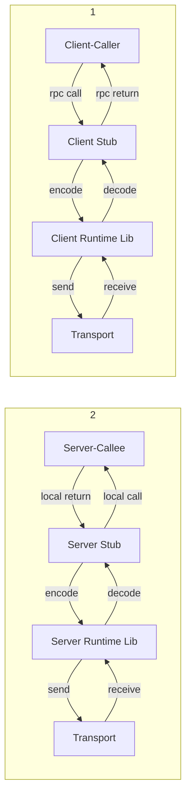
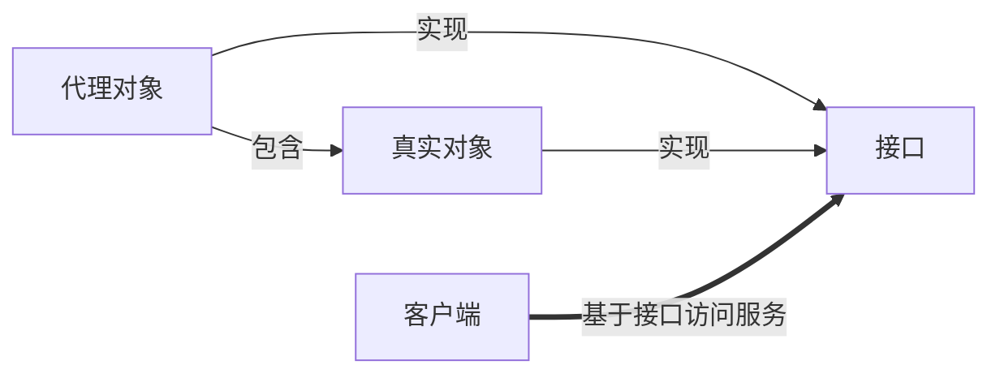

## 远程过程调用(RPC, Remote Procedure Call)

### 1. RPC简介

RPC允许一台计算机调用另一台计算机上的程序并获得结果，就像是本地调用一样。RPC能够充分利用集群计算资源，无限扩展计算集群，突破单台服务器计算能力受限的局限。

**RPC框架的三要素**：Provider、Consumer、Registry，其中Provider为服务提供者，Consumer为服务的消费者，而Registry为服务注册和发现中心，三者关系如下图所示。

```mermaid
graph TD
  subgraph B
    D[RPC Client]
    E[RPC Server]
    D -->|call|F[ ]
    F -->|call| E
  end
  subgraph A
    A[RPC Server]
    B[RPC Client]
    C[Registry]
    A -->|register|C
    B -->|subscribe|C
    C -->|notify|B
  end

```

**RPC调用流程**



1. 服务消费方以本地调用方式调用服务；
2. Client Stub接收到调用后负责将**方法、参数**等封装编码成能够进行网络传输的消息体；
3. Client Stub从注册中心找到服务器，并将消息发送到服务端；
4. Server Stub接收到消息进行解码；
5. Server Stub根据解码后的结果调用本地服务；
6. 本地服务执行后将结果返回给Server Stub；
7. Server Stub将结果编码打包发送给消费方；
8. Client Stub接收到消息进行解码

而RPC的目标就是要2~8步封装起来，让用户对这些细节透明。而要实现RPC框架需要使用多个技术组合，下面为实现RPC需要用到的技术：

- **动态代理**，生成Client Stub和Server Stub需要用到**Java动态代理**，而动态代理的实现方法有：Java原生、CGlib、Javassist。
- **序列化**，为了能够在网络上传输，需要将Java对象转换为字节数组（编码/序列化），为了能够解析Java对象，需要将字节数组转换为Java对象（解码/反序列化）。常用序列化技术：Java原生、[thrift、protobuf](https://baijiahao.baidu.com/s?id=1603698023373451006&wfr=spider&for=pc)、kyro等，不同序列化技术性能[可参考](https://github.com/eishay/jvm-serializers/wiki)。
- **NIO**，当前很多RPC框架直接基于[Netty](https://netty.io/)进行底层IO通信。
- **服务注册中心**，可用技术：Zookeeper、Redis、Etcd和Consul。

### 2. RPC的简单实现

​	RPC为不同计算机间的方法可以相互调用。**为什么需要服务中心？**由于服务端提供不同接口调用服务，客户端需要调用不同接口比较混乱，为了方便管理因此采用在服务端需要有一个服务中心（相当于工厂）在其中把服务的接口都注 册进来，这样以后客户端调用服务直接调用服务中心就行，不需要再调用具体的接口服务。

**RPC的实现**

 如何注册接口？可以在服务中心采用Map保存接口名称与具体接口服务的映射。客户端访问服务端必然进行`socket`通信，客户端要调用服务端的服务，只需要将接口名称发送给服务端，服务端根据`反射机制`得到对应的接口信息。服务端需要根据客户的不同请求，返回不同的接口类型，客户端就需要能够接收不同的接口类型，因此需要`动态代理`对象，服务端返回什么类型该代理对象就是什么类型！

1. 定义接口及接口实现类；
2. 在将接口注册到服务中心 CentralService.register；
3. 服务端给暴露一个socket端口，以便客户端能够通过该端口调用服务 CentralService.start；
4. 客户端要获取代表服务端不同服务的动态代理对象Proxy.newProxyInstance；
5. 在InvocationHandler中将要调用的远程方法及参数信息发送给服务端；
6. 服务端接收请求后，根据调用服务类型及参数本地执行服务并将结果通过socket发送给动态代理；
7. 动态代理接收结果后返回给客户端；

服务的定义

```java
interface HelloService{
    String hello(String name);
}

class HelloServiceImpl implements HelloService{
    public String Hello(String name) {
        return "Hello " + name;
    }
}
```

注册中心

```java
interface ServiceCenter {
    void start();
    void stop();
    void register();
}

class ServiceCenterImpl {
    public static final int PORT = 9999;
    private ServerSocket server;
    private Map<String, Class> registeredServices;
    private boolean isRunning;
    private ExecutorService executor;
    
    public ServiceCenterImpl() {
        server = new ServerSocket();
        registeredServices = new HashMap<>();
        int avaiableCores = Runtime.getRuntime().avaiableProcessors();
        executor = new Executors.newFixedThreadPool(avaiableCores);
        isRunning = false;
    }
    
    public void start() {
        try {
            server.bind(new InetSocketAddress("localhost", PORT))
        } catch (IOException e) {
            e.printStackTrace();
        }
        isRunning = true;
        while(isRunning) {
            try {
                Socket sock = server.accept();
            	executor.execute(new TaskRunner(sock));  
            } catch(Exception e) {
				e.printStackTrace();                
            }
        }
    }
    public void stop() {
        if (isRunning) {
            try{
                isRunning = false;
                if(executor != null) executor.shutdown();
            	if(server != null) server.close();
            } catch (Exeption e) {
				e.printStackTrace();                
            }
        }
    }
    //客户端发送的是接口名称，而服务端拿到名称后会首先转换为Class类型
    public void register(Class service, Class ServiceImpl ) {
        registeredServices.put(service.getName(), serviceImpl);
    }
}

class TaskRunner extends Runnable{
    private Socket socket;
    public TaskRunner(Socket socket) {
        this.socket = socket;
    }
    public void run() {
        ObjectOutputStream oos = null;
        ObjectInputStream ois = null;
        try{
            oos = new ObjectOutputStream(sock.getOutputStream());
            ois = new ObjectInputStream(sock.getInputSream());
            // 1. 获取请求数据
		   String serviceName = ois.readUTF();
            String methodName = ois.readUTF();
            Class[] paramTypes = (Class[]) ois.readObject();
            Object[] params = (Object[]) ois.readObject();
            
            // 2. 利用反射执行结果并返回
            //根据客户请求，在服务中心找到具体接口进行处理
            Class serviceImpl = registeredServices.get(serviceName);
            Method method = serviceImpl.getMethod(methodName, paramTypes);
            Object result = method.invoke(serviceImpl.newInstace(), params);
            
            //3. 将结果返回给客户端
            oos.writeObject(result);
        } catch (Exception e) {
            e.printStackTrack();
        } finnaly {
            if(oos != null) oos.close();
            if(ois != null) ois.close();
        }
    }
}
```

客户端调用服务

```java
public class Client {
    /**
     *  获取对应服务名称的动态代理对象，动态代理对象可代表服务的任何对象
     */
    public static <T> T getRemoteProxyObj(Class serviceInterface, InetSocketAddress address) {
        /**
		 * 创建动态代理需要三个参数：
		 * 1、类加载器：需要代理哪个类，例如需要代理HelloService，就需要
		 *   将HelloService的类加载器传入；
		 * 2、需要代理的对象具有哪些功能/方法，例如say()、sleep()等，而方
		 *   法是在接口中，因此第二个参数就是存放接口的；一个接口有多种实现，
		 *   即被代理的对象可以有多种。
		 * 3、实现InvocationHandler实例，就是重写服务调用的接口
		 */
        return (T) Proxy.newProxyInstace(
            serviceInterface.getClassLoader(),
            new Class[]{HelloService.class},
            (proxy, method, args) -> {
                //1. 向服务注册中心建立连接请求服务
                Socket sock = new Socket();
                scok.connect(new InetSocketAddress("localhost",9999));
                
                //2. 发送请求:接口名、方法名、方法参数类型，方法参数
                ObjectOutputStream oos = new ObjectOutputStream(sock.getOutputStream());
                oos.writeUTF(serviceInterface.getName());
                oos.writeUTF(method.getName());
                oos.writeObject(method.getParameterTypes());
                oos.writeObject(args)
                
                //3. 获取并解析响应
                ObjectInputStream ois = new ObjectInputStream(sock.getInputSteam());
                Object result = ois.readObject();
                
                oos.close();
                ois.close();
                sock.close();
                return result;
            }
        );
    }
}
```

RPC服务测试

```java
public class TestRPCServer {
	public static void main(String[] args) {
        CentralService service =  new CentralService();
        service.register(HelloService.class, HelloServiceImpl.class);
        service.start();
	}
}

public class TestRPCClient {
	public static void main(String[] args) {
		try {
			HelloService helloService = Client.getRemoteProxyObj(
					//告诉服务调用远程的这个接口
					Class.forName("rpc.server.HelloService"));
			System.out.println(helloService.sayHello("Govind"));
		} catch (ClassNotFoundException e) {
			e.printStackTrace();
		}
	}
}
```

### 3. 动态代理

​	**代理模式**：给目标对象提供一个代理对象，并由代理对象控制对目标对象的引用。代理模式的目的或优点有两个：1、通过引入代理对象的方式来间接访问目标对象，防止直接访问目标对象给系统带来不必要的复杂性；2、通过代理对象对原有的业务增强。

​	代理模式中的`三个要素`：接口、真实对象、代理对象；`两个动作`：代理对象和真实对象要实现接口、代理对象包含真实对象。



```java
public interface HelloService {
    String sayHello(String name);
}

public class HelloServiceImpl implements HelloService {
    public String sayHello(String name) {
        return "Hello " + name;
    }
}
// 静态代理
public HelloServiceProxy implements HelloService {
    private HelloService service;
    
    public HelloServiceProxy(HelloService service) {
        this.service = service;
    }
    
    public String sayHello(String name) {
        //对原有业务的增强
        //前置增强
        String result = service.sayHello(name)
        //后置增强
        return result;
    }
}
```

​	**静态代理的缺点**：因为代理对象需要实现与目标对象一样的接口，会导致代理类十分繁多，不易维护，同时一旦接口增加方法，则目标对象和代理类都需要维护。

**动态代理**

动态代理是指（通过指定代理的目标对象实现的接口类型）在动态的在内存中构建代理对象。动态代理的实现由两种：Java代理、CGlib代理。

>动态代理的应用：
>
>1、Spring事务注解实现的原理
>
>2、 MyBatis直接使用mapper接口访问数据库
>
>3、权限管理、AOP、日志几种打印等

**Java代理**

​	代理对象不需要实现接口，但是目标对象一定要实现接口否则不能用动态代理。JDK动态代理中包含一个InvocationHandler接口和一个Proxy类，JDK实现代理只需要使用`Proxy.newProxyInstance`方法，但是该方法需要接收三个参数。

```java
class Proxy {
    /**
     * 生成代理对象产生步骤	：
     * 1、基于代理接口查找类加载器；
     * 2、动态生成一个Proxy Class字节码；
     * 3、状态Proxy Class字节码，用类加载器的define方法实现；
     * 4、通过newInstace创建代理对象；
     */
    static Object newProxyInstance(
        ClassLoader loader,  //当前目标对象使用类加载器
        Class<?>[] interfaces, //目标对象实现的接口的类型
        //执行目标对象的方法时，会触发事件处理器的invoke方法,
        // 会把当前执行目标对象的方法作为参数传入
        InvocationHandler h) 
}
```


```java
public interface InvocationHandler {     
    public Object invoke(
        Object proxy,  //被代理的对象
        Method method, // 被代理的对象
        Object[] args  //调用的方法的参数
    ) throws Throwable; 
}
```


```java
class HelloServiceProxy {
    public static <T> T getProxy(Class service, Object target) {
        return Proxy.newProxyInstance(
        	service.getClassLoader(),
            new Class[]{service},
            new InvocationHandler() {
                (proxy, method, args) -> {
                    // 前置任务，如：开始事务
                    Object result = method.invoke(target, args);
                    // 后置任务，如提交事务
                    return result;
                }
            }
        );
    }
}
```

**CGlib代理**

​	静态代理和动态代理模式都是**要求目标对象是实现一个接口的目标对象**，但是有时候目标对象只是一个单独的对象并没有实现任何的接口，这个时候就可以使用以目标对象子类的方式类实现代理，此时的代理称为CGlib代理（子类代理）。

​	CGlib代理是在内存中构建一个子类对象从而实现对目标对象功能的扩展，CGlib是一个强大的高性能的代码生成包可以在运行期扩展Java类与实现Java接口，底层是通过使用字节码处理框架ASM来转换字节码并生成新的类。

> CGlib是针对类来实现代理的，原理是对指定的目标类生成一个子类，并覆盖其中方法实现增强，因为采用的是继承，所以不能对final修饰的类进行代理；若目标对象的方法为final/static，那么就不会被拦截，即不会执行目标对象额外的业务方法！

```java
public class HelloServiceProxy implements MethodInterceptor{
    private Object target;
    
    public HelloServiceProxy(Object target) {
        this.target = target;
    }
    
    //给目标对象创建一个代理对象
    public Object getProxyInstace() {
        Enhancer en = new Enchancer();
        en.setSuperClass(target.getClass());
        en.setCallback(this);
        return en.create();
    }
    
    @Override
    public Object intercept(Object obj, Method method, Object[] args, MethodProxy proxy)throws Throwable {
        // 前置任务，如：开始事务
        Object result = method.invoke(target, args);
        // 后置任务，如提交事务
        return result;
    }
}
```


**JDK和CGlib动态代理实现的区别**

1、JDK动态代理生成的代理类和委托类实现了相同的接口；
2、CGlib动态代理中生成的字节码更加复杂，生成的代理类是委托类的子类，且不能处理被final关键字修饰的方法；
3、JDK采用反射机制调用委托类的方法，CGlib采用类似索引的方式直接调用委托类方法；

> Spring AOP的实现方式与区别？
>
> 1、Java Proxy：通过动态构建字节码实现，`生成一个全新的Proxy Class`；
>
> 2、CGlib：通过动态构建字节码实现，`生成一个全新的Proxy Class`；
>
> 3、AspectJ：在程序编译时`直接修改目标类`的字节，织入代理字节码中；
>
> 4、instrumentation：基于JavaAgent在类装载时动态拦截并`直接修改目标类`的字节码；
>
> 无论哪种实现方式，本质都是修改字节码，区别在于从哪里进行切入修改字节码，直接修改字节码的工具有CGlib、JavaAssistant！

### 4. 基于Netty的RPC框架实现

​	**什么是RPC框架？**RPC通过网络从远程计算机程序上请求服务，而不需要了解底层网络技术的协议。RPC假定某些传输协议的存在如TCP/UDP，为通信应用程序之间携带信息数据。在OSI网络通信模型中，RPC跨越了传输层和应用层，RPC使得开发网络分布式多程序在内的应用程序更加容易。下图为经典的RPC框架Dubbo的架构图。


为什么需要RPC框架？

1. 但服务越来越多，服务URL配置管理变得困难，F5硬件负载均衡器的单点压力越来越大；
2. 服务依赖关系复杂，甚至分不清哪个应用要在哪个应用之前启动；
3. 服务的调用量越来越大，服务的容量问题就暴露出来，这个服务需要多少机器支撑，通过monitor模块计算服务的调用情况判断需要加多少机器！

​	当我们的业务越来越多、应用也越来越多时，自然的，我们会发现有些功能已经不能简单划分开来或者划分不出来。此时可以将公共业务逻辑抽离出来，将之组成独立的服务 Service应用。而原有的、新增的应用都可以与那些独立的 Service应用交互，以此来完成完整的业务功能。所以此时，我们_急需一种高效的应用程序之间的通讯手段_来完成这种需求，所以你看RPC大显身手的时候来了！其实也是服务化、微服务和分布式糸统架构的基础场景。

**RPC架构的设计**

​	**RPC框架核心技术要点**：1、远程服务提供者需要以某种形式提供服务调用相关的信息，包括但不限于服务接口定义，数据结构或中间态的服务定义文件；2、远程代理对象(调用方，消费方)；3、通信，包括协议、IO方式(BIO、NIO)、多连接(取决于业务数据量大小)、心跳机制；4、序列化，Java原生序列化机制在高并发时会有很多问题，因此出现了很多hessian、jackson、protobuf、avro等，此外还需要进行编码设计(编码规则越简单越好，编码内容越少越好)。

> RPC是长连接，由于是远程连接每次建立连接性能会很低，因此会通过心跳机制保持长连接，对于跨JVM、跨网络、跨物理层、跨中继设备(会是不是把连接中断)的都会建立长连接！

​	为什么Dubbo的服务提供方的暴露服务的配置文件是写在Spring的配置文件中？Dubbo中的服务提供方的初始化是通过Spring容器Container初始化并有Spring将服务方的元信息注册到服务中心。


1、定义公共接口和消息格式

```java
//远程服务接口，是对外暴露的服务 rpc-api
public interface IRpcCalc {
	int add(int a, int b);
	int sub(int a, int b);
	int mult(int a, int b);
	int div(int a, int b);
}
public class InvokerMessage implements Serializable {
	private static final long serialVersionUID = -2942328630173229267L;
	//要调用的服务名
	private String serviceName;
	//要调用服务的那个方法
	private String methodName;
	private Class<?>[] parameterTypes;
	private Object[] parameterValues;
}
```

2、服务端实现服务

```java
public class RpcCalcImpl implements IRpcCalc {
	@Override
	public int add(int a, int b) {
		return a + b;
	}
	@Override
	public int sub(int a, int b) {
		return a - b;
	}
	@Override
	public int mult(int a, int b) {
		return a * b;
	}
	@Override
	public int div(int a, int b) {
		assert(b == 0);
		return a / b;
	}
}
```

3、服务端注册服务

```java
/**
 * 在rpc-server启动时将服务实现类用Spring容器管理起来，
 *  并且由Spring容器将服务注册到ZK中去。
 */
@Slf4j
public class RpcRegister {
	//服务端监听端口，用于监听Netty传送过来的信息报文
	private int port;

	public RpcRegister(int port) {
		this.port = port;
	}

	//启动服务，web化启动服务 WebApplicationContext
	public void start() {
		//基于Netty的NIO通信模型，处理客户端连接线程池组
		EventLoopGroup bossGroup = new NioEventLoopGroup();
		//工作线程组，专门用来处理业务
		EventLoopGroup workerGroup = new NioEventLoopGroup();
		try {
			//引导启动类：
			ServerBootstrap bootstrap = new ServerBootstrap();
			bootstrap.group(bossGroup, workerGroup)
					//指定通道类型
					.channel(NioServerSocketChannel.class)
					.childHandler(new ChannelInitializer<SocketChannel>() {
						@Override
						protected void initChannel(SocketChannel socketChannel) throws Exception {
							//初始化通道：初始化为拦截器链模式
							ChannelPipeline pipeline = socketChannel.pipeline();
							//队列上走请求信息流，handler进行拦截处理
							//Netty提供的丢包、粘包解决机制
							pipeline.addLast(new LengthFieldBasedFrameDecoder(Integer.MAX_VALUE, 0, 4, 0,4));
							pipeline.addLast(new LengthFieldPrepender(4));
							pipeline.addLast("encoder", new ObjectEncoder()); //对象编码器
							pipeline.addLast("decoder", new ObjectDecoder(Integer.MAX_VALUE, ClassResolvers.cacheDisabled(null)));

							//初始化自定义handler
							pipeline.addLast(new RegistryHandler());
						}
					}).option(ChannelOption.SO_BACKLOG, 128)
						//保持长连接
						.childOption(ChannelOption.SO_KEEPALIVE, true);
			//sync轮训端口，若有连接进来则返回一个异步结果
			ChannelFuture future = bootstrap.bind(this.port).sync();
			log.info("Rpc provider server listen on {}", this.port);
			//监听
			future.channel().closeFuture().sync();
		} catch (Exception e) {
			log.info("Rpc Provider shutdown for {}", e.getMessage());
			bossGroup.shutdownGracefully();
			workerGroup.shutdownGracefully();
		}
	}

	public static void main(String[] args) {
		new RpcRegister(9999).start();
	}
}
```

```java
//Netty接收到消息后的处理方法
public class RegistryHandler extends ChannelInboundHandlerAdapter {
	//引入注册中心ZK，这里利用HashMap模拟
	public static ConcurrentHashMap<String, Class> registeredServices = new ConcurrentHashMap<>();
	//全自动扫描集合，权限定类名
	private List<String> classCache = new ArrayList<>();

	public RegistryHandler() {
		//服务发现，扫描包
		scanClass("framework.rpc.provider.service");
		// zk服务注册
		doRegister();
	}
	//服务注册
	private void doRegister() {
		if (classCache.size() <= 0) {
			log.info("未发现任何服务可以注册");
			return;
		}

		for (String serviceName : classCache) {
			try {
				Class<?> clz = Class.forName(serviceName);
				Class<?> interfaces =clz.getInterfaces()[0];
				registeredServices.put(interfaces.getName(), clz);
				log.info("注册服务：{}", serviceName);
			} catch (ClassNotFoundException e) {
				log.info("服务注册失败：{}", e.getMessage());
			}
		}
	}
	//服务发现：自动扫描xml配置路径
	private void scanClass(String packageName) {
		URL url = this.getClass().getClassLoader().getResource(packageName.replace(".","/"));
		assert url != null;
		File dir = new File(url.getFile());
		for (File file : Objects.requireNonNull(dir.listFiles())) {
			if (file.isDirectory()) {
				scanClass(String.format("%s.%s", packageName, file.getName()));
			} else {
				//找到服务实现类，如：framework.rpc.provider.service.RpcHelloImpl
				String serviceImplName = String.format("%s.%s", packageName, file.getName().replace(".class", "").trim());
				classCache.add(serviceImplName);
				log.info("发现服务：{}", serviceImplName);
			}
		}
	}

	@Override
	public void channelRead(ChannelHandlerContext ctx, Object msg) throws Exception {
		InvokerMessage message = (InvokerMessage)msg;
		Object result = new Object();
		if (registeredServices.containsKey(message.getServiceName())) {
			Class clz = registeredServices.get(message.getServiceName());
			Method method = clz.getMethod(message.getMethodName(), message.getParameterTypes());
			result = method.invoke(clz.newInstance(), message.getParameterValues());
		}
		//Netty异步方式写回给客户端
		ctx.write(result);
		ctx.flush();
		ctx.close();
	}
	@Override
	public void exceptionCaught(ChannelHandlerContext ctx, Throwable cause) throws Exception {
		//RPC 分布式事务问题处理
		log.info("交易出错");
	}
}
```

4、客户端动态代理

```java
public class RpcProxy {
	@SuppressWarnings("unchecked")
	public static <T> T create(Class<?> service) {
		MethodProxy methodProxy = new MethodProxy(service);
		T result = (T) Proxy.newProxyInstance(service.getClassLoader(),
				new Class[]{service}, methodProxy);
		return result;
	}
}

//动态代理：通过解耦方式实现invoker的转发
class MethodProxy implements InvocationHandler {
	private Class<?> service;
	public MethodProxy(Class<?> service) {
		this.service = service;
	}

	@Override
	public Object invoke(Object proxy, Method method, Object[] args) throws Throwable {
		//代理对象的实现类和声明该方法的实现类的字节码相同，则传入的为一个具体实现类
		if (Object.class.equals(method.getDeclaringClass())) {
			try {
				return method.invoke(this, args);
			} catch (Throwable e) {
				e.printStackTrace();
			}
		} else {
			//调用远程方法
			return rpcInvoker(proxy, method, args);
		}
		return null;
	}

	private Object rpcInvoker(Object proxy, Method method, Object[] args) {
		//构建远程消息
		InvokerMessage message = new InvokerMessage();
		message.setServiceName(this.service.getName());
		message.setMethodName(method.getName());
		message.setParameterTypes(method.getParameterTypes());
		message.setParameterValues(args);

		ConsumerHander consumerHander = new ConsumerHander();
		EventLoopGroup group = new NioEventLoopGroup();
		Bootstrap bootstrap = new Bootstrap();
		bootstrap.group(group).channel(NioSocketChannel.class)
				.option(ChannelOption.TCP_NODELAY, true)
				.handler(new ChannelInitializer<SocketChannel>() {
					@Override
					protected void initChannel(SocketChannel socketChannel) throws Exception {
						ChannelPipeline pipeline = socketChannel.pipeline();
						pipeline.addLast(new LengthFieldBasedFrameDecoder(Integer.MAX_VALUE, 0, 4, 0,4));
						pipeline.addLast(new LengthFieldPrepender(4));
						pipeline.addLast("encoder", new ObjectEncoder()); //对象编码器
						pipeline.addLast("decoder", new ObjectDecoder(Integer.MAX_VALUE, ClassResolvers.cacheDisabled(null)));

						//初始化自定义handler
						pipeline.addLast(consumerHander);
					}
				});
		try {
			ChannelFuture future = bootstrap.connect("localhost", 9999).sync();
			future.channel().writeAndFlush(message).sync();
			future.channel().closeFuture().sync();
		} catch (InterruptedException e) {
			e.printStackTrace();
		} finally {
			group.shutdownGracefully();
		}
		return consumerHander.getResponse();
	}
}
```

```java
//接收到消息
public class ConsumerHander extends ChannelInboundHandlerAdapter {
	//对外暴露返回消息接口
	@Getter
	private Object response;

	@Override
	public void channelRead(ChannelHandlerContext ctx, Object msg) throws Exception {
		response = msg;
		log.info("响应消息：{}", msg);
	}

	@Override
	public void exceptionCaught(ChannelHandlerContext ctx, Throwable cause) throws Exception {
		//RPC 分布式事务问题处理
		log.info("交易出错");
	}
}
```

5、消费方使用远程调用 

```java
public class ConsumerTest {
	public static void main(String[] args) {
		IRpcCalc rpcCalc = RpcProxy.create(IRpcCalc.class);

		log.info("2 + 3 = {}", rpcCalc.add(2,3 ));
		log.info("2 - 3 = {}", rpcCalc.sub(2,3 ));
		log.info("2 * 3 = {}", rpcCalc.mult(2,3 ));
		log.info("2 / 3 = {}", rpcCalc.div(2,3 ));
	}
}
```