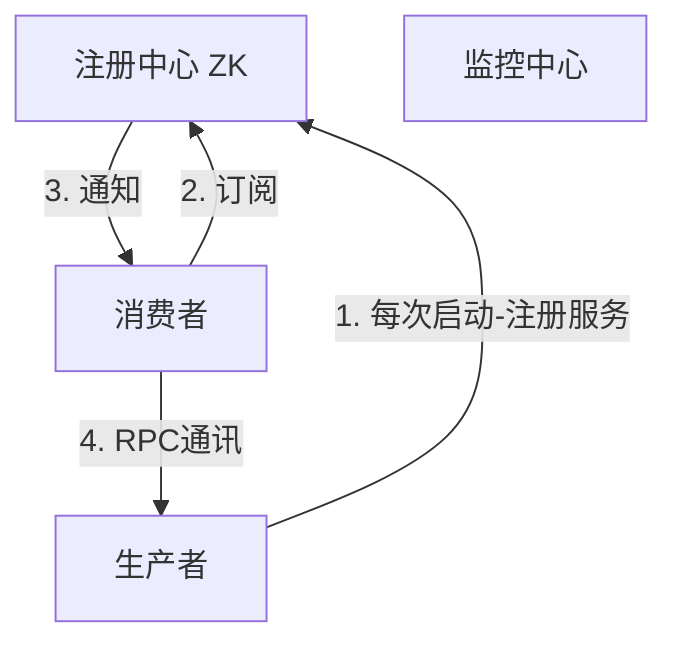

## ZooKeeper学习笔记


### 2. ZooKeeper实现动态负载均衡

**SOA架构（面向服务架构）**：传统项目通常包含控制层、业务逻辑层、数据访问层；而面向服务的开发就是面向业务逻辑开发，不包括页面，作为单独的项目，而页面层作为另一个单独项目需要调用业务服务获取数据展示，因此面向服务的开发就是解耦合、拆分后组合为一个整体项目。因此会员系统和会员服务不同，会员系统是完整的可独立运行的系统，而会员服务只对外提供数据服务不做展示。因此，面向服务的开发也称为面向接口的开发，对外提供服务接口由控制层来调用，而控制层与业务逻辑层之间的调用或通信就是通过RPC实现，这个总体架构就成为SOA架构。

Dubbo是一个分布式开发框架且是一个RPC远程调用框架，同时用于服务治理(负载均衡、熔断、服务注册等)，ZooKeeper作为分布式协调中心，在Dubbo中的注册中心可以是redis、Zookeeper主要用于保存信息。Dubbo进行服务治理主要是管理服务与服务之间的依赖关系，通过Dubbo注册中心可以解决负载均衡、集群、高可用、熔断。 Dubbo中的几个核心概念及原理：

- 注册中心，Dubbo中用ZK实现，
- 生产者，提供接口服务，例如：会员服务，当生产者启动后就会将服务信息注册到ZK上去，
- 消费者，调用接口服务，例如：订单系统，采用订阅方式保证在消费者能够获取最新的服务地址，在服务地址发生变化时，会及时通知到消费者；
- 监控中心，每一次调用都会在监控中心有记录，哪些调用成功，哪些调用失败，失败的会重试；



**Enruka与ZooKeeper的区别？**


生产者是服务（接口）的提供者，消费者是接口的调用方。
$$
架构演变：单点系统 \rightarrow 分布式开发 \rightarrow  SOA面向于服务的架构 \rightarrow 微服务架构
$$
**动态负载、软负载、硬负载**

负载均衡的作用是减去单台服务器压力，通过集群均摊请求压力。

> 分布式：一个业务分拆多个子业务，部署在不同的服务器上集群：同一个业务，部署在多个服务器上。集群是解决高可用的，而分布式是解决高性能、高并发的。

**软负载**是使用软件实现负载均衡机制，例如nginx，缺点是配置更改后需要重启程序不能立即生效。而**硬负载**则是使用硬件实现负载均衡，例如F5。**动态负载均衡**能够实时更新同步配置，不需要重启程序。

**ZooKeeper**

ZooKeeper是一个分布式协调工具，可以用作`分布式锁`(redis也可以做，但ZK性能较好)、`分布式配置中心`、`消息中间件`(可以实现发布订阅)，此外ZK具有类似Redis中的哨兵机制(当主redis宕机时会再选取Leader，实现`选举策略`，同时ZK也可以实现`负载均衡`和`命名服务器`。ZK中采用树状结构存储数据，节点为<节点名称，节点值>构成节点名称也称为路径，节点有两种类型：临时节点和永久节点。ZK支持事件通知，当节点发生变化时会通知所有客户端。

```java
/**
* 创建节点，节点不能够重复创建，会抛出NodeExistsExeption
*/
// IP, ,connectTimeout
ZkClient zkClient = new ZkClient("127.0.0.1:2181",60000, 1000);
//创建永久节点
zkClient.create("/test", "value1", CreateMode.PERSISTENT);
zkClient.create("/test/node01_", "value2", CreateMode.PERSISTENT);
// 创建临时节点，在zkClient关闭会话后就会自动注销，因此在ZK可视化工具上是看不到的
zkClient.create("/test/node01_tmp", "value_temp", CreateMode.EPHEMERAL);
zkClient.close();
```


> 一句话总结ZK：一致、有头、数据树。


