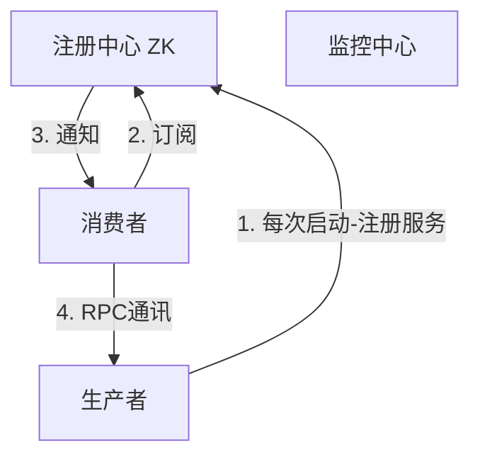

## ZooKeeper学习笔记

###  1. ZK核心概念

ZK最核心的是解决分布式系统数据一致性问题(Consistency ACID)，分布式技术的发展都是基于Google的三篇论文(GFS，BigTable，MapReduce)发展而来对应的开源版本为HDFS、HBase、HadoopMR。

ZK是是什么？每个ZK节点都保存一颗数据树且是一样的，数据存放在内存的因此读速度很快，有写时会通知所有从节点因此写入(先写日志然后修改数据可实现灾难恢复)会慢点。ZK的**数据模型**：树形结构，每一个节点称为znode可以有子节点或数据，节点类型分为**临时节点**和**永久节点**，临时节点在客户端断开后消失；每个节点有各自**版本号**，节点数变化时版本号累加(**乐观锁**)；每个节点存储的数据不宜过大，一般几K最佳，同时可以设置节点权限限制用户访问。

> 一句话总结ZK：一致(各个节点数据一致)、有头(Leader，写操作只有Leader能写然后ZAB广播给其他Follower同步----最终一致性)、数据树(每个节点都绑定一份数据)。
>
> ZK应用场景：**配置一致性**、**HA**、**pub/sub**、**naming service**、**load balance**、**分布式锁**

**ZK之watcher机制**

针对每个节点的操作，都会有一个监督者（watcher），当监控的某个对象(znode)发生变化时，则触发watcher事件
zk中的watcher是一次性的，触发后立即销毁。父亲节点，子节点，增删改都能触发watcher，针对不同的watcher事件也不相同：

1. (子)节点创建事件，当为父节点设置watcher，创建父节点触发NodeCreated事件，创建子节点时触发NodeChildrenChanged事件；
2. (子)节点删除事件，当为父节点设置watcher，删除父节点触发NodeDeleted事件，删除子节点时触发NodeChildrenChanged事件；
3. (子)节点数据变化事件，当为父节点设置watcher，修改父节点数据触发NodeDataChanged事件，修改子节点不触发事件；

**ZK之ACL权限控制**

针对节点可以设置读写等权限，目的为了保障数据安全性，使用场景有两种：_1.开发/测试环境分离，开发者无权操作测试库 的 节点只能看；2.生产环境上控制指定ip的服务可以访问相关节点，防止混乱_。权限permission可以指定不同的权限范围以及角色，ALC相关命令：

-  getAcl获取某个节点的acl权限；
- setAcl设置某个节点的acl权限；
- addauth输入认证授权信息，注册时输入明文密码(登录)但是在zk的系统里，密码是以加密的形式存在的；

ZK权限列表构成为：**[schema: id :permissions]**

1. schema代表采用的某种权限机制；
2. id代表允许访问的用户；
3. permissions代表权限组合字符串；

| schema | 说明                                                         |
| ------ | ------------------------------------------------------------ |
| world  | world下只有一个**id=anyone**即只有一个用户写法为`world:anyone:[permissions]` |
| auth   | 代表认证登录，需要注册用户有权限即可写法为`auth:username:password:[permissions]` |
| digest | 需要对密码加密才能访问写法为`digest:username:BASE64(SHA1(password)):[permissions]` |
| ip     | 当设置ip为指定的ip地址时，此时权限ip进行访问，比如`ip:192.168.1.1:[cdrwa]` |
| super  | 代表超级管理员，拥有所有的权限                               |

schema中auth与digest的区别就是前者为明文，后者为密文，采用

```
  setAcl /path auth:gao:gpasswd:cdrwa
  setAck /path digest:gao:BASE64(SHA1(password)):cdrwa
```

是等价的，在通过`addauth digest:gao:gpasswd`后都能操作指定节点的权限

| permission类型 | 说明         | permission类型 | 说明            |
| -------------- | ------------ | -------------- | --------------- |
| CREATE         | 创建子节点   | READ           | 获取节点/子节点 |
| WRITE          | 设置节点数据 | DELETE         | 删除子节点      |
| ADMIN          | 设置权限     |                |                 |

```shell
world:anyone:cdrwa
# 使用auth、digest时，需要用addauth先登录用户，才能设置权限
addauth digest gao:gao
setAcl /names/gao auth:gao:gao:cdrwa
setAcl /names/gao digest:gao:XweDal3j0JQKrQzM0Dp06=:cdra
```

```java
// world:anyone:cdrwa
client.create("/acl", "acl".getBytes(), ZooDefs.Ids.OPEN_ACL_UNSAFE, CreateMode.PERSISTENT);

List<ACL> acls  =  new ArrayList<ACL>();
acls.add(new ACL(ZooDefs.Perms.CREATE | ZooDefs.Perms.DELETE | ZooDefs.Perms.READ,
                    new Id("auth", "gao:gao")));
client.create("/acl/acl_a", "acl_1".getBytes(), acls, CreateMode.PERSISTENT);

//注册过的用户必须通过addAuthInfo才能操作节点
client.addAuthInfo("digest", "gao:gao".getBytes());
byte[] data  = client.getData("/acl/acl_a",null,null);
logger.info("获取/acl/acl_a数据: [{}]", new String(data));

 //scheme=ip认证
acls.add(new ACL(ZooDefs.Perms.CREATE, new Id("ip", "127.0.0.1")));
client.create("/acl/acl_b", "acl_b".getBytes(), acls, CreateMode.PERSISTENT);
```

**super的使用方法**

1. 修改zkServer.sh增加super管理员；

   ```shell
   nohup "$JAVA" "-Dzookeeper.log.dir=${ZOO_LOG_DIR}" "-Dzookeeper.root.logger=${ZOO_LOG4J_PROP}"\
       "-Dzookeeper.DigestAuthenticationProvider.superDigest=gao:XweDal3j0JQKrQzM0Dp06="\ #添加行
       -cp "$CLASSPATH" $JVMFLAGS $ZOOMAIN "$ZOOCFG" > "$_ZOO_DAEMON_OUT" 2>&1 < /dev/null &
   ```

2. 重启zkServer.sh，然后使用addauth登录超级管理员账户，接下来就可以使用auth、digest设置权限；

   ```shell
   # 登录超级用户
   addauth digest gao:gao
   # 使用auth，digest设置权限
   setAcl / ip:127.0.0.1:r
   ```

#### 1.1 **ZAB协议—ZK的原子消息广播协议**

- 集群半数以上存活的情况下，保证对外提供可用服务；
- 客户端的写入， 修改请求全部转交给Leader处理，Leader还要确保修改完成的数据同步到其他节点中；
- Leader宕机或整个集群重启时，确保已经在leader服务器上提交的事务请求，最终被所有服务器提交，同时确保在重启集群快速恢复故障之前的状态，保证集群数据存储的可靠性、数据广播的一致性；
- 选举算法

 **ZAB选举算法简介**

`假设集群有三台机器(server.1~3)`，则第一台机器启动后读取配置文件(server.x)，通过ZAB协议查看集群中的机器是否超过半数，没有超过半数则等待；当第二台机器起来后查看配置文件，通过ZAB协议确定集群中启动的机器数目，此时为2台，超过半数，则开始投票选举。

1. 第一次投票server.1投自己一票后由于集群数目未超过半数，则等待；
2. 第二次投票此时，集群有2台机器超过半数，此时投票时，投给myid最大的那个机器，因此第二次投票server.1投给myid=2，server.2投给myid=2，此时第二台机器票数为2为Leader，第一台机器为Follower；

当第三台机器启动后，Leader和Follower同时存在，第三台机器就自动为Follower。

#### 1. 2 **ZK节点类型**

1. PERSISTENT，持久化目录节点，客户端与ZK断开连接(_tickTime*syncLimit_定义连接超时标志)后，该节点依旧存在；
2. EPHEMERAL，临时目录节点，户端与ZK断开连接(_tickTime*syncLimit_定义连接超时标志)后，该节点将消失；
3. EPHEMERAL_SEQUENTIAL，临时顺序编号目录节点，只是ZK给节点添加顺序编号，客户端与ZK断开连接(_tickTime*syncLimit_定义连接超时标志)后，该节点将消失；
4. PERSISTENT_SEQUENTIAL，持久化顺序编号目录节点，只是ZK给节点添加顺序编号，客户端与ZK断开连接(_tickTime*syncLimit_定义连接超时标志)后，该节点依旧存在，实际不常用；

**Java API使用举例**


#### 1.3 **ZK应用场景**

- **配置一致性**，多个服务器使用相同的配置，若逐个去更改比较困难，若把所有配置放在ZK中，可以实现集群配置一致性，当修改数据时会通知给客户端(通过watcher实现)，保证配置一致性。

- **服务器动态感知上下线**，通过在ZK上记录任务执行进度，当出现服务器资源不足、服务器断电或失联情况时(_tickTime*syncLimit_定义连接超时标志)，ZK通过事件机制通知业务服务器，让业务服务器重启服务处理任务中断，在重启另一台服务器后紧接着处理这个任务。

- **高可用**，例如Hadoop中只有一个NameNode，存在单点故障。Hadoop中有主从机制，在ZK中注册主从NameNode，当主NameNode节点失效后，通过ZK事件机制将主NameNode置为Slave，而将从NameNode置为Master实现高可用。

  

- **分布锁**，应用场景是多个服务要修改同一个数据。`分布式锁的一般创建过程`：

  1. 第一步需要修改数据时，在ZK上创建一个文件作为这份数据的唯一标识如，order_12id；

  2. 去第三方服务器拉去数据；

  3. 修改数据；

  4. 把修改后的数据写回数据源；

  5. 把创建的文件order_12id删除；  

  而第二客户要修改数据时，首先创建数据标识发现文件已存在，然后尝试再次创建文件，重试若干次后会创建成功，然后按照上述步骤2执行下去。

  ==上述过程的问题==：1. 数据拉去回来后，service方法异常执行造成线程阻塞无法释放文件锁；2. 数据拉回来后，service方法执行时间过长，服务器宕机、断网导致文件锁无法释放；3. 上述操作`1~5`应该是事务操作，任何一个阶段失败都会导致事务操作失败，如何保证事务的回滚！而在ZK实现分布式锁可以解决上述问题。

  

- **分布式队列**，ZK中支持持久化顺序编号目录节点，命令`create -s -e /tem`会自动创建顺序节点，形如：`/tem00001`, `/tem00002`，满足队列FIFO的特性。


###  2. ZooKeeper实现动态负载均衡

**SOA架构（面向服务架构）**：传统项目通常包含控制层、业务逻辑层、数据访问层；而面向服务的开发就是面向业务逻辑开发，不包括页面，作为单独的项目，而页面层作为另一个单独项目需要调用业务服务获取数据展示，因此面向服务的开发就是解耦合、拆分后组合为一个整体项目。因此会员系统和会员服务不同，会员系统是完整的可独立运行的系统，而会员服务只对外提供数据服务不做展示。因此，面向服务的开发也称为面向接口的开发，对外提供服务接口由控制层来调用，而控制层与业务逻辑层之间的调用或通信就是通过RPC实现，这个总体架构就成为SOA架构。

Dubbo是一个分布式开发框架且是一个RPC远程调用框架，同时用于服务治理(负载均衡、熔断、服务注册等)，ZooKeeper作为分布式协调中心，在Dubbo中的注册中心可以是redis、Zookeeper主要用于保存信息。Dubbo进行服务治理主要是管理服务与服务之间的依赖关系，通过Dubbo注册中心可以解决负载均衡、集群、高可用、熔断。 Dubbo中的几个核心概念及原理：

- 注册中心，Dubbo中用ZK实现，
- 生产者，提供接口服务，例如：会员服务，当生产者启动后就会将服务信息注册到ZK上去，
- 消费者，调用接口服务，例如：订单系统，采用订阅方式保证在消费者能够获取最新的服务地址，在服务地址发生变化时，会及时通知到消费者；
- 监控中心，每一次调用都会在监控中心有记录，哪些调用成功，哪些调用失败，失败的会重试；



**Enruka与ZooKeeper的区别？**

生产者是服务（接口）的提供者，消费者是接口的调用方。
$$
架构演变：单点系统 \rightarrow 分布式开发 \rightarrow  SOA面向于服务的架构 \rightarrow 微服务架构
$$
**动态负载、软负载、硬负载**

负载均衡的作用是减去单台服务器压力，通过集群均摊请求压力。

> 分布式(做不同的事)：一个业务分拆多个子业务，部署在不同的服务器上作为一个整体对外提供服务。集群(做同一个事)：同一个业务，部署在多个服务器上。集群是解决高可用的，而分布式是解决高性能、高并发的。

**软负载**是使用软件实现负载均衡机制，例如nginx，缺点是配置更改后需要重启程序不能立即生效。而**硬负载**则是使用硬件实现负载均衡，例如F5。**动态负载均衡**能够实时更新同步配置，不需要重启程序。

**ZooKeeper**

ZooKeeper是一个分布式协调工具，可以用作`分布式锁`(redis也可以做，但ZK性能较好)、`分布式配置中心`、`消息中间件`(可以实现发布订阅)，此外ZK具有类似Redis中的哨兵机制(当主redis宕机时会再选取Leader，实现`选举策略`，同时ZK也可以实现`负载均衡`和`命名服务器`。ZK中采用树状结构存储数据，节点为<节点名称，节点值>构成节点名称也称为路径，节点有两种类型：临时节点和永久节点。ZK支持事件通知，当节点发生变化时会通知所有客户端。

```java
/**
* 创建节点，节点不能够重复创建，会抛出NodeExistsExeption
*/
// IP, ,connectTimeout
ZkClient zkClient = new ZkClient("127.0.0.1:2181",60000, null);
//创建永久节点
zkClient.create("/test", "value1", CreateMode.PERSISTENT);
zkClient.create("/test/node01_", "value2", CreateMode.PERSISTENT);
// 创建临时节点，在zkClient关闭会话后就会自动注销，因此在ZK可视化工具上是看不到的
zkClient.create("/test/node01_tmp", "value_temp", CreateMode.EPHEMERAL);
zkClient.close();
```

###  3. Apache Curator


Apache Curator是一个比较完善的ZooKeeper客户端框架，通过封装的一套高级API 简化了ZooKeeper的操作。通过查看官方文档，可以发现Curator主要解决了三类问题：
1. 封装ZooKeeper client与ZooKeeper server之间的连接处理
2. 提供了一套Fluent风格的操作API
3. 提供ZooKeeper各种应用场景(recipe， 比如：分布式锁服务、集群领导选举、共享计数器、缓存机制、分布式队列等)的抽象封装

Curator主要从以下几个方面降低了zk使用的复杂性：

- 重试机制:提供可插拔的重试机制, 它将给捕获所有可恢复的异常配置一个重试策略，并且内部也提供了几种标准的重试策略(比如指数补偿)；
- 连接状态监控: Curator初始化之后会一直对zk连接进行监听，一旦发现连接状态发生变化将会作出相应的处理
- zk客户端实例管理:Curator会对zk客户端到server集群的连接进行管理，并在需要的时候重建zk实例，保证与zk集群连接的可靠性；
- 各种使用场景支持:Curator实现了zk支持的大部分使用场景（甚至包括zk自身不支持的场景），这些实现都遵循了zk的最佳实践，并考虑了各种极端情况；

> 原生ZK API连接超时不支持自动重连，监听器注册一次后会生效，不支持递归创建节点。

####  3.1 Curator监听器(永久生效)

ZK API自带的监听器使用 一次后就会失效，在Curator中提供了支持这种监听器的接口，除了原生ZK监听器外，还支持Curator自己实现的监听器CuratorWatcher，使用方法如下：

```java
 client.getData().usingWatcher(new Watcher() {
            public void process(WatchedEvent event) {
                logger.info("ZK Native Watcher");
            }
        }).forPath("/master");
client.getData().usingWatcher(new CuratorWatcher() {
            public void process(WatchedEvent event) throws Exception {
                logger.info("Curator Watcher");
            }
        }).forPath("/master");
```

Curator对节点的监听提供了很好的封装，将重复注册、事件信息等处理的很好，同时监听事件返回信息比较详细包括变动节点的路径，节点值等原生API没有提供的信息。Curator监控过程类似与一个本地缓存视图与远程Zookeeper视图的对比过程，Curator官方提供的接口如下：

- NodeCache，监听数据节点的变更，缺点是无法监控增加、删除事件。

  ```java
  final NodeCache nodeCache = new NodeCache(client, PATH, false);
  nodeCache.getListenable().addListener(new NodeCacheListener() {
      public void nodeChanged() throws Exception {
          System.out.println("当前节点："+nodeCache.getCurrentData());
      }
  });
   //如果为true会立即缓存节点内容到cache中，默认为false
  nodeCache.start(true);
  ```

- PathChildrenCache，对指定路径节点的一级子目录监听，不对该节点的操作监听，对其子目录的增删改操作监听；

  ```java
  final PathChildrenCache pathChildrenCache = 
                                     new PathChildrenCache(client, "/nodes", true);
  pathChildrenCache.getListenable().addListener(
      new PathChildrenCacheListener() {
           /**
            * 1. 注册子节点触发 CHILD_ADDED
            * 2. 更新子节点值触发 CHILD_UPDATED
            * 3. 删除子节点触发 CHILD_REMOVED
            * 4. ZK挂掉触发CONNECTION_SUSPENDED，一段时间后触发CONNECTION_LOST
            * 5. ZK重启触发CONNECTION_RECONNECTED
            */
          public void childEvent(CuratorFramework client, PathChildrenCacheEvent event) throws Exception {
              switch (event.getType()) {
                  case CHILD_ADDED:
                      logger.info("process CHILD_ADDED event");
                      break;
                  case CHILD_UPDATED:
                      logger.info("process CHILD_UPDATED event");
                      break;
                  case CHILD_REMOVED:
                      logger.info("process CHILD_REMOVED event");
                      break;
                  case CONNECTION_SUSPENDED:
                      logger.info("process CONNECTION_SUSPENDED event");
                      break;
                  case CONNECTION_RECONNECTED:
                      logger.info("process CONNECTION_RECONNECTED event");
                      break;
                  case CONNECTION_LOST:
                      logger.info("process CONNECTION_LOST event");
                      break;
                  case INITIALIZED:
                      logger.info("process INITIALIZED event");
                      break;
              }
          }
      }
  );
  /** StartMode
   * 1. POST_INITIALIZED_EVENT：异步初始化cache，初始化完成后会出发事件INITIALIZED；
   * 2. NORMAL：异步初始化cache；
   * 3. BUILD_INITIAL_CACHE：同步初始化客户端的cache，会立即从服务器端拉取子节点视图到内存；
  */
  pathChildrenCache.start(PathChildrenCache.StartMode.BUILD_INITIAL_CACHE);
  ```

- TreeCache，综合NodeCache和PathChildrenCahce的特性，是对整个目录进行监听，可以设置监听深度；

  ```java
  /**
   * maxDepth值设置说明，比如当前监听节点/t1，目录最深为/t1/t2/t3/t4,则maxDepth=3,说明下面3级子目录全
   * 监听，即监听到t4，如果为2，则监听到t3,对t3的子节点操作不再触发
   */
  final TreeCache  treeCache =  TreeCache.newBuilder(client, "/tasks")
      .setCacheData(true)
      .setMaxDepth(2)
      .build();
  treeCache.start();
  treeCache.getListenable().addListener(
      new TreeCacheListener() {
          public void childEvent(CuratorFramework client, TreeCacheEvent event) throws Exception {
              switch (event.getType())  {
                  case NODE_ADDED:
                      logger.info("process NODE_ADDED event[{}]", event.getData());
                      break;
                  case NODE_UPDATED:
                      logger.info("process NODE_UPDATED event");
                      break;
                  case NODE_REMOVED:
                      logger.info("process NODE_REMOVED event");
                      break;
                  case CONNECTION_SUSPENDED:
                      logger.info("process CONNECTION_SUSPENDED event");
                      break;
                  case CONNECTION_RECONNECTED:
                      logger.info("process CONNECTION_RECONNECTED event");
                      break;
                  case CONNECTION_LOST:
                      logger.info("process CONNECTION_LOST event");
                      break;
                  case INITIALIZED:
                      logger.info("process INITIALIZED event");
                      break;
              }
          }
      }
  );
  ```

#### 3.2 Watcher实现统一配置

```java
/**
*  {"type":"add", "url":"http://dev.ulog.abc", "remark":"add config"}
*  {"type":"update", "url":"http://10.235.143.112/ulogportal/", "remark":"update config"}
*  {"type":"delete", "url":"", "remark":"delete config"}
*/
public class UnifyConfig {
    private static final Logger logger = LoggerFactory.getLogger(UnifyConfig.class);
    final static String CONFIG_PATH = "/redis";
    final static String SUB_CONFIG_PATH = "/config";
    final static String CONN_STR="10.233.87.241:9080,10.233.87.54:9080";
    final static int SESSION_TIMEOUT = 2000;
    final static int CONN_TIMEOUT = 5000;
    //用于挂起主进程
    public static CountDownLatch latch =  new CountDownLatch(1);
    private static CuratorFramework client = null;

    public static void main(String[] args) {
        try {
            RetryPolicy retryPolicy = new ExponentialBackoffRetry(0, 10);
             //启动Client
             client = CuratorFrameworkFactory.builder()
                    .retryPolicy(retryPolicy)
                    .connectString(CONN_STR)
                    .sessionTimeoutMs(SESSION_TIMEOUT)
                    .connectionTimeoutMs(CONN_TIMEOUT)
                    .build();
             client.start();
             logger.info("客户端连接成功，[{}]", client);
            //采用PathChildrenCache对配置进行监控
            final PathChildrenCache configNode = new PathChildrenCache(client, CONFIG_PATH,true);
            configNode.start();

            configNode.getListenable().addListener(
              new PathChildrenCacheListener() {
                  public void childEvent(CuratorFramework client, PathChildrenCacheEvent event) throws Exception {
                      if (event.getType()== PathChildrenCacheEvent.Type.CHILD_UPDATED)  {
                          // 确保发生数据更新的路径为/redis/config
                          String pathChanged  = event.getData().getPath();
                          if (pathChanged.equals(CONFIG_PATH+SUB_CONFIG_PATH)) {
                              logger.info("[{}]配置发生改变，需要同步更新", pathChanged);

                              //读取节点数据
                              String jsonConfig = new String(event.getData().getData());
                              logger.info("节点[{}]的配置为：{}", pathChanged, jsonConfig);

                              //json配置转换为POJO
                              RedisConfig redisConfig =  new Gson().fromJson(jsonConfig, RedisConfig.class);

                              if (redisConfig !=  null) {
                                  String type =  redisConfig.getType();
                                  String url = redisConfig.getUrl();
                                  String remark = redisConfig.getRemark();

                                  if (type.equals("add")) {
                                      logger.info("监听到新增配置，准备下载...");
                                      Thread.sleep(1000);
                                      logger.info("开始下载配置，下载路径为:[{}]", url);

                                      Thread.sleep(2000);
                                      logger.info("下载成功，已将其添加到项目中！");
                                  } else if (type.equals("update")) {
                                      logger.info("监听到更新配置，准备下载...");
                                      Thread.sleep(1000);
                                      logger.info("开始下载配置，下载路径为:[{}]", url);

                                      Thread.sleep(2000);
                                      logger.info("下载成功，准备替换配置...");
                                      logger.info("备份项目已有配置");
                                      logger.info("替换项目配置");
                                      Thread.sleep(2000);
                                      logger.info("配置成功！");
                                  } else if (type.equals("delete")) {
                                      logger.info("监听到需要删除配置");
                                      Thread.sleep(1000);
                                      logger.info("配置 删除成功");
                                  }
                              }
                          }
                      }
                  }
              }
            );
            latch.await();
        } catch (Exception e) {
            e.printStackTrace();
        } finally {
            if (client != null) {
                client.close();
                logger.info("关闭会话");
            }
        }
    }
}
```


