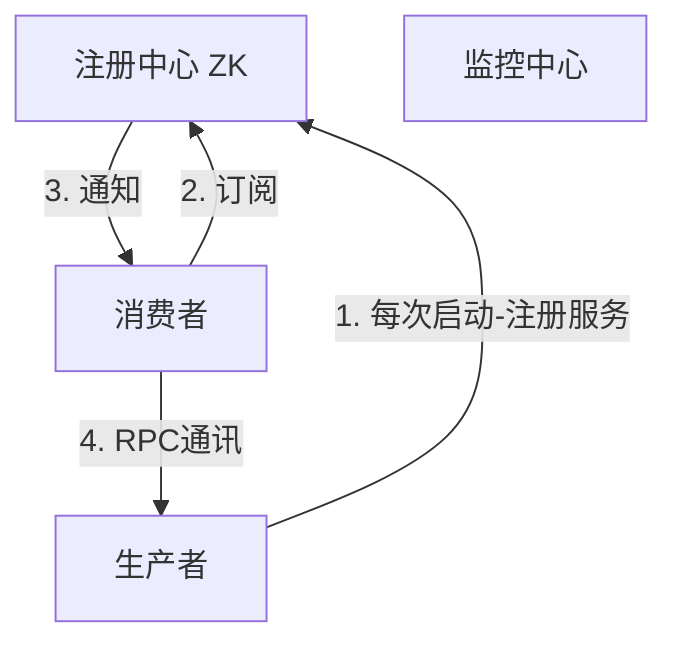

## ZooKeeper学习笔记

ZK最核心的是解决分布式系统数据一致性问题(Consistency ACID)，分布式技术的发展都是基于Google的三篇论文(GFS，BigTable，MapReduce)发展而来对应的开源版本为HDFS、HBase、HadoopMR。

ZK是是什么？每个ZK节点都保存一颗数据树且是一样的，数据存放在内存的因此读速度很快，有写时会通知所有从节点因此写入(先写日志然后修改数据可实现灾难恢复)会慢点。

> 一句话总结ZK：一致(各个节点数据一致)、有头(Leader，写操作只有Leader能写然后ZAB广播给其他Follower同步----最终一致性)、数据树(每个节点都绑定一份数据)。
>
> ZK应用场景：**配置一致性**、**HA**、**pub/sub**、**naming service**、**load balance**、**分布式锁**

**使用举例**：

- **配置一致性**，多个服务器使用相同的配置，若逐个去更改比较困难，若把所有配置放在ZK中，可以实现集群配置一致性，当修改数据时会通知给客户端，保证配置一致性。

- **服务器动态感知上下线**，通过在ZK上记录任务执行进度，当出现服务器资源不足、服务器断电或失联情况时(_tickTime*syncLimit_定义连接超时标志)，ZK通过事件机制通知业务服务器，让业务服务器重启服务处理任务中断，在重启另一台服务器后紧接着处理这个任务。

- **高可用**，例如Hadoop中只有一个NameNode，存在单点故障。Hadoop中有主从机制，在ZK中注册主从NameNode，当主NameNode节点失效后，通过ZK事件机制将主NameNode置为Slave，而将从NameNode置为Master实现高可用。

  

- **分布锁**，应用场景是多个服务要修改同一个数据。`分布式锁的一般创建过程`：

  1. 第一步需要修改数据时，在ZK上创建一个文件作为这份数据的唯一标识如，order_12id；

  2. 去第三方服务器拉去数据；

  3. 修改数据；

  4. 把修改后的数据写回数据源；

  5. 把创建的文件order_12id删除；  

  而第二客户要修改数据时，首先创建数据标识发现文件已存在，然后尝试再次创建文件，重试若干次后会创建成功，然后按照上述步骤2执行下去。

  ==上述过程的问题==：1. 数据拉去回来后，service方法异常执行造成线程阻塞无法释放文件锁；2. 数据拉回来后，service方法执行时间过长，服务器宕机、断网导致文件锁无法释放；3. 上述操作`1~5`应该是事务操作，任何一个阶段失败都会导致事务操作失败，如何保证事务的回滚！而在ZK实现分布式锁可以解决上述问题。

  

- **分布式队列**，ZK中支持持久化顺序编号目录节点，命令`create -s -e /tem`会自动创建顺序节点，形如：`/tem00001`, `/tem00002`，满足队列FIFO的特性。


**ZAB协议—ZK的原子消息广播协议**

- 集群半数以上存活的情况下，保证对外提供可用服务；
- 客户端的写入， 修改请求全部转交给Leader处理，Leader还要确保修改完成的数据同步到其他节点中；
- Leader宕机或整个集群重启时，确保已经在leader服务器上提交的事务请求，最终被所有服务器提交，同时确保在重启集群快速恢复故障之前的状态，保证集群数据存储的可靠性、数据广播的一致性；
- 选举算法

**ZAB选举算法简介**

`假设集群有三台机器(server.1~3)`，则第一台机器启动后读取配置文件(server.x)，通过ZAB协议查看集群中的机器是否超过半数，没有超过半数则等待；当第二台机器起来后查看配置文件，通过ZAB协议确定集群中启动的机器数目，此时为2台，超过半数，则开始投票选举。

1. 第一次投票server.1投自己一票后由于集群数目未超过半数，则等待；
2. 第二次投票此时，集群有2台机器超过半数，此时投票时，投给myid最大的那个机器，因此第二次投票server.1投给myid=2，server.2投给myid=2，此时第二台机器票数为2为Leader，第一台机器为Follower；

当第三台机器启动后，Leader和Follower同时存在，第三台机器就自动为Follower。

**ZK节点类型**

1. PERSISTENT，持久化目录节点，客户端与ZK断开连接(_tickTime*syncLimit_定义连接超时标志)后，该节点依旧存在；
2. EPHEMERAL，临时目录节点，户端与ZK断开连接(_tickTime*syncLimit_定义连接超时标志)后，该节点将消失；
3. EPHEMERAL_SEQUENTIAL，临时顺序编号目录节点，只是ZK给节点添加顺序编号，客户端与ZK断开连接(_tickTime*syncLimit_定义连接超时标志)后，该节点将消失；
4. PERSISTENT_SEQUENTIAL，持久化顺序编号目录节点，只是ZK给节点添加顺序编号，客户端与ZK断开连接(_tickTime*syncLimit_定义连接超时标志)后，该节点依旧存在，实际不常用；

**Java API使用举例**


###  ZooKeeper实现动态负载均衡

**SOA架构（面向服务架构）**：传统项目通常包含控制层、业务逻辑层、数据访问层；而面向服务的开发就是面向业务逻辑开发，不包括页面，作为单独的项目，而页面层作为另一个单独项目需要调用业务服务获取数据展示，因此面向服务的开发就是解耦合、拆分后组合为一个整体项目。因此会员系统和会员服务不同，会员系统是完整的可独立运行的系统，而会员服务只对外提供数据服务不做展示。因此，面向服务的开发也称为面向接口的开发，对外提供服务接口由控制层来调用，而控制层与业务逻辑层之间的调用或通信就是通过RPC实现，这个总体架构就成为SOA架构。

Dubbo是一个分布式开发框架且是一个RPC远程调用框架，同时用于服务治理(负载均衡、熔断、服务注册等)，ZooKeeper作为分布式协调中心，在Dubbo中的注册中心可以是redis、Zookeeper主要用于保存信息。Dubbo进行服务治理主要是管理服务与服务之间的依赖关系，通过Dubbo注册中心可以解决负载均衡、集群、高可用、熔断。 Dubbo中的几个核心概念及原理：

- 注册中心，Dubbo中用ZK实现，
- 生产者，提供接口服务，例如：会员服务，当生产者启动后就会将服务信息注册到ZK上去，
- 消费者，调用接口服务，例如：订单系统，采用订阅方式保证在消费者能够获取最新的服务地址，在服务地址发生变化时，会及时通知到消费者；
- 监控中心，每一次调用都会在监控中心有记录，哪些调用成功，哪些调用失败，失败的会重试；



**Enruka与ZooKeeper的区别？**


生产者是服务（接口）的提供者，消费者是接口的调用方。
$$
架构演变：单点系统 \rightarrow 分布式开发 \rightarrow  SOA面向于服务的架构 \rightarrow 微服务架构
$$
**动态负载、软负载、硬负载**

负载均衡的作用是减去单台服务器压力，通过集群均摊请求压力。

> 分布式(做不同的事)：一个业务分拆多个子业务，部署在不同的服务器上。集群(做同一个事)：同一个业务，部署在多个服务器上。集群是解决高可用的，而分布式是解决高性能、高并发的。

**软负载**是使用软件实现负载均衡机制，例如nginx，缺点是配置更改后需要重启程序不能立即生效。而**硬负载**则是使用硬件实现负载均衡，例如F5。**动态负载均衡**能够实时更新同步配置，不需要重启程序。

**ZooKeeper**

ZooKeeper是一个分布式协调工具，可以用作`分布式锁`(redis也可以做，但ZK性能较好)、`分布式配置中心`、`消息中间件`(可以实现发布订阅)，此外ZK具有类似Redis中的哨兵机制(当主redis宕机时会再选取Leader，实现`选举策略`，同时ZK也可以实现`负载均衡`和`命名服务器`。ZK中采用树状结构存储数据，节点为<节点名称，节点值>构成节点名称也称为路径，节点有两种类型：临时节点和永久节点。ZK支持事件通知，当节点发生变化时会通知所有客户端。

```java
/**
* 创建节点，节点不能够重复创建，会抛出NodeExistsExeption
*/
// IP, ,connectTimeout
ZkClient zkClient = new ZkClient("127.0.0.1:2181",60000, null);
//创建永久节点
zkClient.create("/test", "value1", CreateMode.PERSISTENT);
zkClient.create("/test/node01_", "value2", CreateMode.PERSISTENT);
// 创建临时节点，在zkClient关闭会话后就会自动注销，因此在ZK可视化工具上是看不到的
zkClient.create("/test/node01_tmp", "value_temp", CreateMode.EPHEMERAL);
zkClient.close();
```


Apache Curator是一个比较完善的ZooKeeper客户端框架，通过封装的一套高级API 简化了ZooKeeper的操作。通过查看官方文档，可以发现Curator主要解决了三类问题：
1. 封装ZooKeeper client与ZooKeeper server之间的连接处理
2. 提供了一套Fluent风格的操作API
3. 提供ZooKeeper各种应用场景(recipe， 比如：分布式锁服务、集群领导选举、共享计数器、缓存机制、分布式队列等)的抽象封装

Curator主要从以下几个方面降低了zk使用的复杂性：

- 重试机制:提供可插拔的重试机制, 它将给捕获所有可恢复的异常配置一个重试策略，并且内部也提供了几种标准的重试策略(比如指数补偿)
- 连接状态监控: Curator初始化之后会一直对zk连接进行监听，一旦发现连接状态发生变化将会作出相应的处理
- zk客户端实例管理:Curator会对zk客户端到server集群的连接进行管理，并在需要的时候重建zk实例，保证与zk集群连接的可靠性
- 各种使用场景支持:Curator实现了zk支持的大部分使用场景（甚至包括zk自身不支持的场景），这些实现都遵循了zk的最佳实践，并考虑了各种极端情况


